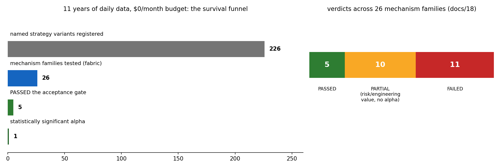
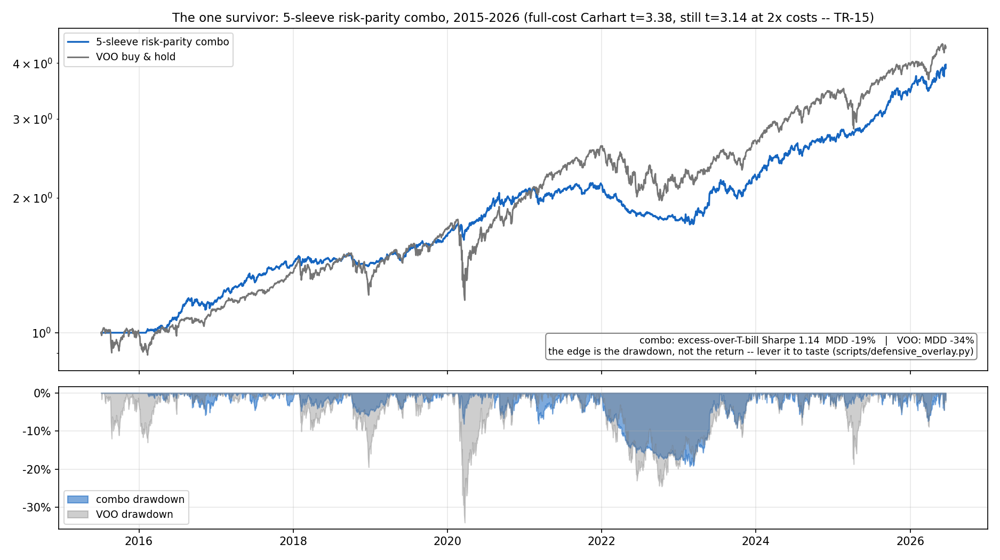
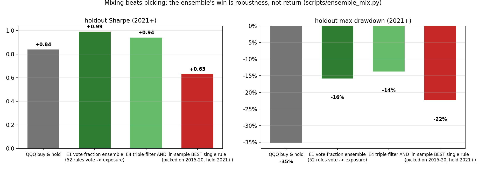
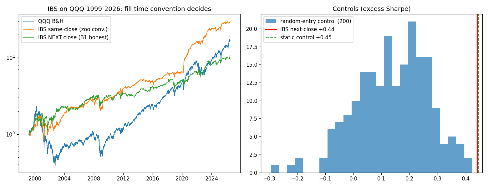
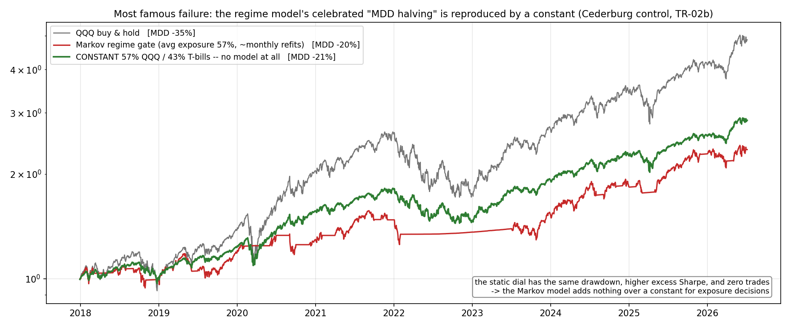
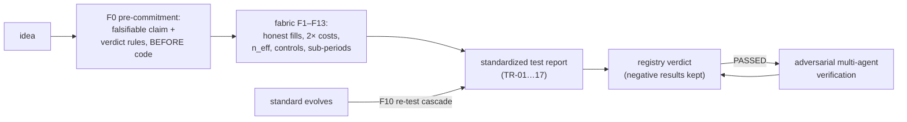
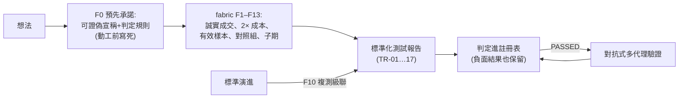

# trading-analysis

**A side project that set out to find a money-printing trading strategy — and instead built a machine for honestly killing bad ones.**

*(English first; 繁體中文在下半部。)*

---

## English

### What this is

A personal research project. The naive starting question: *"Of all the trading strategies floating around the internet, papers, and guru books — which ones can still be arbitraged today?"* Using $0/month of free data (yfinance, SEC EDGAR, public archives), across 80+ commits and **~140 mechanisms/strategies tested (17 standardized test reports)**, the answer turned out to be more valuable than the question — because it turned *"what do we know, what don't we know, and how do we decide what's feasible"* into reproducible code and documents.

### What we built

1. **An acceptance framework ("fabric" v2.0, [docs/17](docs/17-fabric-acceptance.md))** — a single rule table F0–F13 codifying every mistake we made: pre-committed falsifiable claims (F0), leak-free signals + fill-time conventions (F1), spread-scaled costs with mandatory 2× stress (F2), excess-over-T-bill Sharpe (F3), effective sample sizes (F4), campaign-wide trial accounting with a t≥3.0 alpha bar (F5), **the Nagel control triple — which simplest control explains it?** (F6), sub-period + long-history replay (F7), verdicts scoped to seat×habitat (F8), path randomization (F9), re-test cascades (F10), universe legitimacy (F11), rebalance-phase averaging (F12), and delisting rules (F13). Its economic preamble is **Grossman-Stiglitz**: at $0 information cost, equilibrium alpha is $0 — every re-open condition must be priced as an information cost.
2. **Seventeen standardized test reports** ([docs/tests/TR-01..17](docs/tests/)): statistical arbitrage, Markov regime-switching, PCA factor models, VaR, GBM Monte Carlo, CAPM, HRP, ML forecasting (GBM & Random Forest), Black-Scholes (N/A — no data, refused to fabricate), LLM agent frameworks, bagged backtesting, rebalance-phase luck, delisting bias, effective samples, cost stress, the IBS full trial, and a replication of Kelly-Malamud-Zhou's *Virtue of Complexity* with the Nagel critique as control. The framework itself was **adversarially reviewed against the literature** and audited (every number re-run).
3. **Working infrastructure**: point-in-time data layer (DuckDB+Parquet; EDGAR aligned to filing dates; 1993+ index history), order-independent backtest engine, rigor modules (PSR/DSR/PBO/SPA), daily Telegram monitors on free GitHub Actions, and a designed **paper-to-TR pipeline** ([docs/21](docs/21-paper-to-tr-pipeline.md)) for continuous paper-driven re-testing.

### Results at a glance

*(Figures regenerate with `uv run python scripts/readme_figures.py`; the IBS chart is TR-16's own exhibit.)*



**The scoreboard.** 226 named variants registered, 26 mechanism families judged, 5 PASSED — and exactly **one** statistically significant alpha. Most of what the internet calls "a working strategy" died in this funnel; keeping the corpses on record is half this repo's value.



**Success #1 — the one survivor.** The 5-sleeve risk-parity combo (tech momentum / defensive rotation / trend-gated TQQQ / gold / bonds) vs VOO: comparable terminal wealth at roughly **half the drawdown** (−19% vs −34%), full-cost Carhart **t = 3.38** — above the Harvey-Liu-Zhu 3.0 bar, still 3.14 at doubled costs (TR-15). Its edge is risk-shaping, not return-maxing: lever it to your drawdown budget (`scripts/defensive_overlay.py`).

| annual return | 2016 | 2017 | 2018 | 2019 | 2020 | 2021 | 2022 | 2023 | 2024 | 2025 | 2026* |
|---|---|---|---|---|---|---|---|---|---|---|---|
| **combo** | +17.1% | +21.1% | **+0.8%** | +15.0% | **+26.4%** | +3.0% | **−16.6%** | +25.4% | +20.2% | **+27.9%** | +15.3% |
| VOO | +12.2% | +21.8% | −4.5% | +31.4% | +18.3% | +28.8% | −18.2% | +26.3% | +25.0% | +17.8% | +10.0% |

*\*2026 = YTD. 2015 omitted (126-day risk-parity warm-up). Cost drag 12–72 bps/yr (TR-15). Read the table honestly: the combo does **not** beat VOO every year — it wins by losing less (2018, 2020, 2022, 2025) and by never being the book that has to recover from −34%.*



**Success #2 — mixing beats picking.** Pick the best of 52 technical rules on 2015–20 and it collapses out-of-sample (holdout Sharpe **0.63**); let all 52 vote and set exposure to the vote fraction, and it holds (**0.99**, MDD −16% vs B&H −35%). The ensemble's win is selection-robustness and drawdown — by construction, long/flat rules on one asset cannot beat buy-and-hold's CAGR.



**Most surprising failure — our own verdict, reversed.** IBS mean-reversion was the *only* technical rule out of 59 to survive randomized-window testing… until TR-16 asked one question: *when do you actually get filled?* Filled at the very close the signal is computed from (orange), it beats everything since 1999; filled honestly at the next close (green), the entire edge drops below buy-and-hold — and a static 38% exposure matches it. Every fast-turnover backtest now has to pass this fill-time sensitivity check (fabric F1).



**Most famous failure — the celebrated regime model vs a constant.** A walk-forward Markov regime-switching gate genuinely identifies volatility regimes and halves QQQ's max drawdown — the classic pitch. But a **constant 57% exposure** (no model, zero trades) delivers the same drawdown with a *higher* excess Sharpe (Cederburg control, TR-02b). Every "smart timing" claim in this repo now has to beat its own dumb constant first (fabric F6).

### What we now KNOW (reproducible evidence)

- **Selection alpha barely exists in free daily data.** Broad momentum is dead; value has been lost for a decade; PEAD/insider/operating factors failed; ML forecasters score OOS IC≈0 (the shuffled control beat the real model); even the KMZ complexity recipe is dominated by a simple 1/σ² volatility dial in our seat. The one robust cross-sectional signal: **gross profitability** (ICIR +0.30).
- **Timing to cash almost always subtracts, and clever risk models rarely beat a constant.** Every cash gate lost to buy-and-hold; the Markov gate's "MDD halving" was fully reproduced by a static 57% exposure; the last surviving technical rule (IBS) died once fills were honest — its edge was trading the very close the signal was computed from.
- **The deliverable value is all in risk-shaping.** The 5-sleeve risk-parity combo survived everything: **full-cost Carhart t=3.38 (2015–2026), above the Harvey-Liu-Zhu t≥3.0 bar, t=3.14 even at 2× costs**, phase-immune (30bps timing-luck band), 2025 out-of-sample +27.9% with −5.7% MDD vs VOO's −18.7%. Caveats stay attached: the t rose because the sample lengthened; campaign-wide Bonferroni remains open (both endpoints in the trial registry).
- **Point estimates lie.** Quarterly momentum's rebalance-phase luck spans 1,753 bps/yr; a zoo table-topper beat equal-weight in only 23% of randomized windows; 59 technical variants collapse to ~1.8 effective independent bets.
- **Most "it works" demos = beta + hindsight lists + ignored costs + generous fills.** Survivorship inflation on our universe: an honest interval of [+1.26%, +2.02%]/yr.

### What we know we DON'T know

Options and intraday dimensions (no point-in-time free data — TR-09 is an honest N/A); long-bear/rate-shock regimes (2015–2026 only had V-shaped crashes; long-history replays cover some of it); unauditable track records (copying a famous account's calls at next-day close showed **no timing edge over random entries into the same names** — the universe intel is the value).

### How we decide feasible vs. not



This loop caught **30+ genuine illusions** in our own work — including reversing our own earlier verdicts twice. Current verdicts live in the [strategy registry (docs/18)](docs/18-strategy-registry.md); each mechanism's native habitat and re-open price in the [taxonomy (docs/19)](docs/19-mechanism-taxonomy.md).

The formulas we lean on hardest, and what each one caught:

| formula | role | what it caught here |
|---|---|---|
| $n_{eff} = \frac{k \cdot n}{1+(k-1)\bar{\rho}}$ | effective samples / trials (F4, F5) | 59 zoo variants ≈ **1.8** independent bets |
| Sharpe on $r - r_{Tbill}$, Lo (2002) adj. | honest Sharpe when cash pays 4–5% (F3) | every absolute Sharpe was inflated 0.04–0.11 |
| $t_{\alpha} \geq 3.0$ (Harvey-Liu-Zhu) | the alpha bar after field-wide multiple testing (F5) | the combo earned PASSED only at full-cost t=3.38 |
| Nagel triple: $w \propto 1/\sigma^2$, static, random-entry | "which dumb control explains it?" (F6) | killed the Markov gate, IBS, and all 18 KMZ variants |
| $E[\alpha] \leq$ information cost (Grossman-Stiglitz) | the economic prior for a $0 project (F0) | every re-open condition now carries a price tag |

### Directions still worth pursuing

1. **Productize risk-shaping** — the combo + leverage dial + monitors are daily-usable; LLM layer as analyst/auditor (never as signal source).
2. **Data-dimension expansion** — the only path to new alpha (Grossman-Stiglitz: pay the information cost): intraday, options chains (start snapshotting today), analyst revisions.
3. **The paper-to-TR pipeline** — weekly paper scout → triage digest → user-picked deep reads → TRs → registry feedback.
4. **Annual rituals** — re-run the OOS year-check, trade audit, and gates every January.

### Quickstart

```bash
uv sync --extra dev
uv run trading-analysis ingest --config configs/mvp.yaml   # ingest daily bars
uv run python scripts/validate_recommendation.py           # flagship combo, full rigor gates
uv run python scripts/tests/tr15_combo_cost.py             # cost-stressed flagship (t=3.38/3.14)
uv run python scripts/tests/tr17_virtue_complexity.py      # Virtue-of-Complexity replication
uv run python scripts/readme_figures.py                    # regenerate the README gallery
```

Architecture: UI (Streamlit) → CLI (Typer) → `trading_analysis.api` (only public surface) → core (data / models / strategy / backtest / portfolio / regime / factors / ml). Docs entry point: [docs/00-executive-summary.md](docs/00-executive-summary.md).

**License**: Apache-2.0 ([LICENSE](LICENSE)). Reference repos (design inspiration only, no code copied): Kronos, TradingAgents, ai-hedge-fund, OpenBB.

> **Disclaimer**: research/education only, not financial advice. Every backtest carries assumptions and limits; half this repo's value is writing those limits down.

---

## 繁體中文

### 這是什麼

一個個人研究的 side project。起點是一個樸素的問題:「網路上、論文裡、大師書裡那些交易策略,到底哪些今天還真的有持續套利的空間?」我們用每月 0 元的免費資料(yfinance、SEC EDGAR、公開檔案庫),歷經 80+ 次 commit、**約 140 個機制/策略的系統性測試(17 份標準化測試報告)**,得到的答案比問題本身更有價值——因為它把「什麼是已知、什麼是未知、如何判斷可不可行」變成了可重跑的程式與文件。

### 我們做了什麼

1. **一套驗收標準(fabric v2.0,[docs/17](docs/17-fabric-acceptance.md))**——單一規則表 F0–F13,把每一次踩過的坑法典化:動工前預先承諾可證偽宣稱(F0)、無洩漏訊號+成交時點慣例(F1)、點差縮放成本+強制 2× 壓力測試(F2)、超額-over-國庫券的 Sharpe(F3)、有效樣本數(F4)、全 campaign 試驗數記帳+alpha 門檻 t≥3.0(F5)、**Nagel 對照三件套——「最簡單的什麼對照組能解釋它?」**(F6)、子期穩定+長歷史重放(F7)、判定效力=座位×棲地(F8)、路徑隨機化(F9)、複測級聯(F10)、宇宙合法性(F11)、再平衡相位平均(F12)、下市規則(F13)。經濟學前提是 **Grossman-Stiglitz**:資訊成本 0 元,均衡下的 alpha 就是 0 元——每個翻案條件都必須標價成一筆資訊成本。
2. **17 份標準化測試報告**([docs/tests/TR-01..17](docs/tests/)):統計套利、Markov 變異變遷、PCA 因子模型、VaR、GBM 蒙地卡羅、CAPM、HRP、機器學習預測(GBM 與隨機森林)、Black-Scholes(N/A——沒有資料就不編數字)、LLM agent 框架、bagged 回測、再平衡相位運氣、下市偏誤、有效樣本、成本壓力、IBS 完整審判、以及 Kelly-Malamud-Zhou《複雜度的美德》復現(以 Nagel 批評為對照)。框架本身也**用文獻做過對抗式審查**,且每個數字都被稽核員重跑核對過。
3. **能運轉的基礎設施**:point-in-time 資料層(DuckDB+Parquet;EDGAR 以申報日對齊;指數歷史回溯 1993)、order-independent 回測引擎、嚴謹度模組(PSR/DSR/PBO/SPA)、每日 Telegram 監控(跑在免費的 GitHub Actions 上),以及設計完成的**論文到 TR 管線**([docs/21](docs/21-paper-to-tr-pipeline.md)),讓高品質論文能持續回饋、重測既有機制。

### 成果掠影

*(所有圖表可用 `uv run python scripts/readme_figures.py` 重新產生;IBS 那張直接取自 TR-16 的原始證物。)*


**計分板。** 226 個具名變體登記在案、26 個機制家族接受審判、5 個 PASSED——而統計顯著的 alpha 恰好只有 **1 個**。網路上大多數所謂「有效的策略」都死在這個漏斗裡;把屍體留在紀錄上,正是這個 repo 一半的價值。


**成功案例一——唯一的倖存者。** 五個 sleeve 的風險平價組合(科技動能/防禦輪動/趨勢濾網 TQQQ/黃金/債券)對上 VOO:終點財富相近,但**回撤約砍半**(−19% vs −34%);全成本 Carhart **t=3.38**,越過 Harvey-Liu-Zhu 的 3.0 門檻,成本加倍後仍有 3.14(TR-15)。它的優勢是風險塑形而非報酬極大化:依你的回撤預算上槓桿(`scripts/defensive_overlay.py`)。

| 年度報酬 | 2016 | 2017 | 2018 | 2019 | 2020 | 2021 | 2022 | 2023 | 2024 | 2025 | 2026* |
|---|---|---|---|---|---|---|---|---|---|---|---|
| **組合** | +17.1% | +21.1% | **+0.8%** | +15.0% | **+26.4%** | +3.0% | **−16.6%** | +25.4% | +20.2% | **+27.9%** | +15.3% |
| VOO | +12.2% | +21.8% | −4.5% | +31.4% | +18.3% | +28.8% | −18.2% | +26.3% | +25.0% | +17.8% | +10.0% |

*\*2026 為年初至今。2015 略去(風險平價需 126 天暖身)。成本拖累 12–72 bps/年(TR-15)。誠實讀法:組合**不是**每年都贏 VOO——它贏在跌得少(2018、2020、2022、2025),以及永遠不必從 −34% 的坑裡爬出來。*


**成功案例二——混合勝過挑選。** 在 2015–20 挑出 52 條技術規則中最好的那條,樣本外直接崩盤(holdout Sharpe **0.63**);讓 52 條全部投票、部位=看多票數比例,則穩住(**0.99**,回撤 −16% vs 買進抱著 −35%)。混合贏的是「選擇穩健性」與回撤——數學上,單一資產的多/空手規則混合不可能贏過買進抱著的年化報酬。


**最意外的失敗——我們自己的判定被自己推翻。** IBS 均值回歸是 59 條技術規則裡*唯一*通過隨機視窗測試的……直到 TR-16 問了一個問題:*你實際上是在哪一根 K 棒成交的?* 用「剛算完訊號的那根收盤價」成交(橘線),它從 1999 年起打遍天下;誠實地用次日收盤成交(綠線),整個優勢掉到買進抱著之下——而且一個恆定 38% 部位就能打平它。從此所有快速換手的回測都必須通過成交時點敏感度檢查(fabric F1)。


**最知名的失敗——備受推崇的 regime 模型 vs 一個常數。** walk-forward 的 Markov 變異變遷閘門確實辨識得出波動狀態,也確實把 QQQ 的最大回撤砍半——教科書級的賣點。但一個**恆定 57% 部位**(沒有模型、零交易)給出同樣的回撤、*更高*的超額 Sharpe(Cederburg 對照,TR-02b)。從此 repo 裡每一個「聰明擇時」的宣稱,都得先贏過自己的笨常數(fabric F6)。

### 我們現在「知道」的(可重跑的證據)

- **免費日線資料上幾乎不存在選股 alpha。** 廣市場動能已死、價值失落十年、PEAD/內部人/營運面因子全滅;機器學習預測器的樣本外 IC≈0(打亂標籤的對照組甚至贏過真模型);連 KMZ 的複雜度配方,在我們的座位上也被一個簡單的 1/σ² 波動旋鈕支配。唯一站得住的橫斷面訊號:**毛利/資產品質因子**(ICIR +0.30)。
- **擇時轉現金幾乎一定扣分,聰明的風險模型很少贏過一個常數。** 每一個現金開關都輸給買進抱著;Markov 模型引以為傲的「回撤砍半」,用恆定 57% 部位就能完整複製;最後一條存活的技術規則(IBS)在誠實成交下陣亡——它的優勢來自「用剛算完訊號的那根收盤價成交」的假象。
- **可交付的價值全在風險塑形。** 五個 sleeve 的風險平價組合通過了所有考驗:**全成本 Carhart t=3.38(2015–2026),越過 Harvey-Liu-Zhu 的 t≥3.0 標準,全通道 2× 成本壓力下仍有 t=3.14**;相位免疫(timing-luck 帶寬僅 30bps);2025 樣本外 +27.9%、最大回撤 −5.7%(同期 VOO −18.7%)。誠實的但書都留著:t 值上升主要因為樣本變長;全 campaign 的 Bonferroni 仍未過關(兩個端點都寫在試驗登記簿裡)。
- **單點估計會說謊。** 季度動能的再平衡相位運氣高達 1,753 bps/年;zoo 榜首在隨機視窗下只有 23% 的機率贏過等權;59 個技術變體實際上只等於約 1.8 個獨立的賭注。
- **網路上大多數「有效」的展示 = beta + 事後清單 + 忽略成本 + 過度寬鬆的成交假設。** 我們宇宙的倖存者偏誤膨脹:誠實區間 [+1.26%, +2.02%]/年。

### 我們「知道自己不知道」的

選擇權與盤中維度(沒有 point-in-time 的免費資料——TR-09 誠實標 N/A);長空頭/利率衝擊的市場情境(2015–2026 只有 V 型崩跌;長歷史重放補了一部分);無法稽核的他人績效(以次日收盤跟單名人喊單,**對同一批股票的隨機進場沒有任何擇時優勢**——有價值的是他的選股宇宙情報,不是時點)。

### 我們如何判斷「可行 vs 不可行」



這個迴圈在我們自己的工作裡抓出 **30+ 個真幻覺**——包括兩次推翻我們自己先前的判定。現行判定以[策略總註冊表(docs/18)](docs/18-strategy-registry.md)為單一事實來源;各機制的原生棲地與翻案價碼在[機制分類學(docs/19)](docs/19-mechanism-taxonomy.md)。

我們最倚重的幾條公式,以及它們各自抓到了什麼:

| 公式 | 角色 | 在本專案抓到的東西 |
|---|---|---|
| $n_{eff} = \frac{k \cdot n}{1+(k-1)\bar{\rho}}$ | 有效樣本/有效試驗數(F4、F5) | zoo 的 59 個變體 ≈ **1.8** 個獨立賭注 |
| Sharpe 算在 $r - r_{Tbill}$ 上+Lo(2002)校正 | 現金有 4–5% 利息時的誠實 Sharpe(F3) | 所有絕對 Sharpe 都被高估 0.04–0.11 |
| $t_{\alpha} \geq 3.0$(Harvey-Liu-Zhu) | 全領域多重測試後的 alpha 門檻(F5) | 旗艦組合到全成本 t=3.38 才拿到 PASSED |
| Nagel 三件套:$w \propto 1/\sigma^2$、靜態部位、隨機進場 | 「哪個笨對照組就能解釋它?」(F6) | 殺掉 Markov 閘門、IBS、KMZ 全部 18 個變體 |
| $E[\alpha] \leq$ 資訊成本(Grossman-Stiglitz) | 0 元專案的經濟學先驗(F0) | 每個翻案條件從此都標上價格 |

### 值得繼續走的方向

1. **風險塑形產品化**——組合+槓桿刻度+監控已可日常使用;LLM 層當分析師/稽核員(絕不當訊號源)。
2. **資料維度擴張**——唯一可能解鎖新 alpha 的路(G-S 紀律:先付資訊成本):盤中資料、選擇權鏈(今天就該開始存快照)、分析師預估修正。
3. **論文到 TR 管線**——每週論文偵察 → 分診週報 → 你點名深讀 → TR → 註冊表回饋。
4. **年度例行檢查**——每年一月重跑樣本外年檢、出手稽核與目標閘門。

### 快速開始

```bash
uv sync --extra dev
uv run trading-analysis ingest --config configs/mvp.yaml   # 匯入日線資料
uv run python scripts/validate_recommendation.py           # 旗艦組合(完整嚴謹閘門)
uv run python scripts/tests/tr15_combo_cost.py             # 成本壓力後的旗艦(t=3.38/3.14)
uv run python scripts/tests/tr17_virtue_complexity.py      # 複雜度的美德復現
uv run python scripts/readme_figures.py                    # 重新產生 README 成果圖
```

架構:UI(Streamlit)→ CLI(Typer)→ `trading_analysis.api`(唯一公開介面)→ 核心函式庫(data / models / strategy / backtest / portfolio / regime / factors / ml)。文件入口:[docs/00-executive-summary.md](docs/00-executive-summary.md)。

**授權**:Apache-2.0([LICENSE](LICENSE))。參考 repo(僅設計參考,未複製程式碼):Kronos、TradingAgents、ai-hedge-fund、OpenBB。

> **免責聲明**:僅供研究與教育用途,不構成投資建議。所有回測都有其假設與限制;把這些限制白紙黑字寫下來,正是這個 repo 一半的價值。
