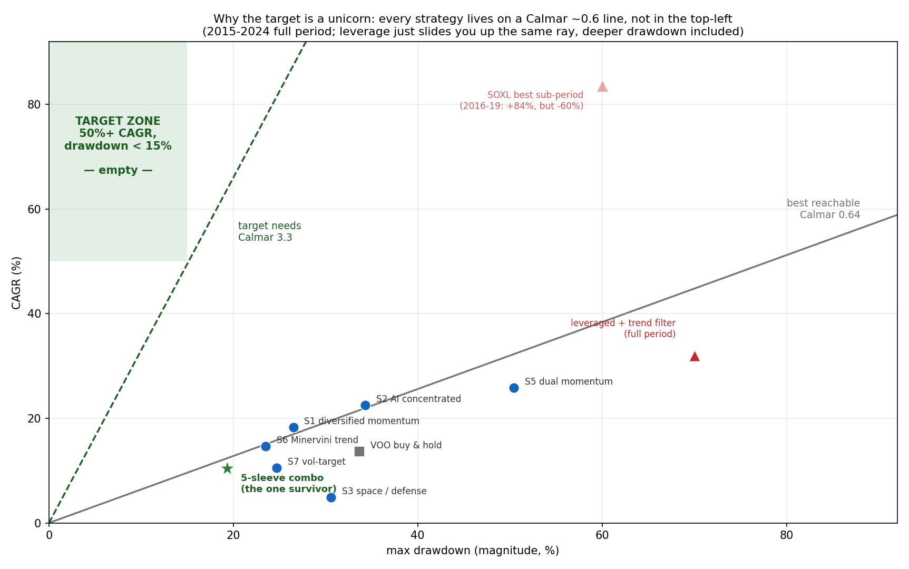
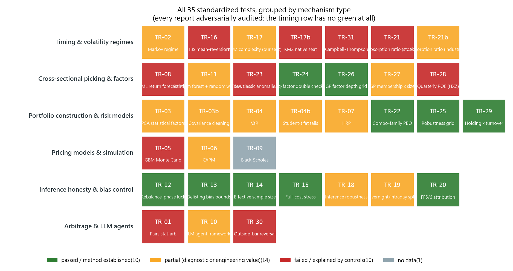
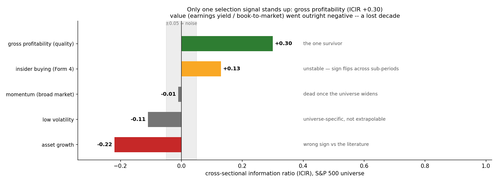
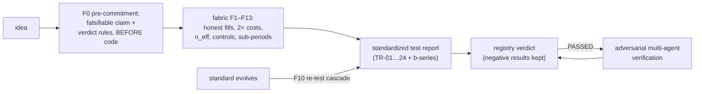
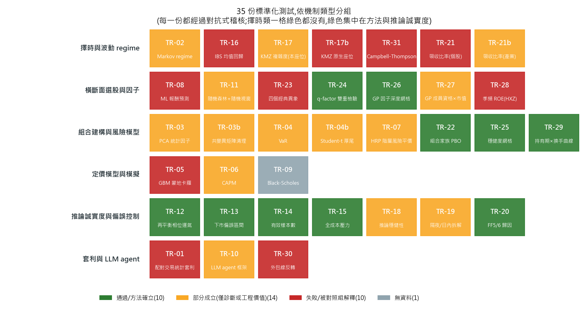
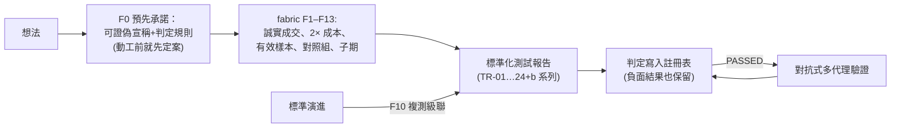

# trading-analysis

**A side project that set out to find a money-printing trading strategy — and instead built a machine for honestly killing bad ones.**

*(English first; 繁體中文在下半部。)*

---

## English

### What this is

A personal research project. It started with a finding we couldn't ignore: **McLean & Pontiff (2016, *Journal of Finance*)** re-tested 97 published return predictors and found their returns average **26% lower out-of-sample and 58% lower after publication** — the market eats published edges. So the question became: *of everything floating around the internet, papers, and guru books, how much survives an honest test run today?* Using $0/month of free data (yfinance, SEC EDGAR, public archives), across 100+ commits and **~150 mechanisms/strategies tested (35 standardized test reports, every one adversarially audited)**, the answer turned out to be more valuable than the question — because it turned *"what do we know, what don't we know, and how do we decide what's feasible"* into reproducible code and documents.

### The bottom line (as of 2026-07)

| the question | the answer |
|---|---|
| Any strategy that prints money? | **No.** The 50%-CAGR-at-low-drawdown target zone is structurally empty — everything we tested sits on the same Calmar ≈ 0.6 ray. |
| Any real alpha at all? | **One, borderline.** The 5-sleeve risk-parity book: monthly Carhart t=2.64, below the strict 3.0 bar. Its real deliverable is half of VOO's drawdown, levered to your budget. |
| Any stock-picking signal? | **One, and it keeps getting more honest.** Gross profitability — headline ICIR +0.30, but masked to actual index members at each date it retains only 59% (ICIR +0.13, TR-27), and its IC turned negative in 2025-26 (on watch). Momentum, value, PEAD, insider, ML forecasters, and four classic anomalies all failed. |
| Does market timing work? | **No — five separate confirmations.** A dumb constant exposure matched or beat every gate we tested (Markov, IBS, absorption ratio on two seats, KMZ complexity). |
| Then what's the asset here? | **The method and the data moat.** 35 adversarially audited test reports, a registry where negative results are first-class, five documented self-corrections, and a $0 data stack with two collect-forward pipelines recording what money can't buy retroactively. |

### What we built

1. **An acceptance framework ("fabric" v2.0, [docs/17](docs/17-fabric-acceptance.md))** — a single rule table F0–F13 codifying every mistake we made: pre-committed falsifiable claims (F0), leak-free signals + fill-time conventions (F1), spread-scaled costs with mandatory 2× stress (F2), excess-over-T-bill Sharpe (F3), effective sample sizes (F4), campaign-wide trial accounting with a t≥3.0 alpha bar (F5), **the Nagel control triple — which simplest control explains it?** (F6), sub-period + long-history replay (F7), verdicts scoped to seat×habitat (F8), path randomization (F9), re-test cascades (F10), universe legitimacy (F11), rebalance-phase averaging (F12), and delisting rules (F13). Its economic preamble is **Grossman-Stiglitz**: at $0 information cost, equilibrium alpha is $0 — every re-open condition must be priced as an information cost.
2. **Thirty-five standardized test reports** ([docs/tests/TR-01..24 + b-series](docs/tests/)): statistical arbitrage, Markov regime-switching, PCA factor models, covariance cleaning, VaR and fat tails, GBM Monte Carlo, CAPM, HRP, ML forecasting, Black-Scholes (N/A — no data, refused to fabricate), LLM agent frameworks, bagged backtesting, rebalance-phase luck, delisting bias, effective samples, cost stress, the IBS full trial — plus a paper-driven wave: inference robustness (TR-18), overnight/intraday decomposition (TR-19), FF5/6 and q-factor attribution (TR-20/24), four classic anomalies (TR-23), combo PBO (TR-22), and **native-seat replications** of Kelly-Malamud-Zhou's *Virtue of Complexity* (TR-17b) and the absorption ratio (TR-21b). Every report was adversarially audited; the audits reversed our own headline more than once.
3. **Working infrastructure**: point-in-time data layer (DuckDB+Parquet; EDGAR aligned to filing dates; 1993+ index history; PIT S&P 500 membership 1996–2026), order-independent backtest engine, rigor modules (PSR/DSR/PBO/SPA), daily Telegram monitors on free GitHub Actions, two **collect-forward pipelines** (daily SPY/QQQ option chains; weekly analyst estimates for the S&P 500 — you cannot download the past, only record the present), a 70-source **data-source catalog** with adopt/reject verdicts ([docs/refs/data-sources.md](docs/refs/data-sources.md)), and a **paper-to-TR pipeline** ([docs/21](docs/21-paper-to-tr-pipeline.md)).

### Results at a glance

*(Figures regenerate with `uv run python scripts/readme_figures.py` and `scripts/readme_figs.py`; the IBS chart is TR-16's own exhibit.)*



**Why the target is a unicorn (start here).** This one plot frames everything after it. Every strategy we tested — sector rules, the flagship combo, even leveraged ETFs — sits on the same Calmar ≈ 0.6 ray. The top-left "target zone" (50%+ CAGR at under 15% drawdown, i.e. Calmar ≈ 3.3) is *structurally empty*, not merely unexplored. Leverage does not move you toward it; it slides you up the same ray with proportionally deeper drawdown. The reachable frontier is ~5× short of the target — a wall, not a tuning problem.


**The scoreboard.** 226 named variants registered, 26 mechanism families judged, 5 PASSED — and exactly **one** statistically significant alpha. Most of what the internet calls "a working strategy" died in this funnel; keeping the failed strategies on record is half this repo's value.



**The verdict map (updated 2026-07).** All 35 standardized tests, grouped by *what kind of mechanism* each one judges. Read it by row: the timing/regime row has no green at all; the green lives almost entirely in the inference-honesty row — method, not signals. The 2026-07 additions are the two native-seat replications: KMZ's Virtue of Complexity **replicates on its home turf (Sharpe +0.41 at 12,000 features) and is still fully explained by volatility-timing controls (+0.50)** — Nagel's critique confirmed at the source (TR-17b); the absorption ratio's crash-warning spike **weakly survives on industry portfolios (7/10 vs 33% base rate) while its timing gate lost to a static constant for the fifth time** (TR-21b).


**Success #1 — the one survivor.** The 5-sleeve risk-parity combo (tech momentum / defensive rotation / trend-gated TQQQ / gold / bonds) vs VOO: comparable terminal wealth at roughly **half the drawdown** (−19% vs −34%), and a **real, robustly-positive Carhart alpha** (stationary-bootstrap P(α≤0)=0.001). Honest caveat (TR-18): the daily-frequency **t=3.38** headline is a Dimson lagged-beta artifact — at the frequency-appropriate **monthly** clock the alpha is **t=2.64 (OLS) / 2.95 (HAC), below the Harvey-Liu-Zhu 3.0 bar**. So: a genuine alpha, but *borderline* on the strict hurdle, not a clean pass. Its edge is risk-shaping, not return-maxing: lever it to your drawdown budget (`scripts/defensive_overlay.py`). Depth-tested (TR-25): the conclusion survives ±20-25% weight tilts (210 variants, alpha-t all ≥2.0), weekly/monthly/quarterly rebalancing (Sharpe spread 0.02), and 1,000 bootstrap paths (99.8% shallower drawdown than VOO) — and the whole plateau stays below t=3.0, so "borderline" is structural, not a weight artifact.

| annual return | 2016 | 2017 | 2018 | 2019 | 2020 | 2021 | 2022 | 2023 | 2024 | 2025 | 2026* |
|---|---|---|---|---|---|---|---|---|---|---|---|
| **combo** | +17.1% | +21.1% | **+0.8%** | +15.0% | **+26.4%** | +3.0% | **−16.6%** | +25.4% | +20.2% | **+27.9%** | +15.3% |
| VOO | +12.2% | +21.8% | −4.5% | +31.4% | +18.3% | +28.8% | −18.2% | +26.3% | +25.0% | +17.8% | +10.0% |

*\*2026 = YTD. 2015 omitted (126-day risk-parity warm-up). Cost drag 12–72 bps/yr (TR-15). Read the table honestly: the combo does **not** beat VOO every year — it wins by losing less (2018, 2020, 2022, 2025) and by never being the book that has to recover from −34%.*


**Success #2 — mixing beats picking.** Pick the best of 52 technical rules on 2015–20 and it collapses out-of-sample (holdout Sharpe **0.63**); let all 52 vote and set exposure to the vote fraction, and it holds (**0.99**, MDD −16% vs B&H −35%). The ensemble's win is selection-robustness and drawdown — by construction, long/flat rules on one asset cannot beat buy-and-hold's CAGR.


**Most surprising failure — our own verdict, reversed.** IBS mean-reversion was the *only* technical rule out of 59 to survive randomized-window testing… until TR-16 asked one question: *when do you actually get filled?* Filled at the very close the signal is computed from (orange), it beats everything since 1999; filled honestly at the next close (green), the entire edge drops below buy-and-hold — and a static 38% exposure matches it. Every fast-turnover backtest now has to pass this fill-time sensitivity check (fabric F1).


**Most famous failure — the celebrated regime model vs a constant.** A walk-forward Markov regime-switching gate genuinely identifies volatility regimes and halves QQQ's max drawdown — the classic pitch. But a **constant 57% exposure** (no model, zero trades) delivers the same drawdown with a *higher* excess Sharpe (Cederburg control, TR-02b). Every "smart timing" claim in this repo now has to beat its own dumb constant first (fabric F6).

### Where we were wrong, and how we caught it

| what we measured | first reading | post-audit reading | what was wrong |
|---|---|---|---|
| Flagship alpha t-stat (TR-18) | 3.38 (daily) | **2.64 (monthly)** | Daily returns understate market beta (Dimson lag), so factor return was booked as alpha; monthly is the honest clock. |
| IBS mean-reversion excess Sharpe (TR-16) | +0.63 (same-close fills) | **+0.44 (next-close fills)** | Filling at the very close the signal is computed from uses future information; filled honestly, it loses to buy-and-hold (+0.45). |
| q-factor shrink of flagship alpha (TR-24) | −30% (mixed windows) | **−2% (same window)** | Numerator and denominator covered different periods; on a shared window the verdict flipped to robust. |
| KMZ complexity Sharpe at P=12,000 (TR-17b) | +0.01 (unfaithful replication) | **+0.41 (faithful replication)** | In-window z-scoring degenerated the kernel — a construction-induced false negative. The faithful result is real and still dominated by the +0.50 volatility controls. |
| Absorption-ratio spike hit rate (TR-21→21b) | 4/10 (stock universe) | **7/10 (industry portfolios)** | The mechanism was tested outside its native habitat; at home the diagnostic half-recovered while the timing gate still lost to a constant. |

Every row is a number we first published to ourselves and later had to correct — not because the market changed, but because the first measurement was built wrong (wrong clock, wrong fill, mismatched windows, an unfaithful replication, the wrong habitat). Three habits did the catching: **pre-committed verdict rules** written before any code (F0), **an adversarial audit after every single report** (it has found a real issue every time), and **control triples** that ask which dumb baseline already explains the result. The corrected reading always became the verdict of record; the original stays in the report as a documented mistake.

### What we now KNOW (reproducible evidence)

- **Selection alpha barely exists in free daily data.** Broad momentum is dead; value has been lost for a decade; PEAD/insider/operating factors failed; ML forecasters score OOS IC≈0 (the shuffled control beat the real model); even the KMZ complexity recipe is dominated by a simple 1/σ² volatility dial in our seat. The one robust cross-sectional signal: **gross profitability** (ICIR +0.30). Depth-tested (TR-26): it is a slow factor (ICIR rises monotonically from 0.10 at 21d to 0.41 at 252d holding), its gross long-short is only ~1%/yr (a signal, not a standalone strategy), and the current negative-IC stretch (rolling −0.05) is about half as deep as the 2022 record trough (−0.11), which recovered within a year. One more honesty pass (TR-27): masked to names actually in the index on each date, the IC keeps only 59% of its headline — a current-member panel books the pre-inclusion runup of future joiners as factor skill; both market-cap halves stay positive.



*One green bar stands alone. Of every cross-sectional factor we ran on the broad universe, only gross profitability clears the noise band; value went outright negative. This is why the repo leans on risk-shaping, not stock-picking.*

- **Timing to cash almost always subtracts, and clever risk models rarely beat a constant.** Every cash gate lost to buy-and-hold; the Markov gate's "MDD halving" was fully reproduced by a static 57% exposure; the last surviving technical rule (IBS) died once fills were honest — its edge was trading the very close the signal was computed from.
- **The deliverable value is all in risk-shaping.** The 5-sleeve risk-parity combo is the one survivor: a **real, robustly-positive Carhart alpha** (bootstrap P(α≤0)=0.001), phase-immune (30bps timing-luck band), 2025 out-of-sample +27.9% with −5.7% MDD vs VOO's −18.7%. But it's **borderline, not a clean pass**: TR-18 found the daily **t=3.38** was a Dimson lagged-beta artifact; at the frequency-appropriate monthly clock it's **t=2.64 (OLS) / 2.95 (HAC), below the Harvey-Liu-Zhu 3.0 bar** — reverting to the original 2.64. Campaign-wide Bonferroni remains open too. The deliverable is the drawdown-halving, not a factor-model-beating alpha.
- **Point estimates lie.** Quarterly momentum's rebalance-phase luck spans 1,753 bps/yr; a zoo table-topper beat equal-weight in only 23% of randomized windows; 59 technical variants collapse to ~1.8 effective independent bets.
- **Most "it works" demos = beta + hindsight lists + ignored costs + generous fills.** Survivorship inflation on our universe: an honest interval of [+1.26%, +2.02%]/yr.

### What we know we DON'T know

Options and intraday dimensions (no point-in-time free data — TR-09 is an honest N/A); long-bear/rate-shock regimes (2015–2026 only had V-shaped crashes; long-history replays cover some of it); unauditable track records (copying a famous account's calls at next-day close showed **no timing edge over random entries into the same names** — the universe intel is the value).

### How we decide feasible vs. not



This loop caught **30+ genuine illusions** in our own work — including reversing our own earlier verdicts twice. Current verdicts live in the [strategy registry (docs/18)](docs/18-strategy-registry.md); each mechanism's native habitat and re-open price in the [taxonomy (docs/19)](docs/19-mechanism-taxonomy.md).

### Decision record

| | |
|---|---|
| **Why** | At $0 information cost, equilibrium alpha is $0 (Grossman-Stiglitz). So the honest deliverable of a free-data project is *risk-shaping plus a kill-machine for bad strategies*, not a money printer. |
| **What** | One levered risk-parity book (the only surviving alpha, borderline), one quality factor (gross profitability), a verdict registry where negative results are first-class, and collect-forward pipelines that buy future data dimensions with calendar time. |
| **How** | F0 pre-commitment before code → fabric F1–F13 → standardized report → adversarial audit → registry. Timing claims must beat a constant (5 confirmations of the timing iron law); re-tests must first verify the replication machinery is faithful (TR-17b's false negative). |
| **Scope** | US equities/ETF, daily-and-slower, retail capital, free or <$5/mo data; Taiwan market as V2. |
| **Out of scope** | Intraday execution, options market-making, anything requiring paid real-time feeds, uncapped pay-per-use services (e.g. BigQuery), copying unauditable track records. |

Evidence for every cell: [registry (docs/18)](docs/18-strategy-registry.md) · [TR reports](docs/tests/) · [trial accounting](docs/trial-registry.md) · [data due diligence (docs/24)](docs/24-data-gaps-and-sources.md).

The formulas we lean on hardest, and what each one caught:

| formula | role | what it caught here |
|---|---|---|
| $n_{eff} = \frac{k \cdot n}{1+(k-1)\bar{\rho}}$ | effective samples / trials (F4, F5) | 59 zoo variants ≈ **1.8** independent bets |
| Sharpe on $r - r_{Tbill}$, Lo (2002) adj. | honest Sharpe when cash pays 4–5% (F3) | every absolute Sharpe was inflated 0.04–0.11 |
| $t_{\alpha} \geq 3.0$ (Harvey-Liu-Zhu) | the alpha bar after field-wide multiple testing (F5) | the combo's daily t=3.38 was a frequency artifact; monthly t=2.64–2.95 sits *below* the bar (TR-18) |
| Nagel triple: $w \propto 1/\sigma^2$, static, random-entry | "which dumb control explains it?" (F6) | killed the Markov gate, IBS, and all 18 KMZ variants |
| $E[\alpha] \leq$ information cost (Grossman-Stiglitz) | the economic prior for a $0 project (F0) | every re-open condition now carries a price tag |

### The data foundation (2026-07)

We ran due diligence on **70 data sources across 7 categories** (all pricing verified on-site) and adopted **40 / rejected 30** — the full table with roles, rejection reasons, and cost estimates is in [docs/refs/data-sources.md](docs/refs/data-sources.md) §0. The working stack, all $0: **Alpaca** (2016+ SIP minute bars), **ThetaData free tier** (the only free options open-interest history, 2023-06+), **OptionsDX + DoltHub** (options chains 2010–present), **Ken French 49 industries** (1926+, already wired into TR-21b), **Goyal-Welch** (macro predictors 1871+, wired into TR-17b), **FRED/ALFRED** (the stack's only true point-in-time macro), **SEC EDGAR** (filings, 8-K events, 13F), **Tiingo** (delisted-stock prices), **fja05680/sp500** (PIT index membership 1996–2026, self-tested against the 2008 removal cohort), and **FinMind** (Taiwan, V2). Two things money can't buy at this budget stay honestly locked: pre-2023 options open interest and IBES-grade estimate-revision history — which is why the snapshot pipelines started today.

### Directions still worth pursuing

1. **Productize risk-shaping** — the combo + leverage dial + monitors are daily-usable; LLM layer as analyst/auditor (never as signal source).
2. **Data-dimension expansion** — the only path to new alpha (Grossman-Stiglitz: pay the information cost): intraday, options chains (snapshotting live since 2026-07), analyst revisions (weekly snapshots live).
3. **The paper-to-TR pipeline** — weekly paper scout → triage digest → user-picked deep reads → TRs → registry feedback.
4. **Annual rituals** — re-run the OOS year-check, trade audit, and gates every January.

### Quickstart

```bash
uv sync --extra dev
uv run trading-analysis ingest --config configs/mvp.yaml   # ingest daily bars
uv run python scripts/validate_recommendation.py           # flagship combo, full rigor gates
uv run python scripts/tests/tr15_combo_cost.py             # cost-stressed flagship (t=3.38/3.14)
uv run python scripts/tests/tr17_virtue_complexity.py      # Virtue-of-Complexity replication
uv run python scripts/readme_figures.py                    # regenerate the README gallery
```

Architecture: UI (Streamlit) → CLI (Typer) → `trading_analysis.api` (only public surface) → core (data / models / strategy / backtest / portfolio / regime / factors / ml). Docs entry point: [docs/00-executive-summary.md](docs/00-executive-summary.md).

**License**: Apache-2.0 ([LICENSE](LICENSE)). Reference repos (design inspiration only, no code copied): Kronos, TradingAgents, ai-hedge-fund, OpenBB.

> **Disclaimer**: research/education only, not financial advice. Every backtest carries assumptions and limits; half this repo's value is writing those limits down.

---

## 繁體中文

### 專案概述

一個個人研究的 side project。起點是一篇沒辦法當作沒看到的論文：**McLean 與 Pontiff(2016，《Journal of Finance》)**重測了 97 個已發表的報酬預測訊號，發現這些訊號的報酬平均在**樣本外低了 26%、論文發表之後低了 58%**——公開發表的優勢，會被市場逐步吃掉。所以真正的問題變成：「網路上、論文裡、大師書裡的那些策略，經過誠實的測試、放到今天，還剩下多少？」我們用每月 0 元的免費資料(yfinance、SEC EDGAR、公開檔案庫)，歷經 100 多次 commit、**約 150 個機制/策略的系統性測試(35 份標準化測試報告，每一份都經過對抗式稽核)**，得到的答案比問題本身更有價值，因為它把「什麼是已知、什麼是未知、如何判斷可不可行」變成了可重現的程式與文件。

### 結果總結(截至 2026-07)

| 問題 | 答案 |
|---|---|
| 有會印鈔的策略嗎？ | **沒有。**「50% CAGR＋低回撤」的目標區在結構上就是空的——我們測過的所有東西都落在同一條 Calmar ≈ 0.6 的射線上。 |
| 有真的 alpha 嗎？ | **有一個，而且只是邊際。**五 sleeve 風險平價組合：月頻 Carhart t=2.64，低於嚴格門檻 3.0。它真正的價值是回撤只有 VOO 的一半，可依回撤預算加槓桿。 |
| 有選股訊號嗎？ | **有一個，而且愈測愈誠實。**毛利/資產品質因子——頭條 ICIR +0.30，但遮罩到「當天真的在指數裡」的名字後只保留 59%(ICIR +0.13，TR-27)，且 2025–26 的 IC 轉負(列入觀察)。動能、價值、PEAD、內部人、機器學習預測、四大經典異象全數陣亡。 |
| 擇時有用嗎？ | **沒有——五次獨立確認。**一個恆定部位就能追平或打敗我們測過的每一個閘門(Markov、IBS、吸收比率兩個座位、KMZ 複雜度)。 |
| 那這個專案的資產是什麼？ | **方法本身，加上資料護城河。**35 份經對抗式稽核的測試報告、一份把負面結果當一等公民的註冊表、五次白紙黑字的自我修正，以及 $0 的資料堆疊與兩條「現在不錄、以後買不到」的前向收集管線。 |

### 建置內容

1. **一套驗收標準(fabric v2.0，[docs/17](docs/17-fabric-acceptance.md))**：單一規則表 F0–F13，把每一次踩過的坑逐條寫成明文規則：動工前先定案的可證偽宣稱(F0)、無洩漏訊號與成交時點慣例(F1)、以買賣價差縮放的成本加上強制 2× 壓力測試(F2)、扣除國庫券利率後的超額 Sharpe(F3)、有效樣本數(F4)、全 campaign 試驗數記帳與 alpha 門檻 t≥3.0(F5)、**Nagel 三重對照：「哪一個最簡單的對照組就能解釋它？」**(F6)、子期穩定與長歷史重放(F7)、判定效力=適用市場×適用情境(F8)、路徑隨機化(F9)、複測級聯(F10)、標的池合法性(F11)、再平衡相位平均(F12)、下市規則(F13)。經濟學前提是 **Grossman-Stiglitz**：資訊成本 0 元，均衡下的 alpha 就是 0 元；每個翻案條件都必須計為一筆資訊成本。
2. **35 份標準化測試報告**([docs/tests/TR-01..24 + b 系列](docs/tests/))：統計套利、Markov 狀態轉換、PCA 因子模型、共變異清理、VaR 與厚尾、GBM 蒙地卡羅、CAPM、HRP、機器學習預測、Black-Scholes(N/A：沒有資料就不硬湊數字)、LLM agent 框架、bagged 回測、再平衡相位運氣、下市偏誤、有效樣本、成本壓力、IBS 完整檢驗，加上一整波由經典論文驅動的重測：推論穩健性(TR-18)、隔夜/日內拆解(TR-19)、FF5/6 與 q-factor 歸因(TR-20/24)、四個經典異象(TR-23)、組合 PBO(TR-22)，以及把 KMZ《複雜度的美德》(TR-17b)與吸收比率(TR-21b)搬回**論文原生棲地**的重測。每一份報告都經過對抗式稽核，而且稽核不只一次推翻了我們自己的頭條讀數。
3. **已建置的基礎設施**：point-in-time 資料層(DuckDB+Parquet；EDGAR 以申報日對齊；指數歷史回溯 1993；S&P 500 成分股 PIT 面板 1996–2026)、order-independent 回測引擎、嚴謹度模組(PSR/DSR/PBO/SPA)、每日 Telegram 監控(跑在免費的 GitHub Actions 上)、兩條**前向收集管線**(每日 SPY/QQQ 選擇權鏈快照；每週 S&P 500 分析師預估快照。過去買不到，只能從今天開始記錄)、一份含採用/不採用判定的 **70 個資料源目錄**([docs/refs/data-sources.md](docs/refs/data-sources.md))，以及**論文到 TR 管線**([docs/21](docs/21-paper-to-tr-pipeline.md))。

### 成果一覽

*(所有圖表可用 `uv run python scripts/readme_figures.py` 與 `scripts/readme_figs.py` 重新產生；IBS 那張直接取自 TR-16 的原始證物。)*


**為什麼那個目標並不存在(請先看這張)。** 這張圖是後面所有結果的前提。我們測過的每個策略，包括產業規則、主力組合、甚至槓桿 ETF，全都落在同一條 Calmar ≈ 0.6 的射線上。左上角的「目標區」(50%+ CAGR、回撤低於 15%，也就是 Calmar ≈ 3.3)在結構上就是空的，不是還沒被找到。槓桿並不會把你推向那裡，只會讓你沿同一條射線往上滑，回撤也按同樣比例加深。可達的前緣離目標還差約 5 倍：這是一道牆，不是調整參數就能解決的問題。


**計分板。** 226 個具名變體登記在案、26 類機制接受檢驗、5 個 PASSED，而統計顯著的 alpha 恰好只有 **1 個**。網路上大多數所謂「有效的策略」都死在這個漏斗裡；把這些失敗的策略完整記錄下來，正是這個 repo 一半的價值。



**判定全景(2026-07 更新)。** 35 份標準化測試，依照「它在檢驗哪一種機制」分組。用橫列來讀：擇時與 regime 那一列一格綠色都沒有；綠色幾乎全部集中在「推論誠實度」那一列——通過的是方法，不是訊號。2026-07 新增的兩份原生棲地重測值得單獨說：KMZ 的複雜度美德**回到論文自己的棲地確實複現(12,000 個特徵時 Sharpe +0.41)，但仍然被波動擇時對照組(+0.50)完整蓋過**，Nagel 的批評在源頭獲得確認(TR-17b)；吸收比率的崩盤預警尖峰**在產業組合上弱存活(10 次大跌命中 7 次，基準率 33%)，它的擇時閘門則第五次輸給一個恆定部位**(TR-21b)。


**成功案例一：唯一的倖存者。** 五個 sleeve 的風險平價(risk parity，依各資產波動度的倒數分配權重)組合(科技動能/防禦輪動/趨勢濾網 TQQQ/黃金/債券)對上 VOO：終點財富相近，但**回撤約砍半**(−19% vs −34%)，且有一個**真實、穩健為正的 Carhart alpha**(定態拔靴 P(α≤0)=0.001)。誠實但書(TR-18)：日頻的 **t=3.38** 是 Dimson lagged-beta 假象，在頻率對應的**月頻**下 alpha 是 **t=2.64(OLS)/2.95(HAC)，低於 Harvey-Liu-Zhu 的 3.0 門檻**。所以：是真 alpha，但對嚴格門檻只是**邊際**，不算乾淨過關。它的優勢是風險塑形而非報酬極大化：依你的回撤預算上槓桿(`scripts/defensive_overlay.py`)。深度檢驗(TR-25)：權重 ±20-25%(210 個變體，alpha-t 全數 ≥2.0)、週/月/季再平衡(Sharpe 差距 0.02)、1,000 條拔靴路徑(99.8% 回撤淺於 VOO)都不改結論——而且整個高原都低於 t=3.0，「邊際」是結構性質，不是權重挑出來的。

| 年度報酬 | 2016 | 2017 | 2018 | 2019 | 2020 | 2021 | 2022 | 2023 | 2024 | 2025 | 2026* |
|---|---|---|---|---|---|---|---|---|---|---|---|
| **組合** | +17.1% | +21.1% | **+0.8%** | +15.0% | **+26.4%** | +3.0% | **−16.6%** | +25.4% | +20.2% | **+27.9%** | +15.3% |
| VOO | +12.2% | +21.8% | −4.5% | +31.4% | +18.3% | +28.8% | −18.2% | +26.3% | +25.0% | +17.8% | +10.0% |

*\*2026 為年初至今。2015 略去(風險平價需 126 天暖身)。成本拖累 12–72 bps/年(TR-15)。平心而論：組合**不是**每年都贏 VOO，而是贏在跌得少(2018、2020、2022、2025)，以及永遠不必從 −34% 的坑裡爬出來。*


**成功案例二：混合勝過挑選。** 在 2015–20 挑出 52 條技術規則中最好的那條，樣本外直接崩盤(holdout Sharpe **0.63**)；讓 52 條全部投票、部位=看多票數比例，則穩住(**0.99**，回撤 −16% vs 買進持有 −35%)。混合贏的是「選擇穩健性」與回撤控制。就數學而言，單一資產的多/空手規則混合，不可能贏過買進持有的年化報酬。


**最意外的失敗：我們親手推翻了自己先前的判定。** IBS 均值回歸是 59 條技術規則裡*唯一*通過隨機視窗測試的……直到 TR-16 問了一個問題：*你實際上是在哪一根 K 棒成交的？* 用「剛算完訊號的那根收盤價」成交(橘線)，它從 1999 年起就勝過其他所有規則；誠實地用次日收盤成交(綠線)，整個優勢掉到買進持有之下，一個恆定 38% 部位就能打平它。從此所有快速換手的回測都必須通過成交時點敏感度檢查(fabric F1)。


**最知名的失敗：備受推崇的 regime 模型，對上一個常數。** walk-forward 的 Markov 狀態轉換閘門確實辨識得出波動狀態，也確實把 QQQ 的最大回撤砍半，堪稱經典的賣點。但一個**恆定 57% 部位**(沒有模型、零交易)給出同樣的回撤、*更高*的超額 Sharpe(Cederburg 對照，TR-02b)。從此 repo 裡每一個「聰明擇時」的宣稱，都得先贏過自己那個最陽春的常數基準(fabric F6)。

### 我們哪裡想錯了，又是怎麼抓到的

| 我們在量什麼 | 第一次讀數 | 稽核後讀數 | 錯在哪裡 |
|---|---|---|---|
| 主力組合 alpha 的 t 值(TR-18) | 3.38(日頻) | **2.64(月頻)** | 日頻報酬會低估市場 beta(Dimson 落後效應)，把因子報酬記成了 alpha；月頻才是誠實的時鐘。 |
| IBS 均值回歸的超額 Sharpe(TR-16) | +0.63(當根收盤成交) | **+0.44(次日收盤成交)** | 用「剛算完訊號的那根收盤價」成交，等於用到未來資訊；誠實成交後輸給買進持有(+0.45)。 |
| q-factor 使主力組合 alpha 縮水(TR-24) | −30%(不同時間窗) | **−2%(同一時間窗)** | 比較的分子與分母覆蓋的期間不同；放到同一個窗之後，判定翻轉為穩健。 |
| KMZ 複雜度在 12,000 特徵時的 Sharpe(TR-17b) | +0.01(實作偏離原論文) | **+0.41(實作對齊原論文)** | 視窗內 z-score 讓核函數退化，造成假陰性；對齊後結果為真，但仍被 +0.50 的波動對照組蓋過。 |
| 吸收比率尖峰的命中率(TR-21→21b) | 4/10(個股樣本) | **7/10(產業組合)** | 機制被放在論文原生棲地之外測試；搬回去之後診斷恢復一半，擇時閘門仍輸給恆定部位。 |

表中每一列，都是一個我們自己先發表、後來又不得不修正的數字。錯的原因不是市場變了，而是第一次的量法本身就有問題：用錯了時鐘(日頻 vs 月頻)、用錯了成交假設、比較時分子分母不同窗、重現論文時實作偏離原始做法、或是把機制放錯了棲地。抓到它們靠的是三個習慣：**動工前就寫死判定規則**(F0，事後不准改球門)、**每一份報告之後都做一次對抗式稽核**(到目前為止每一次都真的抓到問題)，以及**對照組三件套**(先問「哪個最笨的基準就能解釋這個結果？」)。修正後的讀數一律成為正式判定；原始的錯誤讀數留在報告裡，標明是一次被記錄下來的失誤。

### 已確認的結論(可重現的證據)

- **免費日線資料上幾乎不存在選股 alpha。** 動能因子在整體市場層級已經失效、價值因子已經連續十年拿不出表現、PEAD、內部人與營運面因子也都沒通過；機器學習預測器的樣本外 IC≈0(打亂標籤的對照組甚至贏過真模型)；連 KMZ 的複雜度配方，以我們的條件來看也被一個依波動度反比(1/σ²)調整部位的簡單規則支配。唯一站得住的橫斷面訊號：**毛利/資產品質因子**(ICIR +0.30)。深度檢驗(TR-26)：它是慢因子(ICIR 隨持有期從 21 天的 0.10 單調升到 252 天的 0.41)、毛多空只有約 1%/年(是訊號，不是獨立策略)；目前的負 IC 段(滾動 −0.05)深度約是 2022 年歷史谷底(−0.11)的一半，而那一次在一年內復原。再多一層誠實檢驗(TR-27)：遮罩到「當天真的在指數裡」的名字後，IC 只保留頭條值的 59%——現任成分股面板把未來入選者入選前的上漲段記成了因子能力；大小市值兩半則都維持正值。


*圖中只有一根綠色長條明顯高出雜訊帶。我們在涵蓋廣泛標的的樣本上測過的每一個橫斷面因子裡，只有毛利品質過得了關；價值因子直接翻負。這正是本專案倚重風險塑形、而非選股的原因。*

- **擇時轉現金幾乎一定扣分，聰明的風險模型很少贏過一個常數。** 每一個現金開關都輸給買進持有；Markov 模型引以為傲的「回撤砍半」，用恆定 57% 部位就能完整複製；最後一條存活的技術規則(IBS)在誠實成交假設下就失效了：它的優勢來自「用剛算完訊號的那根收盤價成交」的假象。
- **可交付的價值全在風險塑形。** 五個 sleeve 的風險平價組合是唯一的倖存者：一個**真實、穩健為正的 Carhart alpha**(拔靴 P(α≤0)=0.001)、相位免疫(timing-luck 區間僅 30bps)、2025 樣本外 +27.9%、最大回撤 −5.7%(同期 VOO −18.7%)。但它是**邊際、不是乾淨過關**：TR-18 發現日頻 **t=3.38** 是 Dimson lagged-beta 假象，在頻率對應的月頻下是 **t=2.64(OLS)/2.95(HAC)，低於 Harvey-Liu-Zhu 的 3.0 門檻**，退回原始的 2.64；全 campaign 的 Bonferroni 也仍未過關。真正的交付是「回撤砍半」，不是一個打贏因子模型的 alpha。
- **單點估計靠不住。** 季度動能的再平衡相位運氣高達 1,753 bps/年；zoo 榜首在隨機視窗下只有 23% 的機率贏過等權；59 個技術變體實際上只等於約 1.8 個獨立的賭注。
- **網路上大多數「有效」的展示 = beta + 事後清單 + 忽略成本 + 過度寬鬆的成交假設。** 我們這個標的池的倖存者偏誤會灌高報酬：誠實區間 [+1.26%, +2.02%]/年。

### 已知的未知

選擇權與盤中維度(沒有 point-in-time 的免費資料，TR-09 因此誠實地標為 N/A)；長空頭/利率衝擊的市場情境(2015–2026 只有 V 型崩跌，長歷史重放補了一部分)；無法稽核的他人績效(以次日收盤跟單名人喊單，**對同一批股票的隨機進場沒有任何擇時優勢**：真正有價值的是他挑選的那批標的，而不是進場時點)。

### 可行性判斷流程



這個迴圈在我們自己的工作裡抓出 **30 多個貨真價實的假象**，其中兩次還推翻了我們自己先前的判定。現行判定以[策略總註冊表(docs/18)](docs/18-strategy-registry.md)為單一事實來源；各機制的原生棲地與翻案價碼則見[機制分類學(docs/19)](docs/19-mechanism-taxonomy.md)。

### 決策記錄

| | |
|---|---|
| **為什麼(Why)** | Grossman-Stiglitz：資訊成本 0 元，均衡下的 alpha 就是 0 元。所以一個免費資料專案誠實的產出，是「風險塑形+一台淘汰爛策略的機器」，不是印鈔機。 |
| **做什麼(What)** | 一個可加槓桿的風險平價組合(唯一倖存、且只是邊際的 alpha)、一個品質因子(毛利/資產)、一份把負面結果當一等公民的判定註冊表，以及用日曆時間換未來資料維度的前向收集管線。 |
| **怎麼做(How)** | F0 預先承諾 → fabric F1–F13 → 標準化報告 → 對抗式稽核 → 寫入註冊表。擇時宣稱必須先贏過一個常數(鐵律至今確認 5 次)；重測論文前，必須先確認自己的實作與原論文的做法一致(TR-17b 的假陰性教訓)。 |
| **範圍(Scope)** | 美股/ETF、日頻與更慢、散戶資金規模、免費或每月 5 美元以內的資料；台股列為 V2。 |
| **不做(Out of scope)** | 盤中執行、選擇權造市(market making，需要機構等級的報價基礎設施)、任何需要付費即時行情的東西、無上限計量計費的服務(例如 BigQuery)、跟單無法稽核的績效紀錄。 |

每一格的證據：[註冊表(docs/18)](docs/18-strategy-registry.md) · [TR 報告](docs/tests/) · [試驗數記帳](docs/trial-registry.md) · [資料盡職調查(docs/24)](docs/24-data-gaps-and-sources.md)。

我們最倚重的幾條公式，以及它們各自抓到了什麼：

| 公式 | 角色 | 在本專案抓到的東西 |
|---|---|---|
| $n_{eff} = \frac{k \cdot n}{1+(k-1)\bar{\rho}}$ | 有效樣本/有效試驗數(F4、F5) | zoo 的 59 個變體 ≈ **1.8** 個獨立賭注 |
| Sharpe 算在 $r - r_{Tbill}$ 上+Lo(2002)校正 | 現金有 4–5% 利息時的誠實 Sharpe(F3) | 所有絕對 Sharpe 都被高估 0.04–0.11 |
| $t_{\alpha} \geq 3.0$(Harvey-Liu-Zhu) | 全領域多重測試後的 alpha 門檻(F5) | 主力組合日頻 t=3.38 是頻率假象；月頻 t=2.64–2.95 其實**低於**門檻(TR-18) |
| Nagel 三重對照：$w \propto 1/\sigma^2$、靜態部位、隨機進場 | 「哪一個最簡單的對照組就能解釋它？」(F6) | 否決了 Markov 閘門、IBS，以及 KMZ 全部 18 個變體 |
| $E[\alpha] \leq$ 資訊成本(Grossman-Stiglitz) | 0 元專案的經濟學先驗(F0) | 每個翻案條件從此都標上價格 |

### 採用的資料來源(2026-07)

我們對 **7 大類、70 個資料源**做了逐一盡職調查(定價與額度全部當天站上驗證)，**採用 40 個、不採用 30 個**；完整的角色、不採用原因與費用推估，見 [docs/refs/data-sources.md](docs/refs/data-sources.md) 的 §0 總覽表。目前實際在用的來源全部 0 元：**Alpaca**(2016 起的 SIP 分鐘線)、**ThetaData 免費層**(唯一免費的選擇權未平倉歷史，2023-06 起)、**OptionsDX + DoltHub**(選擇權鏈 2010 至今)、**Ken French 49 產業**(1926 起，已接進 TR-21b)、**Goyal-Welch**(總經預測變數 1871 起，已接進 TR-17b)、**FRED/ALFRED**(整套組合裡唯一真 point-in-time 的總經資料)、**SEC EDGAR**(申報、8-K 事件、13F)、**Tiingo**(下市股票價格)、**fja05680/sp500**(指數成分 PIT 面板 1996–2026，已用 2008 年移除名單逐一驗證)、**FinMind**(台股，V2)。有兩樣東西在這個預算下誠實地買不到：2023 年以前的選擇權未平倉，以及 IBES 等級的預估修正歷史。這正是兩條快照管線今天就要開始跑的原因。

### 後續發展方向

1. **風險塑形產品化**：組合、槓桿調節與監控已可日常使用；LLM 層當分析師/稽核員(絕不當訊號源)。
2. **資料維度擴張**：唯一可能解鎖新 alpha 的路(G-S 紀律：先付資訊成本)，包含盤中資料、選擇權鏈(2026-07 起每日快照已上線)、分析師預估修正(每週快照已上線)。
3. **論文到 TR 管線**：每週論文偵察 → 分類摘要 → 你點名深讀 → TR → 註冊表回饋。
4. **年度例行檢查**：每年一月重跑樣本外年度檢查、交易稽核與嚴謹度閘門。

### 快速上手

```bash
uv sync --extra dev
uv run trading-analysis ingest --config configs/mvp.yaml   # 匯入日線資料
uv run python scripts/validate_recommendation.py           # 主力組合(完整嚴謹閘門)
uv run python scripts/tests/tr15_combo_cost.py             # 成本壓力後的主力組合(t=3.38/3.14)
uv run python scripts/tests/tr17_virtue_complexity.py      # 複雜度的美德重現
uv run python scripts/readme_figures.py                    # 重新產生 README 成果圖
```

架構：UI(Streamlit)→ CLI(Typer)→ `trading_analysis.api`(唯一公開介面)→ 核心函式庫(data / models / strategy / backtest / portfolio / regime / factors / ml)。文件入口：[docs/00-executive-summary.md](docs/00-executive-summary.md)。

**授權**：Apache-2.0([LICENSE](LICENSE))。參考 repo(僅設計參考，未複製程式碼)：Kronos、TradingAgents、ai-hedge-fund、OpenBB。

> **免責聲明**：僅供研究與教育用途，不構成投資建議。所有回測都有其假設與限制；把這些限制白紙黑字寫下來，正是這個 repo 一半的價值。
