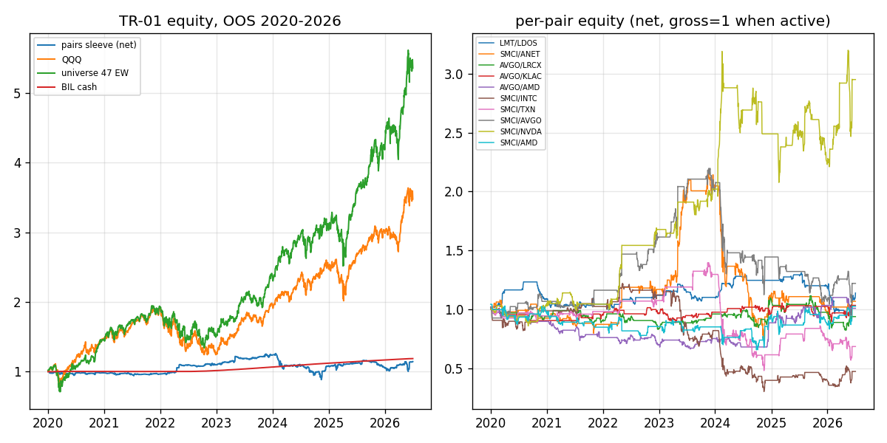
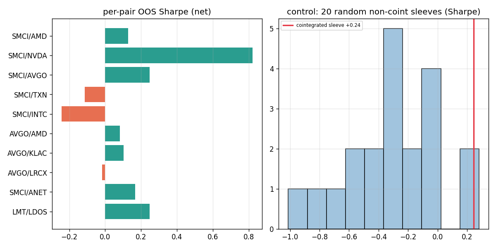

# TR-01 統計套利：共整合配對交易（Engle-Granger）

> 腳本：`scripts/tests/tr01_stat_arb_pairs.py`｜圖：`docs/tests/img/tr01_*.png`｜2026-07-07

## 1. 機制定義與理論

配對交易假設同產業兩檔股票的對數價格存在共整合關係：`log P1 = a + b*log P2 + e`，殘差 e 為定態均值回歸序列。當 spread z-score 偏離超過門檻時做多被低估腿、做空被高估腿（美元中性），等回歸至均值時平倉。理論來源：Gatev-Goetzmann-Rouwenhorst 2006（RFS，*Pairs Trading: Performance of a Relative-Value Arbitrage Rule*，1962-2002 約 +11% 年化超額）；工程參考 github.com/bradleyboyuyang/Statistical-Arbitrage（Engle-Granger 兩階段檢定）。核心假設：①共整合關係在訓練期外持續 ②spread 偏離是暫時性錯價而非結構斷裂 ③回歸速度快於成本侵蝕。

## 2. 相關既有機制

- **Kalman 動態 hedge ratio 配對**（docs/13 §5，`scripts/kalman_pairs.py`）：6 組經典跨產業配對，Sharpe **−0.50**，corr to combo **+0.01**（真市場中性但賠錢），加入組合反而使 alpha t 2.66→1.79。本 TR 是其「正版共整合選對 + 訓練/交易分離」補測。
- **均值回歸家族**：seasonality（docs/13，邊際）、regime-rotation（證偽）。docs/13 §7 鐵律：「不相關不夠，必須不相關∧有利可圖」。

## 3. 預期目標

GGR 2006 原始宣稱：市場中性、約 **+11% 年化超額報酬**（1962-2002）。已知文獻（Do & Faff 2010/2012）顯示 post-2002 衰退、post-2010 淨成本後趨近 0。本測目標：在本 repo 宇宙上量測衰退到底剩多少，並驗證共整合篩選是否優於隨機配對。

## 4. 測試設計

- **宇宙**：`sector_strategies.SECTORS` 47 檔，只配同產業對（AI_semis/software_AI/space_defense/robotics）。
- **訓練 2015-2019**：log adj_close 上 Engle-Granger 檢定（兩方向取較小 p），共測 **247 對（494 次檢定）**；p<0.05 有 **31 對**（5% 假陽性期望 ~12 對）；取 p 值最小前 10 對。
- **OOS 交易 2020-01-02 → 2026-07-02（1,633 日）**：rolling 252d OLS hedge ratio（窗嚴格止於 t−1）、spread z-score(60)；|z|>2 進場（美元中性 0.5/0.5 兩腿）、|z|<0.5 出場、|z|>4 硬停損（視為結構斷裂，鎖住至 |z|<0.5）；部位 shift(1)；**個股 10bps/腿**計於兩腿換手。
- **樣本（F4）**：10 對 × 1,633 日 = **16,330 pair-days**，橫跨 6.5 個日曆年（訓練+OOS 合計 11.5 年）✅。
- **控制組（F6）**：訓練期 p>0.5 的 67 對「明確不共整合」池，抽 20 組 × 10 對，跑完全相同引擎。
- **基準（F3）**：QQQ、VOO、同宇宙 47 檔等權 buy&hold、BIL（現金）。

## 5. 結果

| 系列（OOS 2020-2026） | 年化報酬 | Sharpe | MDD |
|---|---|---|---|
| **配對 sleeve（淨 10bps/腿）** | **+1.96%** | **+0.24** | **−29.71%** |
| QQQ buy&hold | +20.90% | +0.89 | −35.12% |
| VOO buy&hold | +15.40% | +0.81 | −33.99% |
| 同宇宙 47 檔等權 B&H | +29.18% | +1.09 | −34.81% |
| 現金（BIL） | +2.70% | +10.43 | −0.21% |
| 控制組（20 組隨機非共整合）均值 | −1.51% | −0.30 [−1.01, +0.28] | — |

每對明細（訓練 p 值 → OOS）：LMT/LDOS(.0079)+1.9%/+0.25；SMCI/ANET(.0098)+1.0%/+0.17；AVGO/LRCX(.0101)−1.0%/−0.02；AVGO/KLAC(.0111)+0.5%/+0.10；AVGO/AMD(.0123)+0.1%/+0.08；SMCI/INTC(.0128)**−11.1%/−0.24（MDD −75%）**；SMCI/TXN(.0198)−5.9%/−0.11；SMCI/AVGO(.0211)+2.8%/+0.25；**SMCI/NVDA(.0246)+18.2%/+0.82**；SMCI/AMD(.0255)−0.3%/+0.13。每對 22-31 筆交易、持倉 30-44% 時間；sleeve 年化換手 **8.30x**、平均倉位部署 41.1%、**對 QQQ 日報酬 corr −0.041（真市場中性）**。

子期：IS 2016H2-2019（選樣偏誤期）年化 −2.28%/Sharpe −0.29；OOS 2020-2022 +2.94%/+0.49；OOS 2023-2026 +1.11%/+0.15。

## 6. 判定: FAILED

- F1 無洩漏 ✅：hedge ratio 窗止於 t−1、z 訊號當日收盤決定、部位 shift(1)、選對只用 2015-2019。
- F2 淨成本 ✅：10bps/腿計於兩腿換手；年化換手 8.30x 已報告。
- F3 可投資基準 ✅：QQQ/VOO/同宇宙 EW/BIL 全列；sleeve 輸 QQQ 18.9pp/年，**連 BIL 現金（+2.70%）都輸**。
- F4 樣本量 ✅：16,330 pair-days、6.5 年 OOS（含訓練 11.5 年）。
- F5 多重測試 ⚠️已誠實揭露：494 次 EG 檢定、31 對過 5% 門檻 vs 假陽性期望 ~12——過半「顯著」對可能是雜訊；交易參數（2/0.5/4/60/252）為任務規格預定、未調參。
- F6 控制組 ✅：共整合 sleeve（+0.24）優於 90% 隨機非共整合抽組（均值 −0.30）——**篩選機制本身有微弱訊號**，但絕對報酬不及格。
- F7 子期 ⚠️：IS −0.29 vs OOS +0.24 **符號翻轉**（訓練期共整合 p 值對獲利無預測力）；OOS 內部 +0.49→+0.15 同號但衰減。
- F8：原始宣稱（~+11% 年化超額、可獲利市場中性套利）未達成——淨報酬低於現金、MDD −29.7%，判 **FAILED**（市場中性屬實但無風控增值，docs/13 已證明「不相關但不賺錢」的 sleeve 加入組合反而拖累）。

## 7. 衰退評估

GGR 2006 宣稱 +11% 年化超額 → 本測 OOS +1.96%，且低於同期現金 BIL +2.70%，**對現金超額為 −0.7%/年：衰退 >100%，與 Do & Faff（2010）「post-2010 淨成本後歸零」文獻完全一致**。相對 Kalman 版（Sharpe −0.50）改善了 0.74 個 Sharpe——共整合選對+訓練/交易分離確實比任意經典配對好——但方向仍是死路。

## 8. 失敗/侷限歸因

1. **套利擁擠衰退**：GGR 發表後 20 年，日線級 pairs 錯價被 HFT/統計套利基金吃光；剩餘 spread 波動不足以覆蓋 10bps/腿 × 8.3x 換手（~17bps/年成本僅是小頭，主因是毛訊號本身太弱）。
2. **共整合 ≠ 未來獲利**：IS 期 Sharpe −0.29 vs OOS +0.24 符號翻轉，p 值排序對 OOS 獲利無排序力。
3. **選對集中度風險**：10 對中 9 對 AI_semis、6 對含 SMCI——單一高波動名字主導；SMCI 2024 會計醜聞（審計辭任）造成 SMCI/INTC 對 MDD −75%，z>4 停損只能部分止血。訓練期共整合最強的對，往往正是後來結構斷裂最猛的對（Type-II 結構風險）。
4. 多重測試：31/247 顯著 vs 期望 12——即使選中的對，約半數可能從頭就是假陽性。

## 9. 可組合性

- **不建議入組合**：corr −0.04 雖是全 repo 最乾淨的市場中性 sleeve，但 docs/13 §5 已示範同型（Kalman pairs corr +0.01）加入 risk-parity 組合使 alpha t 2.66→1.79——「不相關∧不賺錢」= 拖累。本 sleeve +0.24 雖優於彼 −0.50，仍低於現金，結論不變。
- 唯一殘值：①z-score 結構斷裂偵測（|z|>4）可反向用作**個股異常警報**（SMCI 醜聞前 spread 先爆）餵給 Serenity/監控管線；②共整合篩選引擎可重用於 TR-03 統計因子殘差或未來期現套利。
- 若真要救活：需日內資料（ORB 級）+ 更寬宇宙（跨 ETF/ADR）+ 動態對池輪換——全部超出本 repo 資料維度（docs/11 結論不變）。
