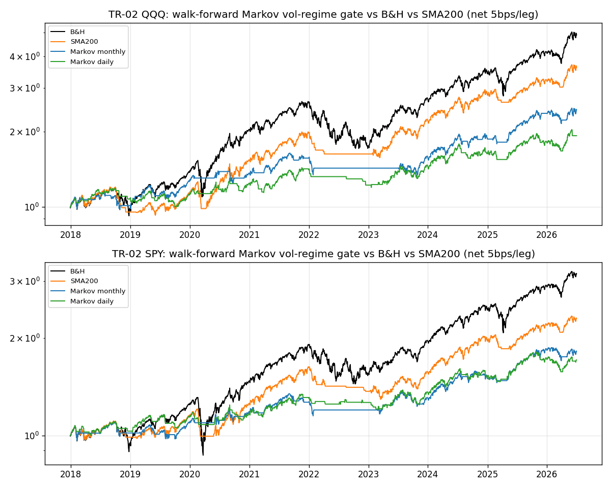
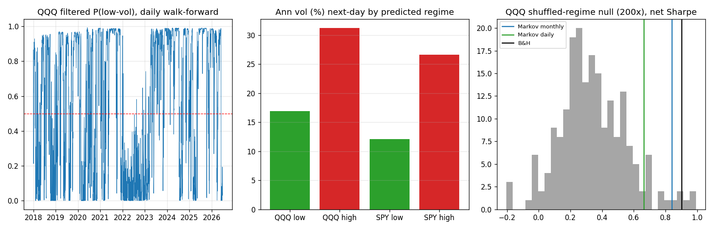

# TR-02 Markov Regime-Switching(Hamilton 1989)波動 regime 擇時 — PARTIAL

## 1. 機制定義與理論
Hamilton (1989, Econometrica)「A New Approach to the Economic Analysis of Nonstationary Time Series and the Business Cycle」:時間序列由一個不可觀測的離散 Markov 鏈驅動,在不同 regime 間切換參數;用 Hamilton filter 遞迴推算 P(regime|資料至 t)。本測試採 2-regime **switching-variance** 版(均值各自估、變異數切換),對日報酬建模——理論上市場存在「低波動(牛)/高波動(熊)」兩態,波動聚集(vol clustering)是最強的樣式化事實之一。交易化假設:P(低波)>0.5 時持有指數、否則持現金(0%),能避開高波熊市段。實作:statsmodels `MarkovRegression(k_regimes=2, switching_variance=True)`。

## 2. 相關既有機制
- docs/12 §1:HMM/Markov 列為「中優先、未測」——本 TR 補上該格。同表 Kalman 趨勢 gate 實測 Sharpe 0.87 輸 SMA200 的 0.99(「快≠好」)。
- docs/14 規則手冊:**禁用 SPY 200SMA 全現金擇時**(錯過 V 反彈的元兇)——本 TR 檢驗「更聰明的 gate」是否豁免此鐵律。
- docs/10 §4g:regime-rotation 被 16-agent 對抗式 review 證偽(防禦機制本身是最大虧損來源)。

## 3. 預期目標
原始文獻脈絡(Hamilton 1989 於 GNP;Hardy 2001、Kritzman-Page-Turkington 2012 於股市)宣稱:regime-aware 配置可**顯著降低 drawdown 並提升風險調整報酬**(文獻常見宣稱 Sharpe 提升 0.2-0.4,主要來自避開 2000-02、2008 長熊)。本 repo 先驗(鐵律):gate 到現金省下的小於錯過的,預期 regime 統計上真實、交易上無 alpha。

## 4. 測試設計
- **標的/期間**:QQQ + SPY(SPY 即 S&P 500 投資級 benchmark,VOO 等價),adj_close,2015-01-02 → 2026-07-02,各 2891 bars。
- **Walk-forward(F1)**:每月底以 expanding window(最少 750 bars)重估;訊號=最後一根 in-sample bar 的 **FILTERED**(非 smoothed)P(低波)。兩變體:(A) monthly——月底機率持有整月;(B) daily——凍結上次月估參數、每日跑 Hamilton filter(filtered prob 在 t 只用 ≤t 的資料,無洩漏)。倉位一律 shift(1)。103 次重估/資產、0 次收斂失敗。
- **成本(F2)**:5bps/leg 收於 turnover;年化 turnover 見結果表。
- **樣本(F4)**:OOS 2017-12-29 → 2026-07-01,2136 bars × 2 資產 = **4272 樣本(bars×assets)**,跨 8.5 年 ≥5 年。
- **控制(F6)**:200 次隨機 permute daily 倉位序列(同曝險比例、隨機時點)的 net Sharpe 分布。
- **變體數(F5)**:2 訊號頻率 × 2 資產 = 4;門檻固定 0.5 未調參。

## 5. 結果
| 策略(net 5bps/leg) | 年化報酬 | Sharpe | MDD | 年化 turnover(legs) |
|---|---|---|---|---|
| QQQ B&H | +20.57% | 0.90 | -35.12% | 0.0 |
| QQQ SMA200 | +16.36% | 0.95 | -22.88% | 4.8 |
| **QQQ Markov monthly** | **+11.19%** | **0.84** | **-18.92%** | 4.5 |
| QQQ Markov daily | +8.06% | 0.66 | -16.67% | 26.4 |
| SPY B&H | +14.55% | 0.80 | -33.72% | 0.0 |
| SPY SMA200 | +10.34% | 0.85 | -20.68% | 6.0 |
| SPY Markov monthly | +7.34% | 0.74 | -14.61% | 4.5 |
| SPY Markov daily | +6.54% | 0.72 | -13.07% | 22.2 |

**Regime 辨識品質(預測性,t 標籤 → t+1 實現報酬)**:QQQ 低波態年化波動 16.9% vs 高波態 31.2%(比 1.84);SPY 12.1% vs 26.6%(比 2.19);低波態占比 58.6%/60.6%。中位參數變異 0.598/4.509(QQQ)、0.310/3.103(SPY)——**regime 是真的**。
**Shuffle 控制**:QQQ null Sharpe 平均 0.34、p95 0.70(monthly 0.84 = 第 97 百分位;daily 第 92);SPY 平均 0.26、p95 0.66(兩者第 98)。訊號含真資訊——只用 ~59% 曝險就拿到接近 B&H 的 Sharpe——但**仍輸給投資級 benchmark**。

## 6. 判定:**PARTIAL**(真實統計結構+風控價值,無交易 alpha)
- F1 ✅ 每月 expanding-window 重估、FILTERED 機率、shift(1)、daily 變體用凍結參數的 filter。
- F2 ✅ 5bps/leg 收於 turnover,年化 turnover 已列(monthly 僅 4.5 legs/yr)。
- F3 ✅ 同標的 B&H + QQQ + SPY(S&P500)+ SMA200 競品;非 vs 零。
- F4 ✅ 4272 OOS bars×assets,跨 2017-12 → 2026-07(8.5 年)。
- F5 ✅ 4 變體(2 頻率 × 2 資產)、門檻 0.5 固定;null bar = shuffle p95(0.66-0.70),monthly Sharpe 過 null 但輸 B&H → 不主張 alpha。
- F6 ✅ 200 次 shuffle 控制已跑,結果如上。
- F7 ✅ 無正負號翻轉,兩半段策略皆正但皆輸 B&H:QQQ Mkv-m 2018-19 ann +12.64%/Sharpe 0.86 vs B&H +17.44%/0.91;2020-26 +10.75%/0.83 vs +21.55%/0.91。SPY 同型(僅 SPY Mkv-d 2018-19 Sharpe 0.83 險勝 B&H 0.81,雜訊級)。
- F8 ✅ 原始宣稱「regime 擇時提升風險調整報酬」**未達成**(Sharpe 全面 ≤ B&H,也輸 SMA200);但 regime 辨識真實、MDD 近乎砍半 → PARTIAL。

## 7. 衰退評估
文獻宣稱的 Sharpe 提升(+0.2~0.4)來自 2000-02 與 2008 那種**長熊**——filter 有幾個月時間慢慢確認 regime 並待在場外。2018-2026 的三次崩跌(2018Q4、2020-03、2025 春)全是 V 型:filter 在暴跌**後**才轉高波態(退出在低點附近)、又在反彈**後**才轉回(錯過回升)。結果擇時溢價完全衰退成負值:QQQ Sharpe 0.84 vs B&H 0.90(-0.06),年化報酬 -9.4pp。**存活下來的只有風控宣稱**:MDD -35.12% → -18.92%(QQQ)、-33.72% → -14.61%(SPY),與 Hardy/Kritzman 的 drawdown-reduction 主張一致。

## 8. 失敗/侷限歸因
1. **鐵律再次驗證**:gate 到現金省下的 < 錯過的——與 SMA200 全現金擇時(docs/14 禁用)、Kalman gate(docs/12)、regime-rotation(docs/10 §4g)同一失敗模式,現在連「統計上最原則性的」Hamilton filter 也不豁免。
2. **波動預測 ≠ 報酬預測**:regime 辨識力貨真價實(次日波動比 1.84-2.19x),但高波態的**均值**並沒有負到足以覆蓋錯過的反彈+成本。
3. filtered 機率天生滯後(這是誠實的代價;smoothed 會好看但洩漏)。daily 變體換到更快的反應,卻付出 26.4 legs/yr 的 whipsaw,Sharpe 反而更差(0.66)——與 Kalman「快≠好」同結論。
4. 訓練窗含 2015-16 才起測(min 750 bars),OOS 恰好全落在 V 反彈時代;若含 2008 結論可能不同,但那不是可交易的現在。

## 9. 可組合性
- **當波動預測器,不當現金 gate**:P(高波) 可餵給五維出場的 V(波動)維度(docs/16 / 8c53b17 的 5-dim exit votes),或做**連續 vol-targeting 倉位縮放**(scale ∝ P(低波))取代 0/1 切換——保留 MDD 減半的價值、避免全現金的鐵律稅。
- **給高 beta sleeve 當風險 overlay**:MDD -35% → -19% 對 AI_semis/space 這類 45%+ 波動 sleeve 的心理可持有性有實值;預期效果是 Calmar 改善、CAGR 讓步。
- **不建議**:與 SMA200 疊加成雙 gate(兩個滯後濾波器相乘只會更晚進場)。
