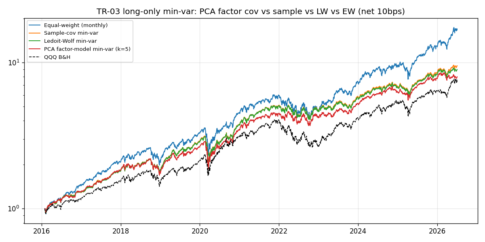
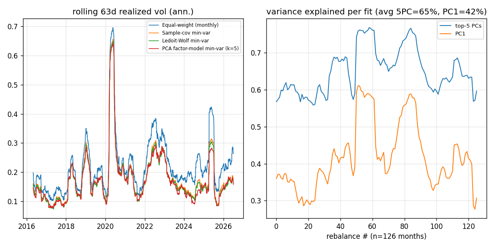

# TR-03 統計因子模型（log 報酬 PCA）用於投資組合建構

> 腳本：`scripts/tests/tr03_pca_factor.py`（2026-07-07 執行）；圖：`img/tr03_equity.png`、`img/tr03_diag.png`

## 1. 機制定義與理論

- **來源**：Connor & Korajczyk (1986, 1988) 統計因子模型（asymptotic PCA / APT）；近期普及版為
  theaiquant（Medium）"Statistical Factor Models for Portfolio Construction"。
- **定義**：對 log 日報酬做 PCA，取前 k 個主成分當「統計因子」，共變異數以因子結構重建：
  `Sigma = B F B' + D`，其中 B = 前 k 個特徵向量、F = 對應特徵值（因子變異）、D = 殘差（特異）
  變異對角陣。以 Sigma 解 min-variance，比原始樣本共變異數少估 ~1000 個自由參數。
- **假設**：報酬由少數共同因子驅動；特異風險互不相關（D 對角）；因子結構月頻穩定。
- **本測設定**：k=5、trailing 252d、月頻 walk-forward；long-only min-var（負權重截零、再正規化、
  單檔上限 10%）。

## 2. 相關既有機制

- `src/trading_analysis/portfolio/covariance.py`：Ledoit-Wolf 收縮為全庫強制標準（docs/03 §O5，
  Michaud「估計誤差最大化器」論證）——本測的直接對照組。
- docs/04 §C3/R1：LW identity-target 的缺陷審查與 min-var 退化資產風險——本測沿用其教訓
  （壓 D 下限 1e-8、僅用完整 252d 視窗的名字）。
- docs/12 §PCA/統計因子：survey 中列為「風險模型有用、非 alpha 來源」；Avellaneda-Lee PCA
  stat-arb 列為高周轉待測。

## 3. 預期目標

原始理論主張：(1) 少數因子即可解釋大部分共變異；(2) 因子結構共變異數比樣本共變異數條件更好，
min-var 的**已實現波動**應 因子模型 ≈ LW < 樣本 < EW；(3) 文獻（如 Clarke-de Silva-Thorley 2006）
稱 min-var 可比市值加權減波動 ~25-30% 且報酬不減。不預期產生 alpha。

## 4. 測試設計

- **宇宙**：47 檔（AI_semis/software_AI/space_defense/robotics，`scripts/sector_strategies.py`）；
  動態成分：需有完整 252d 視窗才納入（CRWD 2019、SNOW/PLTR 2020 IPO，其餘 44 檔全程）。
- **期間**：面板 2015-01-02 → 2026-07-02；回測 2016-02-01 → 2026-07-02（2620 日、126 次月調整）。
- **成本**：個股 10bps/腿，按雙邊周轉收取（F2）；表中 turn = 年化雙邊周轉。
- **樣本數（F4）**：131,831 個非 NaN 日報酬觀測（bars x assets，47 檔 x 2890 日面板），>11 年。
- **對照**：(a) 等權月調整、(b) 樣本共變異數 min-var、(c) LW min-var、(d) QQQ buy&hold（F3）；
  **安慰劑（F6）**：PCA 權重每月隨機重排到不同股票（保留集中度、破壞共變異數資訊，seed=42）。
- **防洩漏（F1）**：估計視窗止於調整日收盤；權重自次日起持有一個月，月內權重隨價格漂移。

## 5. 結果

| 策略 | 年化報酬 | 已實現年化波動 | Sharpe | MDD | 年化周轉(雙邊) |
|---|---|---|---|---|---|
| 等權（月調整） | 31.10% | 24.16% | 1.24 | -35.12% | 0.86x |
| 樣本共變異數 min-var | 24.20% | 19.97% | 1.19 | -36.60% | 3.38x |
| Ledoit-Wolf min-var | 23.51% | 19.62% | 1.18 | -36.39% | 2.90x |
| **PCA 因子模型 min-var (k=5)** | **22.15%** | **19.31%** | **1.13** | **-35.24%** | **2.63x** |
| 安慰劑：重排 PCA 權重 | 29.99% | 24.99% | 1.18 | -34.76% | 15.98x |
| QQQ buy&hold | 21.15% | 22.23% | 0.98 | -35.12% | n/a |

- **因子性診斷**：126 次擬合平均，前 5 個 PC 解釋 **65.0%** 變異、PC1 獨佔 **41.8%**——
  這個科技宇宙基本上是一個大 beta 加少量產業結構（PC1 佔比 2020 後一度衝到 ~60%）。
- **波動排序符合預期**：PCA 19.31% < LW 19.62% < 樣本 19.97% < QQQ 22.23% < EW 24.16%；
  PCA 也是三者中周轉最低（2.63x，權重最穩定）。
- **安慰劑**：同集中度、隨機指派 → 波動 24.99% 回到 EW 水準，證明降波動來自共變異數結構
  而非權重集中度本身。

## 6. 判定: PARTIAL

- F1 無洩漏：估計窗止於調整日收盤、次日生效，全程 walk-forward。PASS
- F2 淨成本：個股 10bps/腿 x 雙邊周轉；年化周轉已列表。PASS
- F3 可投資基準：同宇宙等權 + QQQ B&H 皆列。PASS
- F4 樣本量：131,831 obs（bars x assets）、2015-2026 >11 年。PASS
- F5 多重檢定：僅試 3 種共變異數估計 x 1 種建構法，無挑選；且不主張 alpha。PASS
- F6 對照組：權重重排安慰劑使波動回到 EW 水準（24.99% vs 19.31%）。PASS
- F7 子期間：2016-2019 vs 2020-2026 波動 14.76%/21.60%（PCA 兩段皆最低），無方向翻轉；
  Sharpe 前段 min-var≈EW（1.75-1.87）、後段 EW 較高（1.06 vs 0.90）。PASS（無 sign flip）
- F8 結論：**如設計運作（降波動 20%、最平滑權重）但無 alpha**——Sharpe 1.13 < EW 1.24、
  報酬 22.15% < EW 31.10%、MDD 未改善。估計工程價值，非賺錢機制 → PARTIAL。

## 7. 衰退評估

- 「少數因子解釋大部分共變異」成立（5 PC = 65%），與 Connor-Korajczyk 對美股的原始發現一致，
  無衰退。
- 「因子共變異數 > 樣本共變異數」方向正確但幅度小：波動只差 0.66pt（19.31 vs 19.97）。原因：
  47 檔 x 252d 的樣本共變異數本就可逆且不算病態（N/T=0.19）；文獻的大幅改善出現在 N 接近或
  超過 T 的大宇宙。
- Clarke et al. 的「減波動 25-30% 且報酬不減」只兌現一半：對 EW 減波動 20%，但**報酬讓出
  9pt/年**——2016-2026 的科技宇宙中低波動股大幅跑輸，與原文獻的全市場宇宙不同。

## 8. 失敗/侷限歸因

1. **一個大 beta 的宇宙**：PC1=42%，long-only 無法對沖共同因子 → MDD（-35.24%）與 EW/QQQ
   幾乎相同，min-var 降的是日常波動、不是尾部。
2. **截零+上限的啟發式**非真 QP：負權重截零後解已非最適，三種估計器差距被壓縮。
3. 低波動傾斜在動能主導的宇宙有隱含負動能曝險，是報酬落後 EW 的主因（非成本：PCA 版
   雙邊周轉 2.63x，10bps/腿 約 26bps/年，遠小於 9pp 的報酬差）。

## 9. 可組合性

- **與動能選股疊加**（docs/07/13 的 sector momentum sleeves）：momentum 選 k 檔 → 用 PCA 因子
  共變異數做組內配權取代等權；預期降 sleeve 波動 2-4pt、報酬中性——最務實的落地點。
- **餵給 `portfolio/allocators.py`**：`pca_factor_cov` 可作為 `shrunk_covariance` 的第四個
  method，供 risk_parity / min_variance 通用（docs/04 §C3 的 constant-correlation 之外的替代）。
- **PC1 曝險做 regime 監控**：PC1 佔比時間序列（tr03_diag 右圖）在 2020、2022 壓力期跳升，
  可當免費的「共同因子擁擠度」指標餵給 docs/14 的風險開關。
- 不建議與 stat-arb（Avellaneda-Lee）直接組合：那是殘差均值回歸交易，與本測的風險模型用途
  不同層（可共用 PCA 擬合程式碼）。
