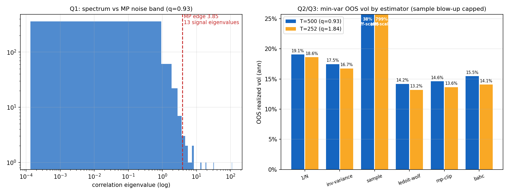

# TR-03b — 共變異清理競技場:MP 譜、特徵值 clipping、特徵向量端 BAHC

> docs/20 佇列最後一項(+docs/23 擴充)。腳本:`scripts/tests/tr03b_covariance_cleaning.py` ·
> 圖:`docs/tests/img/tr03b_cleaning.png` · 對抗稽核:一個 CONFIRMED-BUG(幽靈資產)已修,
> 一個判定(LW 勝 clip)被稽核推翻為平手,Q1 判詞 N 校準修正。

## 判定總覽

| 問題 | 判定 |
|---|---|
| Q1 MP 譜:幾個訊號特徵值? | **13/463(2.8%)**;47 檔子面板中位數 **4** → docs/20 的「~3-5」**在其校準 N 下成立**,訊號數隨 N 增長(與 Laloux 6/406、Plerou ~20/1000 一致) |
| Q2 特徵值端:clip vs LW | **同族平手**(幽靈股修正後 T=500 14.61% vs 14.20%,0.97 規則平手;bootstrap CI 跨 1)——docs/20 預測獲支持 |
| Q3 特徵向量端:BAHC | **PARTIAL** — 贏 naive/sample,但沒贏 LW;三個 lite 實作嫌疑全被反事實排除,輸是真輸(P=0.001) |
| 對角控制:共變異值得嗎? | **值得,限 vol 通道**:LW 13.20% < 0.97×inv-variance 16.75%(P<0.001);**淨報酬通道 inv-variance 反而全勝**(+15.2% 零槓桿零換手) |

**座位**:463 檔高覆蓋現任 S&P(幽靈股濾網後)、無約束全額投資 min-var、月頻 walk-forward、
T∈{500, 252}(q=0.93 / 1.84,後者 sample 奇異)。判準=OOS 實現年化波動(gross;成本經稽核
確認不翻 vol 排名)。

## 結果(幽靈股修正後)

| 估計器 | T=500 vol | T=252 vol | 槓桿 | 換手 |
|---|---|---|---|---|
| 1/N | 19.06% | 18.61% | 1.0 | 0 |
| inv-variance(對角控制) | 17.45% | 16.75% | 1.0 | 0.05 |
| sample | 37.74% | **爆炸 799%**(奇異) | 36→445 | — |
| **Ledoit-Wolf** | **14.20%** | **13.20%** | 8.7/6.6 | 3.1 |
| MP-clip | 14.61% | 13.64% | 5.0/4.4 | 1.0-1.4 |
| BAHC-lite | 15.46% | 14.08% | 4.3/4.2 | 1.1-1.4 |

## 對抗稽核的三個關鍵發現(已實作/採納)

1. **幽靈資產 CONFIRMED-BUG**:SW(97% 樣本期)與 AMCR(45%)是上市前平價回填——恆零報酬
   →相關≈0→被 min-var 家族當免費分散器(LW 平均押 6.3-6.7%、單窗最高 22.4%)。價格覆蓋濾網
   擋不住;已加「**窗口恰零報酬占比 >20% 即剔除**」濾網。剔除後「LW 勝 clip」翻平手——
   **原判定是幽靈股+變異數收縮美化的**(lw-corr 分解:LW 只清相關、配 sample vols 時與 clip
   打平 P=0.44)。
2. **BAHC 輸得真**:cophenetic 轉換偏差 ~0.003 可忽略、B=30 只改 0.2pp、single linkage 更糟
   (17.8%)——average linkage 已是慷慨選擇。結構性原因:塊狀均勻化的相關讓槓桿縮到 4.2
   (LW 6.6),壓 vol 火力天生較小。**注意 scope**:BAHC 的原生 headline 是 max-Sharpe/均值
   通道(5 個月資料 Sharpe 1.25),本 TR 只審 vol 通道;k>1 遞迴與均值通道留作翻案條件。
3. **「賺回門票」必須 vol-scoped**:淨報酬/風險比 inv-variance(0.90)壓過 LW(0.82),
   10bps 成本下 LW 拖累 3.6%/yr(換手 3.1)vs clip 1.6%。**操作結論:要壓波動用 LW(我們的
   全域慣例正確);要淨報酬,對角 inverse-variance 就夠——與 TR-07(HRP)同一族教訓。**

## 對既有判定的影響

- **LW 全域強制(O5 慣例)**:確認正確——在它的座位(大 N min-var 壓 vol)無可挑戰者。
- **docs/12「瓶頸是資料不是方法」**:再添一例——三種清理法(值端兩種+向量端一種)在 vol 通道
  擠在 13-15%,方法間差距 < 方法 vs naive 的差距。
- **翻案條件**:BAHC 的均值/max-Sharpe 通道測試(需誠實的期望報酬估計=另一個大坑)、k-BAHC
  完整遞迴、產業分類先驗的塊狀清理(GICS 面板,與 TR-21 翻案條件共用)。

*2026-07-09。docs/20 論文佇列至此全清(TR-17/18/19/20/21/22/03b/04b)。*
