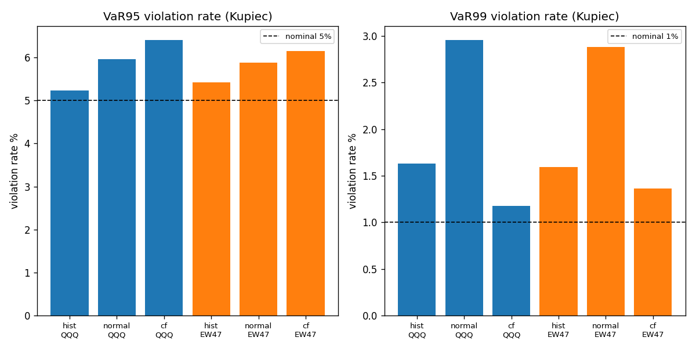
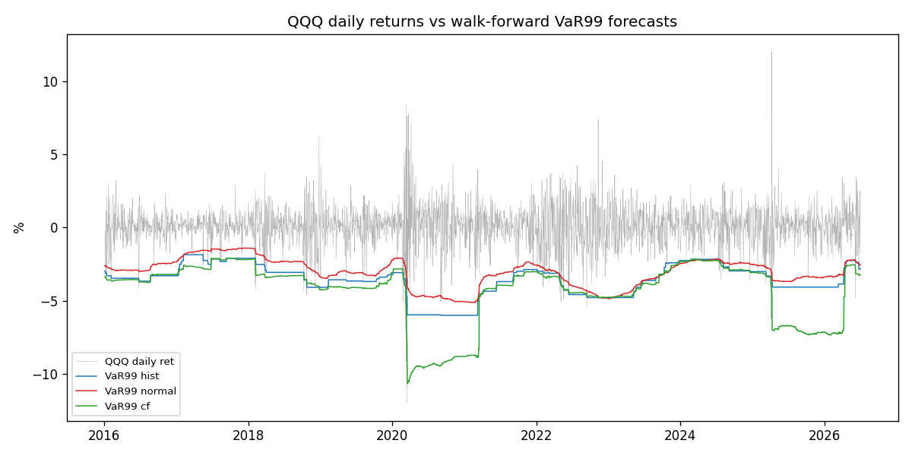
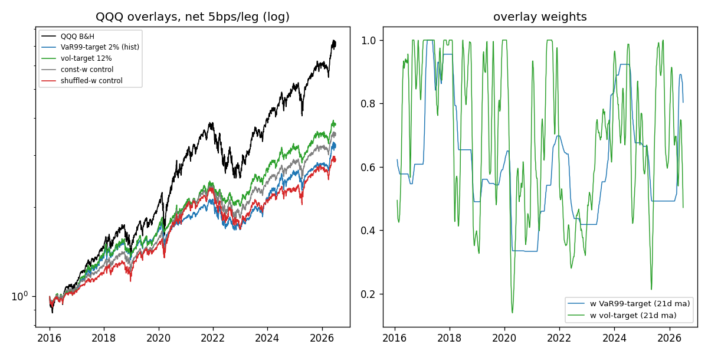

# TR-04:Value-at-Risk(量測品質 + VaR-targeting 部位控制)

## 1. 機制定義與理論

- **VaR(在險價值)**:1 日 α 分位損失門檻,P(r_t < VaR_α) = α。三種估計器,皆用**滯後 252 日視窗** walk-forward:
  1. **歷史模擬**:視窗報酬的第 α 百分位(無分布假設)。
  2. **參數常態**(RiskMetrics 1996):mu + sigma * z_α,假設報酬常態。
  3. **Cornish-Fisher**:以視窗偏態 S、超額峰態 K 修正 z(z_cf = z + (z^2-1)S/6 + (z^3-3z)K/24 - (2z^3-5z)S^2/36),半參數捕捉肥尾。
- **Kupiec (1995) POF 檢定**:違規數 x ~ Bin(T, α) 之 LR 檢定,LR ~ chi2(1),p>0.05 = 覆蓋率合格。
- **VaR-targeting**:部位 w_t = min(1, 2% / |VaR99_t|),使部位的預測 99% VaR ≤ 權益 2%。
- 出處:J.P. Morgan RiskMetrics Technical Document (1996);Kupiec (1995) JoD;github.com/ibaris/VaR。

## 2. 相關既有機制

- **12% vol-target sizing**:`scripts/factor_search.py`(VOL_TARGET=0.10)、`scripts/highvol_ruleset.py`(0.25);docs/17 已認定 vol-target 為 PARTIAL(風控價值、無 alpha)。本 TR 直接對戰。
- **GARCH/vol 預測建議**:docs/12(§GARCH 家族——「接到 vol-target sizing 改善回撤控制」)、CVaR 優化列為值得補。
- **防禦 overlay / regime gate**:`scripts/defensive_overlay.py`、docs/07 的 SPY 200SMA regime——同屬「降曝險減 MDD」家族。

## 3. 預期目標

原始理論宣稱:(a) RiskMetrics 常態 VaR 能準確量測日風險;(b) 歷史/CF 修正肥尾後覆蓋率更佳;(c) VaR-targeting 能把尾部損失控制在預算內。指派預期:常態在尾部 FAIL、歷史/CF 較準;VaR-target ~ vol-target(PARTIAL,誠實風控、無 alpha)。

## 4. 測試設計

- **宇宙/期間**:QQQ 與 EW-47(sector_strategies 47 檔等權日再平衡)日報酬,2015-01-02~2026-07-02;評估日 2016-01-05 起(首 252 日為視窗)= **2,638 個評估日,橫跨 10.5 個日曆年**(F4 ✓)。
- **樣本數**:Part A = 2,638 日 x 2 資產 x 3 估計器 = **15,828 個預測日**(99% 層;95%+99% 合計 31,656)≥3,000(F4 ✓)。
- **F1 無洩漏**:所有 rolling 統計量 `.shift(1)`;第 t 日預測只用 t-252~t-1。
- **F2 成本**:overlay 為 ETF,5bps/腿計於換手;年化換手見結果表。
- **F3 基準**:QQQ B&H + VOO B&H(VOO 庫內只到 2026-06-18,末 9 日補 0 報酬)。
- **F6 控制組**:(i) 常數權重 = VaR overlay 平均權重 0.61;(ii) 時間打亂權重(seed 42)。
- **F5**:共試 12 個覆蓋檢定(3 估計器 x 2 層 x 2 資產,全數列報無挑選)+ 3 個 overlay 變體(hist/CF VaR-target、12% vol-target);2%/12% 預算為事前固定,無參數搜索。
- 腳本:`scripts/tests/tr04_var.py`。

## 5. 結果

**Part A:Kupiec POF 覆蓋率(252 日 walk-forward)**

| 資產 | 層 | 估計器 | 違規率 | 名目 | LR | p 值 | 判定 | 2016-19 | 2020-26 |
|---|---|---|---|---|---|---|---|---|---|
| QQQ | 95% | hist | 5.23% | 5% | 0.29 | 0.589 | **PASS** | 4.98% | 5.39% |
| QQQ | 95% | normal | 5.95% | 5% | 4.75 | 0.029 | FAIL | 5.37% | 6.31% |
| QQQ | 95% | CF | 6.41% | 5% | 10.13 | 0.002 | FAIL | 4.88% | 7.35% |
| QQQ | 99% | hist | 1.63% | 1% | 8.89 | 0.003 | FAIL | 1.19% | 1.90% |
| QQQ | 99% | normal | 2.96% | 1% | 66.91 | 0.000 | FAIL | 2.99% | 2.94% |
| QQQ | 99% | CF | 1.18% | 1% | 0.77 | 0.379 | **PASS** | 0.70% | 1.47% |
| EW47 | 95% | hist | 5.42% | 5% | 0.96 | 0.328 | **PASS** | 5.07% | 5.63% |
| EW47 | 95% | normal | 5.88% | 5% | 4.04 | 0.044 | FAIL | 5.67% | 6.00% |
| EW47 | 95% | CF | 6.14% | 5% | 6.76 | 0.009 | FAIL | 4.98% | 6.86% |
| EW47 | 99% | hist | 1.59% | 1% | 7.92 | 0.005 | FAIL | 1.29% | 1.78% |
| EW47 | 99% | normal | 2.88% | 1% | 62.54 | 0.000 | FAIL | 3.28% | 2.63% |
| EW47 | 99% | CF | 1.36% | 1% | 3.18 | 0.075 | **PASS** | 1.19% | 1.47% |

**Part B:QQQ overlay(2016-01-05~2026-07-02,淨 5bps/腿)**

| 策略 | 年化報酬 | Sharpe | MDD | 年化波動 | 換手/年 | 平均權重 |
|---|---|---|---|---|---|---|
| QQQ B&H(基準) | 20.46% | 0.95 | -35.12% | 22.3% | 0.10 | 1.00 |
| VOO B&H(基準) | 15.27% | 0.89 | -33.99% | 17.9% | 0.10 | 1.00 |
| **VaR99-target 2% (hist)** | 11.72% | 0.94 | -21.36% | 12.6% | 0.48 | 0.61 |
| VaR99-target 2% (CF) | 9.70% | 0.87 | -20.59% | 11.4% | 0.68 | 0.55 |
| vol-target 12% | 13.58% | 1.08 | -17.83% | 12.5% | 4.76 | 0.70 |
| 常數權重控制組 (F6) | 12.71% | 0.95 | -22.41% | 13.6% | 0.06 | 0.61 |
| 打亂權重控制組 (F6) | 10.63% | 0.78 | -27.40% | 14.2% | 51.58 | 0.61 |

overlay 實現的日報酬 1% 分位 = **-2.39%**(預算 -2.00%;B&H 為 -3.92%)——預算大致守住但仍超支 0.39pp。

## 6. 判定:PARTIAL

- F1 ✓ 全部訊號 shift(1),252 日視窗嚴格用過去資料。
- F2 ✓ 5bps/腿;VaR-target 換手僅 0.48x/年(成本近零),vol-target 4.76x/年。
- F3 ✓ 對照 QQQ B&H 與 VOO B&H;overlay 年化報酬輸 QQQ B&H 8.7pp。
- F4 ✓ 15,828 預測日(2,638 日 x 2 資產 x 3 估計器),2016-2026 共 10.5 年。
- F5 ✓ 12 個覆蓋檢定全列報;overlay 3 變體、預算事前固定,無挑選。
- F6 ✓ 常數權重控制組 Sharpe 0.95 = VaR-target 0.94 → **VaR 擇時對 Sharpe 零貢獻**;打亂權重 0.78 → 擇時只贏「隨機時點」不贏「恆定曝險」。
- F7 ✓ 無正負號翻轉:overlay 兩子期 CAGR 皆正(13.48%/10.48%);normal 兩子期違規率皆 ~3x 名目;CF@95 在 2020-26 惡化(4.88%→7.35%)。
- F8:**PARTIAL** —— 量測部分如理論運作(Kupiec 準確揪出常態肥尾失準),overlay 如設計把 MDD 從 -35% 壓到 -21%,但無 alpha(Sharpe 0.94 ≤ B&H 0.95,且 = 常數權重控制組)。

## 7. 衰退評估

- **RiskMetrics 常態 VaR(1996 宣稱可用於日風險量測)**:在 2016-2026 科技股上 99% 層違規率 2.88-2.96%(名目 1% 的 ~3 倍),LR 62-67,p<10^-14 —— 原宣稱在肥尾市場**完全失效**,與文獻(Kupiec 之後 30 年共識)一致,非新衰退。
- **Kupiec 檢定本身**:零衰退,精準區分三估計器。
- **VaR-targeting**:原理論只承諾風險控制不承諾 alpha;實測 MDD -21.4% vs -35.1% 達標,1% 分位 -2.39% 輕微超支預算 -2.00%(視窗適應滯後),Sharpe 無增益 —— 與 vol-target 既有結論(docs/17)一致。

## 8. 失敗/侷限歸因

- **沒有單一估計器同時通過兩層**:hist 過 95% 敗 99%(252 日視窗只有 ~2.5 個 1% 尾部樣本,適應慢);CF 過 99% 敗 95%(高峰態下 CF 修正把 5% 分位往 0 推,肩部失真——Maillard 2012 的 CF 有效域問題);normal 四項全敗。
- 2020-26 子期普遍比 2016-19 差(COVID、2025-04 關稅日 +12% 單日),violation clustering 未檢定(未做 Christoffersen 獨立性檢定)。
- overlay 輸 vol-target(Sharpe 0.94 vs 1.08):VaR99 尾部估計噪音大、階梯狀跳動(見 tr04_var99_lines.png),權重反應比 20 日 vol 慢;風險預算被 2020/2025 尾部事件「事後」拉低造成復甦期曝險不足(post 子期 10.48% vs vol-target 12.98%)。
- EW-47 宇宙有倖存者偏差(現存 47 檔),對 VaR 覆蓋率檢定影響輕微但存在。

## 9. 可組合性

- **取代/併入現有 12% vol-target**(factor_search、highvol_ruleset):實測 vol-target 較優,VaR 版**不建議取代**;可作為第二道尾部預算(取 min(w_vol, w_var)),預期再壓 MDD 1-3pp、犧牲 ~1pp CAGR。
- **CF-VaR99 作為監測儀表**:CF 是唯一通過 99% 覆蓋的估計器,適合接到 Telegram 監控(serenity tracker 體系)做日風險報告,不做交易訊號。
- **GARCH/EWMA 波動預測**(docs/12 待補項)可換掉 252 日等權視窗,預期修復 hist@99 的適應滯後,讓覆蓋率通過。
- 與 **regime gate(SPY 200SMA)** 疊加屬同方向重複風控,預期邊際效益低。

---
*腳本:`scripts/tests/tr04_var.py`;圖:`docs/tests/img/tr04_coverage.png`、`tr04_var99_lines.png`、`tr04_overlay.png`。2026-07-07。*
