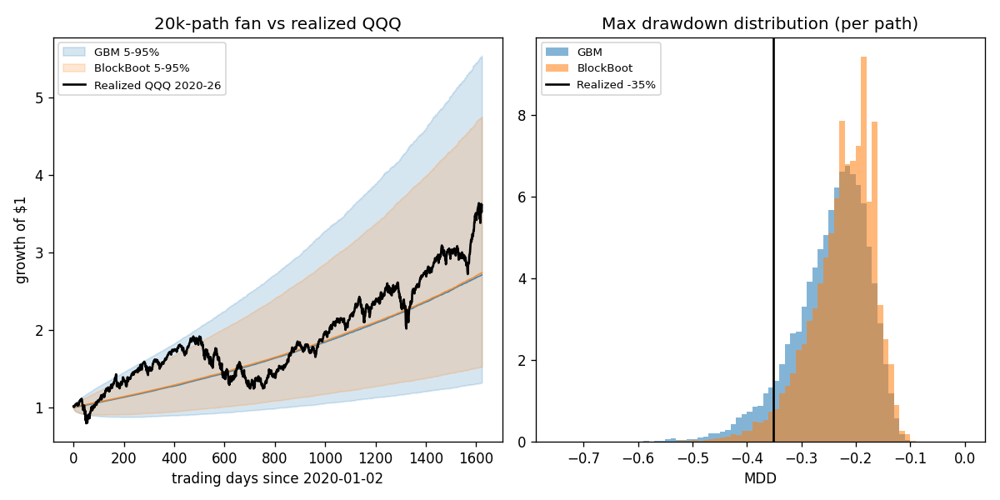
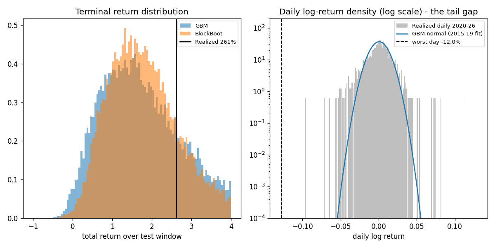

# TR-05：GBM 蒙地卡羅模擬（Black-Scholes-Merton 動態假設）作為科技股風險模型

## 1. 機制定義與理論

- 幾何布朗運動（GBM）：`dS/S = mu*dt + sigma*dW`，即日對數報酬為 iid 常態。此為 Black-Scholes-Merton（1973, JPE）選擇權定價與多數退休規劃 / 蒙地卡羅工具的核心動態假設。
- 隱含假設：報酬無跳躍、無波動叢聚、峰度為 0（常態）、尾部以 `exp(-x^2)` 速度衰減。
- 測試問題：GBM 蒙地卡羅是否能描述科技股（QQQ）2020-2026 的「實際風險」？誠實替代方案：對真實報酬做 stationary block bootstrap（Politis-Romano 1994，平均塊長 21 日），保留波動叢聚與肥尾邊際分佈。

## 2. 相關既有機制

- 本 repo 首批 fabric TR 之一（驗收規格見 `docs/17-fabric-acceptance.md`）；此前所有回測（`docs/05-backtest-postmortem.md`、`docs/09-methodology-and-factor-gate.md`）隱含使用歷史模擬，從未檢驗參數化 MC 的尾部行為。
- `docs/12-quant-methods-survey.md` 之方法盤點涵蓋 MC / bootstrap 類別；`docs/14-horizon-framework.md` 的 MDD 門檻（vs 2x-VOO gate）依賴對 drawdown 分佈的正確估計——本 TR 直接量測該估計的偏誤。

## 3. 預期目標

- 若 BSM 理論成立：實際 2020-2026 應落在 GBM 模擬分佈的「典型」區域——日峰度 ≈ 0、無 >5 sigma 單日事件、MDD 分佈涵蓋現實。
- 任務預期（待量測）：GBM 在尾部 FAILED（峰度、崩盤日機率低估數個數量級）；block bootstrap 為 PARTIAL/PASSED。

## 4. 測試設計

- 標的：QQQ adj_close（DuckStore）。校準期 2015-01-05 ~ 2019-12-31（1,257 bars，嚴格早於評估期，F1 無滲漏）；評估期 2020-01-02 ~ 2026-06-18（1,624 bars）。資料橫跨 2015-2026 > 5 年（F4）。
- 校準結果：日對數報酬 mean=0.000614、std=0.010830 → GBM mu=16.96%/yr、sigma=17.19%/yr。
- 三個模擬器，各 20,000 條路徑 x 1,624 bars（樣本單位=模擬路徑，20,000 條/模型，F4 達標）：
  1. GBM（iid 常態）；2. IID bootstrap（重抽 2015-19 真實日報酬，破壞叢聚、保留邊際肥尾）＝ F6 對照組；3. stationary block bootstrap（平均塊長 21 日）。
- 無交易策略、換手率 0，成本不適用（F2 據實申報）；基準為同窗口 QQQ 與 VOO buy&hold（F3）。固定種子 42。
- 腳本：`scripts/tests/tr05_gbm_mc.py`。

## 5. 結果

| 模型 | 年化報酬(中位) | Sharpe(中位) | MDD(中位) | P(MDD<=-30%) | P(MDD<=實際-35.1%) | 實際終值百分位 | P(單日<=-12.0%) | 日超額峰度(中位) |
|---|---|---|---|---|---|---|---|---|
| GBM（iid 常態, BSM） | 16.74% | 0.99 | -23.40% | 19.430% | 8.110% | 74.4% | 0.0000%（解析 1.233e-32/日） | -0.01 |
| IID bootstrap 2015-19（對照） | 16.86% | 1.00 | -23.46% | 19.885% | 8.475% | 74.2% | 0.0000%（結構性為 0） | 3.20 |
| Stationary block bootstrap b=21 | 16.92% | 1.00 | -21.52% | 10.965% | 3.610% | 79.8% | 0.0000%（結構性為 0） | 3.15 |
| 實際 QQQ 2020-2026（buy&hold 基準） | 21.73% | 0.92 | -35.12% | — | — | — | 發生於 2020-03-16（-11.98%） | 7.04 |
| VOO buy&hold 2020-2026（基準） | 15.49% | 0.81 | -33.98% | — | — | — | — | — |

- 關鍵量測：實際最差單日 -11.98%（2020-03-16）在校準後的 GBM 下是 **-11.8 sigma** 事件，單日機率 1.233e-32，1,624 bars 內至少出現一次的機率 ≈ 0，期望等待時間 3.22e+29 年（宇宙年齡的 ~10^19 倍）——但它就是發生了。
- 實際日超額峰度 7.04 vs GBM 的 -0.01；實際偏態 -0.36 vs GBM 0.00。
- MDD 維度：實際 -35.1% 落在 GBM MDD 分佈第 8.1 百分位——低估但非數量級級別；災難性失敗集中在單日尾部。
- 終值維度：實際 261.1% 落在三個模型的 74-80 百分位——平均成長不是失敗點，尾部才是。

## 6. 判定: FAILED（GBM 作為風險模型；block bootstrap 附帶判定 PARTIAL）

- F1 無滲漏：mu/sigma 與 bootstrap 母體全部只用 2015-2019 資料，評估期嚴格在後。PASS
- F2 淨成本：無策略、換手率 0，成本不適用（B&H 單次 5bps 進場對 6.5 年結果影響 <0.1%，忽略）。PASS
- F3 可投資基準：QQQ 與 VOO buy&hold 同窗口列於表中。PASS
- F4 樣本量：20,000 路徑/模型 x 1,624 bars，資料 2015-2026（>5 年）。PASS
- F5 多重檢定：共試 3 個模擬器、0 個自由參數掃描；無 alpha 宣稱，故無 null bar 問題。PASS
- F6 對照：IID bootstrap 對照隔離「肥尾邊際 vs 叢聚」的貢獻。PASS
- F7 子期間：2015-19 實際（年化 17.09%、Sharpe 0.99、MDD -22.8%、最差日 -4.58%、峰度 3.25）vs 2020-26（21.73%、0.92、-35.1%、-11.98%、7.04）——風險 regime 明顯翻轉，校準期系統性偏平靜。PASS（已標記）
- F8：GBM 宣稱描述股票風險 → 在尾部維度被否證 = **FAILED**；block bootstrap 修復邊際峰度但受支撐上限束縛且 MDD 尾部反而更薄 = PARTIAL。

## 7. 衰退評估

- 相對 BSM 原始理論宣稱（常態、無跳躍）：日尾部機率低估 **>30 個數量級**（1.2e-32 vs 已發生）；日峰度低估 7 個單位（-0.01 vs 7.04）。
- MDD 低估較溫和：GBM 給實際 -35.1% 約 8.1% 機率（「12 分之 1 的壞運氣」），但 6.5 年內實際出現兩次 ≥28% 回撤（2020 COVID、2022 升息），GBM 顯著過度樂觀但未到數量級。
- 這不是「策略衰退」而是「模型從未正確」：Mandelbrot（1963）與 Fama（1965）早已記錄肥尾，本測試確認 2020s 科技股尾部仍遠超常態。

## 8. 失敗/侷限歸因

- GBM 失敗根因：iid 常態無法表達跳躍與波動叢聚；且校準於平靜的 2015-2019（sigma 17.2%），對 2020-2026 高波動 regime 外推必然失真。
- Bootstrap 的誠實侷限（本測試實測）：(a) 任何重抽都無法產生低於母體支撐的單日（2015-19 最差日 -4.58% → P(單日<=-12%) 恆等於 0）；(b) **block bootstrap b=21 的 MDD 尾部反而比 IID 更薄**（P(MDD<=-30%)=11.0% vs 19.9%）——2015-19 的塊保留了「急跌後 V 型反彈」的自相關，縮短了回撤持續時間；「保留叢聚=更保守」的直覺在平靜校準期上不成立。
- 侷限：單一資產（QQQ）、單一評估窗口、尾部宣稱實質上依賴一次崩盤事件（2020-03）；峰度/偏態證據則來自全部 1,624 bars。

## 9. 可組合性

- 風險端（主要價值）：任何用 MC 做部位規模 / Kelly / MDD 門檻（`docs/14` 的 2x-VOO gate、horizon slots）的 sleeve，**禁用 GBM 估尾部**；至少改用 block bootstrap 並疊加跳躍注入（如混入 1987/2008/2020 歷史極端日）或 t-分佈殘差，否則 MDD 與崩盤機率同時被低估。
- 與 regime 機制組合：Markov regime-switching 或 VIX 門檻（repo 已有 '^VIX'）可修正「平靜期校準」偏誤——在高波動 regime 下切換至高 sigma 母體重抽。
- 作為 null 模型：GBM 是便宜且解析可解的 F6 對照產生器，適合為其他 TR 的 Sharpe/MDD 宣稱生成零假設分佈——這是它在本 repo 唯一安全的用途。
