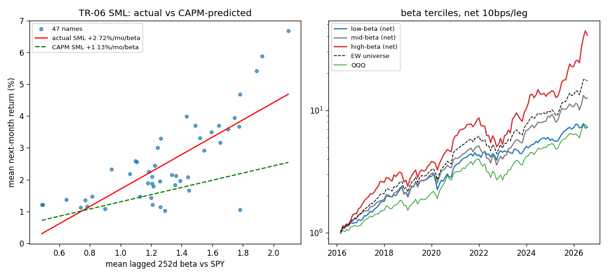
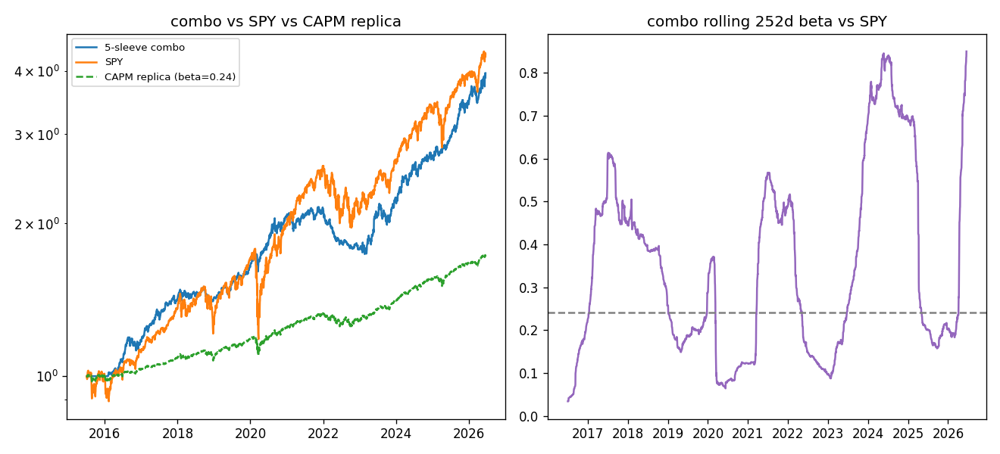

# TR-06 CAPM / 市場模型(Sharpe 1964)

> 腳本:`scripts/tests/tr06_capm.py`|判定:**PARTIAL**|2026-07-07

## 1. 機制定義與理論

CAPM(Sharpe 1964 *Capital Asset Prices*, JF;Lintner 1965):E[r_i] = rf + β_i·(E[r_m] − rf)。
兩個可測含義:(A) **定價**——橫截面上報酬應與 β 線性相關,SML 斜率 = 市場風險溢酬、截距 = rf
(檢定法:Fama-MacBeth 1973 兩階段迴歸);(B) **歸因**——市場模型 r_i = α + β·r_m + ε 把任何
策略報酬拆成市場 β 與殘餘 α。文獻反面:Fama-French 1992 發現 SML 近乎平坦;Frazzini-Pedersen
2014 BAB(低 β 異常)在美股 Sharpe ~0.78。本測試同時量測 SML 實際斜率與 BAB 方向。

## 2. 相關既有機制

- **Carhart-4 歸因**(`validate_recommendation.py`、docs/08):組合 alpha t=2.64 的既有標準——CAPM 是它的單因子退化版。
- **低波動因子**(docs/06 因子搜尋):重疊樣本 t −5.54 → 非重疊 −1.05,已知在本宇宙不穩健,與低 β 異常是近親。
- **動量 sleeve**(docs/07/08):高 β tercile 成分與動量選股高度重疊(同一批成長股)。

## 3. 預期目標

CAPM 宣稱:SML 斜率 ≈ 已實現市場超額報酬(本期 +1.13%/mo)、截距 ≈ rf(+0.17%/mo)。
文獻先驗(50 年):SML 平坦或倒掛、低 β tercile 風險調整後贏高 β。歸因端:量測 5-sleeve 組合的
CAPM α,對照已記錄的 Carhart α(+6.08%/yr, t=2.64)。

## 4. 測試設計

- **宇宙/期間**:`sector_strategies.SECTORS` 47 檔(2015-01–2026-07;CRWD/PLTR/SNOW 上市晚,依可用性進橫截面)。
- **β 估計(F1)**:滾動 252 日日報酬對 SPY 的 cov/var,取 t−1 月底值預測 t 月報酬——訊號嚴格先於報酬。
- **A 定價**:每月依落後 β 分 3 組(EW,個股 10bps/腿計於單向換手,F2);Fama-MacBeth 每月橫截面
  OLS,均值斜率之 t;SML 散點 = 各檔全期平均落後 β vs 平均次月報酬。
- **B 歸因**:`vr.build_combo()` 的 rp(日頻、已含成本)對 SPY 超額(rf=BIL)單因子 HAC 迴歸。
- **樣本(F4)**:A = 5,733 stock-months(47 檔 × 126 月,2016-02–2026-07,>10 年);B = 2,756 日。
- **控制(F6)**:β 橫截面隨機重排 ×200 的 placebo FM 斜率分布。
- **變體數(F5)**:1 個設計(252d β/tercile 固定,無參數搜尋),單測 null bar |t|>2。

## 5. 結果

**A1 Fama-MacBeth(126 月,5,733 觀測)**:平均斜率 **+1.899%/mo(t=+2.69)**,截距 +0.115%/mo(t=+0.15);
CAPM 預測斜率 +1.130%/mo → 實際比預測陡 1.7 倍,但差距 t≈1.09 未達顯著(se 0.71%/mo)。
Placebo(F6):重排 β 平均 t=+0.03,P(|t|≥2.69)=0.01 → β-報酬關聯非假象。
**A4 SML 逐檔橫截面(47 點)**:斜率 +2.721%/mo/β,截距 **−1.018%/mo(< rf +0.173)**——截距條件違反。

| 組合(月頻,2016-02–2026-07) | 年化報酬 | Sharpe | MDD | 年化換手 |
|---|---|---|---|---|
| 低 β tercile(淨) | +20.80% | 1.16 | −25.91% | 1.5x |
| 中 β tercile(淨) | +27.22% | 1.27 | −30.29% | 3.3x |
| 高 β tercile(淨) | **+42.39%** | **1.36** | −41.90% | 1.8x |
| 低−高(BAB 方向,淨) | **−20.45%** | **−0.79** | −92.07% | — |

> **勘誤(稽核發現)**:上列「低−高(淨)」價差以 net_low − net_high 計,等於把空方(高β)腿的交易成本記成價差的收益;含空方成本的真實 BAB 價差會比 −20.45% 再差 ~0.3-0.6pp/年。方向與判定不受影響(反轉幅度遠大於記帳誤差)。
| 同宇宙 EW(毛) | +31.26% | 1.43 | −28.05% | — |
| QQQ | +20.95% | 1.12 | −32.58% | — |
| SPY | +15.52% | 1.04 | −23.93% | — |

形成期 β 0.82/1.27/1.73 → 實現 β 0.96/1.22/1.49(壓縮但保序)。**低 β 異常在本宇宙不存在且反向**。

**B 歸因(n=2,756 日,2015-07–2026-06)**:combo CAPM α = **+7.95%/yr(t=+3.28, p=0.001)**,β=0.24,R²=0.20;
combo 年化 13.41%/Sharpe 1.34/MDD −19.26% vs SPY 14.29%/0.84/−33.72%。
子期:2016-19 α +8.01%(t=2.35)、2020-24 α +5.05%(t=1.30)。對照 Carhart-4(docs/08):+6.08%/yr, t=2.64
→ **CAPM 因忽略 UMD/HML 曝險而高估 α ~1.9pp**,repo 以 Carhart 為準的做法被證實必要。

## 6. 判定: PARTIAL

- **F1** 無洩漏:β 用 t−1 月底前 252 日資料,tercile/FM 都預測「次月」報酬。✅
- **F2** 淨成本:個股 10bps/腿計於單向換手(含建倉);年化換手 1.5–3.3x 已報。✅
- **F3** 基準:同宇宙 EW、QQQ、SPY 全列;tercile 全部輸 EW 毛基準。✅
- **F4** 樣本:5,733 stock-months(>3,000)、橫跨 10.5 年;B 2,756 日。✅
- **F5** 多重測試:1 個設計無搜尋;單測 bar |t|>2,FM t=2.69 過。✅
- **F6** 控制:placebo ×200 平均 t=+0.03、P=0.01 → 斜率非機制假象。✅
- **F7** 子期:斜率同號(+1.23/+2.30)無翻號,但 2020-26 為預測值 2 倍;combo α t 2.35→1.30 衰退。⚠️註記
- **F8**:定價「方向」存活但非乾淨 CAPM(截距 −1.02%/mo 違反、斜率過陡且由 2020-26 驅動);BAB 可交易
  含義反向(L−H Sharpe −0.79);歸因端有效但高估 α。**機制如設計運作、無新 alpha → PARTIAL**。

## 7. 衰退評估

與原理論比:FM 斜率 +1.90%/mo 為 CAPM 預測(+1.13)的 1.7 倍、逐檔 SML 截距 −1.02%/mo 低於 rf——
不是文獻典型的「平坦 SML」衰退,而是**反向偏離**(高 β 補償過度)。與 Frazzini-Pedersen 2014 比:
BAB 在本宇宙 Sharpe −0.79(原文 +0.78)→ 異常完全反轉,因為 47 檔全是科技/國防成長股,2016-26
牛市中高 β = 高動量同一批名字。與 repo 既有 Carhart 比:CAPM α +7.95% vs Carhart +6.08%,單因子
模型把動量/價值曝險誤記為 α。

## 8. 失敗/侷限歸因

- **宇宙選擇偏誤**:47 檔單一板塊叢集,β 離散度承載的是「成長科技曝險」不是純市場風險;斜率在
  2020-26(+2.30 vs 預測 +1.08)被 AI 行情灌水。橫截面僅 47 點,統計功效低(無法區分 1.9 與 1.13)。
- **截距違反**是 Black(1972)零 β CAPM 的**反向**(文獻:截距>rf、斜率過平;這裡:截距<rf、斜率過陡)。
- 月末 2026-07 只含 2 個交易日(部分月),影響極小。tercile 未做 β 中性化,L−H 帶負 β(牛市天然虧)。
- rf 用 BIL(2015 前段利率≈0),與 Ken French RF 有微小差異;B 部分為離線可重現而採投資可得工具。

## 9. 可組合性

- **歸因標準**:維持 Carhart-4 為 α 標準,CAPM 僅作快速 sanity check(高估 α ~1.9pp,勿單獨引用)。
- **combo 滾動 β(0.03–0.85,均值 0.24)**波動大 → 可餵給 β-target/vol-target overlay(與 TR-04 VaR-target
  比對),把 2024 β 尖峰(0.85)壓回;預期降 MDD 而非增報酬。
- **高 β tercile ≠ 新 sleeve**:與 equity_mom sleeve 同名字高相關,加入只會重演 docs/13 的 beta 稀釋
  教訓(zero-signal 控制 2.89 > 2.64);低 β tercile 亦輸 EW,無添加價值。
