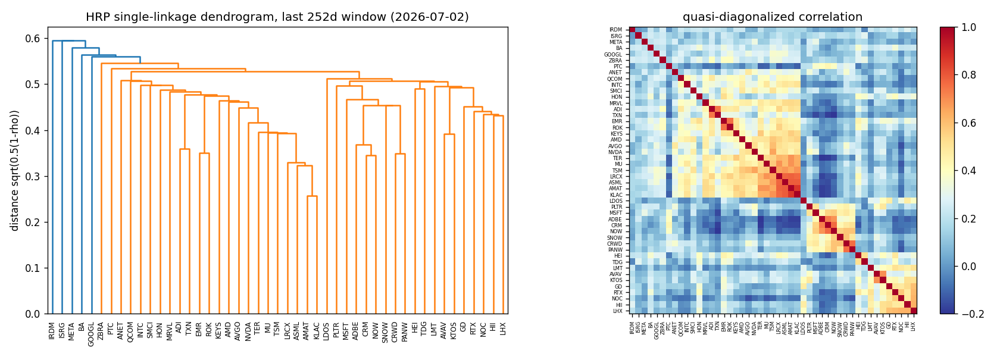
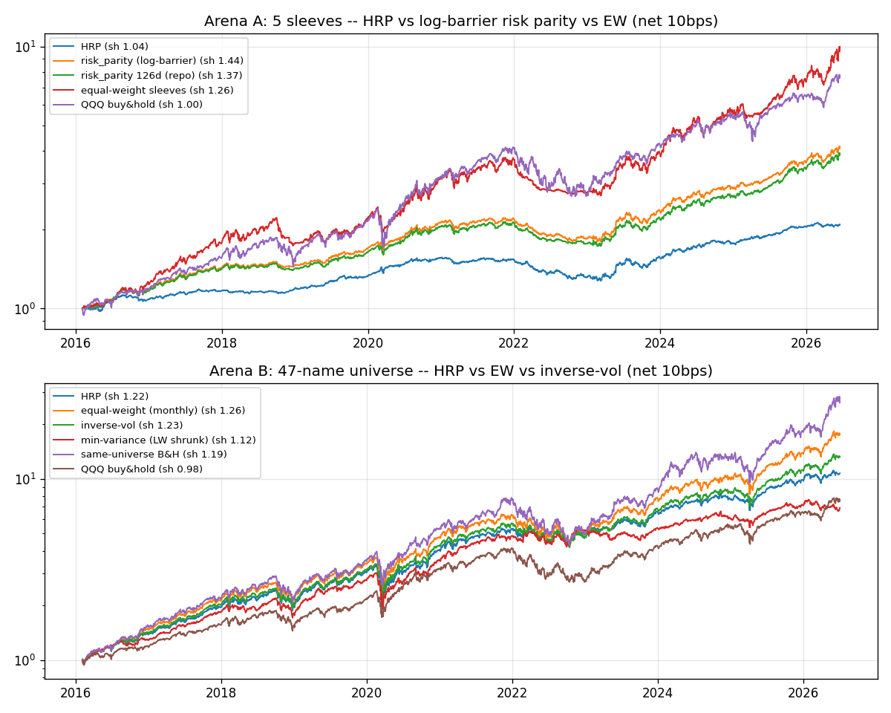

# TR-07 階層風險平價(HRP)vs 本 repo 的 log-barrier 風險平價

> 執行:`uv run python scripts/tests/tr07_hrp.py`(2026-07-07)。文中所有數字皆為腳本實際輸出。

## 1. 機制定義與理論

Lopez de Prado (2016)〈Building Diversified Portfolios that Outperform Out-of-Sample〉(Journal of Portfolio Management 42(4);AFML ch.16;PyPortfolioOpt 有實作,本 TR 直接用 scipy 重寫):
1. 相關矩陣 → 距離 `d = sqrt(0.5*(1-rho))`;2. `scipy.cluster.hierarchy.linkage(single)` 建樹;3. 準對角化(葉序重排,把高相關資產排在一起);4. 遞迴二分:由上而下對半切,兩半各以「叢集內反變異數組合」算叢集變異數 v0、v1,權重按 `alpha = 1 - v0/(v0+v1)` 分配。
理論主張:不需反矩陣(避開共變異數矩陣病態/Markowitz 之咒),蒙地卡羅中樣本外變異數比 CLA 最小變異低約三成、也優於天真反變異數(IVP)。**它是風險配置器,不宣稱選股 alpha。**

## 2. 相關既有機制

- 本 repo 現役:`trading_analysis.portfolio.allocators.risk_parity`(Maillard/Spinu log-barrier ERC)+ Ledoit-Wolf 收縮共變異數(docs/08 推薦組合即用它,`validate_recommendation.build_combo`)。
- `min_variance` / `equal_weight`(DeMiguel-Garlappi-Uppal 1/N 門檻)同在 `allocators.py`;docs/04(組合檢討)、docs/12 §組合構建有 HRP 之調查條目。
- TR-03 統計因子(PCA)同屬「相關結構」機制,但用途是因子而非權重。

## 3. 預期目標

依 LdP:HRP 樣本外變異數低於 min-var 與 IVP、報酬風險比更穩健;對同質宇宙不預期贏 1/N(DGU)。本 TR 的決策問題:**在實際 5 sleeves 上 HRP 是否勝過現役 log-barrier risk_parity(要不要換)?**

## 4. 測試設計

- 共同協定:月頻 walk-forward(step=21),252 交易日回看窗(嚴格用 t 之前資料,權重再 `shift(1)`),換手 `sum|dw|` 每腿收 10 bps(對 ETF sleeves 屬保守)。
- Arena A:repo 5 sleeves(equity_mom/defensive/lev_trend/gold/bonds,日報酬已含各自內部成本)。HRP vs log-barrier RP(252d)vs RP(126d,repo 現行參數)vs sleeves 等權;基準 QQQ。2016-02-03→2026-06-18,2,609 日 × 5 = **13,045 bar×asset**。
- Arena B:47 檔類股宇宙(`sector_strategies.SECTORS`)。HRP vs 月度等權 vs 反波動 vs min-var(LW 收縮);基準同宇宙 B&H(起日可投資者買入不再動)+ QQQ。2016-02-03→2026-07-02,2,618 日,**119,863 bar×asset**,125 次再平衡,平均持有 45.5 檔。
- F4:兩場皆 >3,000 觀測、橫跨 10.4 個日曆年。F6 控制組:permuted-HRP(每次再平衡把 HRP 權重向量在當期可投資名單內隨機重排,20 seeds)——破壞叢集資訊、保留權重分布。
- F5:7 個事先指定變體,無任何超參數搜尋;本 TR 不宣稱 alpha。

## 5. 結果

**Arena A — 5 sleeves(net 10bps)**

| 變體 | 年化報酬 | Sharpe | MDD | 年化波動 | 換手/年 | Sh 15-19 | Sh 20-26 |
|---|---|---|---|---|---|---|---|
| HRP | +7.41% | 1.04 | -18.69% | 7.10% | 0.96x | 1.38 | 0.93 |
| **risk_parity(log-barrier, 252d)** | **+14.78%** | **1.44** | -18.84% | 9.92% | 0.55x | 1.90 | 1.30 |
| risk_parity(126d, repo 現行) | +14.13% | 1.37 | -19.37% | 10.01% | 0.82x | 1.73 | 1.26 |
| 等權 sleeves(DGU 門檻) | +24.95% | 1.26 | -28.58% | 19.20% | 0.04x | 1.41 | 1.21 |
| QQQ buy&hold | +21.94% | 1.00 | -35.12% | 22.21% | 0 | 1.27 | 0.92 |

平均權重:HRP = {equity_mom 0.088, defensive 0.062, lev_trend 0.015, gold 0.135, **bonds 0.699**};RP = {0.147, 0.099, 0.063, 0.230, bonds 0.460}。

**Arena B — 47 檔宇宙(net 10bps)**

| 變體 | 年化報酬 | Sharpe | MDD | 年化波動 | 換手/年 | Sh 15-19 | Sh 20-26 |
|---|---|---|---|---|---|---|---|
| HRP | +25.66% | 1.22 | -37.15% | 20.50% | 2.96x | 1.85 | 0.97 |
| 等權(月度) | +31.72% | 1.26 | -35.10% | 24.17% | 0.11x | 1.82 | 1.07 |
| 反波動 | +28.21% | 1.23 | -35.48% | 22.27% | 0.42x | 1.81 | 1.02 |
| min-variance(LW) | +20.45% | 1.12 | -37.03% | 18.17% | 2.99x | 1.91 | 0.81 |
| 同宇宙 B&H | +37.01% | 1.19 | -45.46% | 30.21% | 0 | 1.68 | 1.07 |
| QQQ buy&hold | +21.42% | 0.98 | -35.12% | 22.23% | 0 | 1.27 | 0.89 |

控制組 permuted-HRP(20 seeds):Sharpe 1.23±0.05、波動 24.41%±0.16%、MDD -35.35%。HRP 波動 20.50% < 重排後 24.41% → **叢集資訊確實降低約 3.9pp 波動**(機制如設計運作),但 Sharpe 不變。

## 6. 判定: PARTIAL

- F1 無洩漏:權重僅用 t 前 252d 窗估計,ffill 後再 shift(1) ✅
- F2 淨成本:10bps/腿計於 `sum|dw|`,各變體年化換手已列表 ✅
- F3 可投資基準:同宇宙 B&H、sleeves 等權(DGU)、QQQ 全列 ✅
- F4 樣本:13,045 + 119,863 bar×asset,2016-02→2026-07(10.4 年)✅
- F5 多重測試:7 個事先指定變體、零調參;不宣稱 alpha,故無 null bar 壓力 ✅
- F6 控制組:permuted-HRP 證明降波動來自叢集結構而非權重分布本身 ✅
- F7 子期:全變體兩子期 Sharpe 同號皆正、無翻號;普遍 2020-26 衰退(HRP 1.38→0.93)✅
- F8:機制如設計運作(真實降波動、Sharpe 勝 min-var)但無 alpha,且**在決策問題上輸給現役 risk_parity → 不換**。

## 7. 衰退評估

LdP 原文(蒙地卡羅)宣稱 HRP 樣本外變異數比 CLA min-var 低 ~31%、優於 IVP。真實資料上:對 IVP 方向成立但幅度縮水(波動 20.50% vs 22.27%,-8%,Sharpe 打平);對 min-var 的「更穩健」以 Sharpe 論成立(1.22 vs 1.12,min-var 2020-26 只剩 0.81),但 LW 收縮讓 min-var 波動(18.17%)反而更低——LdP 的對照是未收縮 CLA,本 repo 的收縮已先解決了他要解決的病態問題。「Outperform out-of-sample」的字面主張(勝 1/N)不成立:Sharpe 1.22 vs 1.26。

## 8. 失敗/侷限歸因

1. **N=5 太小、sleeves 異質**:遞迴二分只能沿樹粗切,反叢集變異數分配把 69.9% 塞進債券(IEF),lev_trend 只剩 1.5%——放棄了股權風險溢酬,年化 7.41% vs RP 14.78%,MDD 卻沒更低(-18.69% vs -18.84%,2022 債災兩者一起跌)。ERC log-barrier 明確均衡風險貢獻,天生適合少量異質 sleeves。
2. HRP 無風險貢獻均衡條款,對低波資產無上限;single linkage 在小 N 下鏈化,切點不穩 → 換手 0.96x/yr 高於 RP 的 0.55x。
3. Arena B 同質高貝塔宇宙:降波動真實但等比例降報酬,MDD 反而比等權深(-37.15% vs -35.10%,重倉的「低波」叢集在 2022 一起跌);換手 2.96x/yr 是反波動(0.42x)的 7 倍,10bps 下約 -6bp/yr 差距事小,但容量/摩擦更差。
4. 侷限:各變體換手不含漂移再平衡(目標權重差分),等權成本略被低估;sleeves 本身是先前研究的樣本內產物,Arena A 絕對水準有繼承偏誤(HRP vs RP 的相對比較不受影響);B&H 不含 2016 後上市者(PLTR/SNOW/CRWD 後進 walk-forward 各變體)。

## 9. 可組合性

- **決策:5 sleeves 續用 log-barrier risk_parity(docs/08 不變)**;126d→252d 回看窗小幅有利(Sharpe 1.37→1.44),可另開一張低成本票驗證。
- HRP 的樹/準對角化可當**診斷與約束**再利用:47 檔動量 sleeve 選股時以 dendrogram 叢集設「每叢集最多 k 檔」上限(dendrogram 圖顯示半導體/軟體/國防三大經濟叢集),防 top-k 全押單一叢集——這是結構資訊真正有增量的地方(F6 控制組證明)。
- 若只要降波動:反波動以 1/7 的換手拿到大部分效果(22.27% vs 20.50%),比 HRP 更划算;不建議 HRP 直接當權重引擎。
