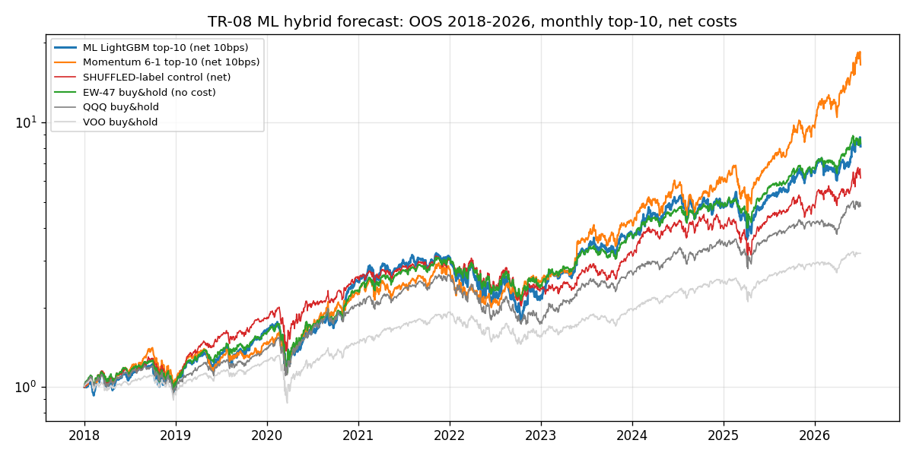
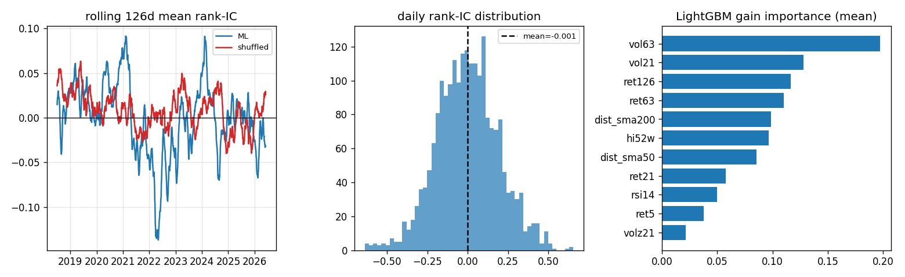

# TR-08 ML 混合報酬預測（LightGBM 走動式重訓）

腳本：`scripts/tests/tr08_ml_forecast.py`　執行：`uv run python scripts/tests/tr08_ml_forecast.py`

## 1. 機制定義與理論

- 來源：manuhup/LSTM-XGBoost-Hybrid（GitHub，LSTM 抓時序 + XGBoost 抓截面特徵的混合價格預測）；學術基準 Gu, Kelly & Xiu (2020) "Empirical Asset Pricing via Machine Learning"（RFS 33(5)）——以樹模型/神經網路對大截面股票特徵做非線性報酬預測，宣稱 OOS R² 為正且十分位多空組合顯著獲利。
- **誠實替代聲明**：本 repo 只裝了 LightGBM，以其作為梯度提升引擎（與 XGBoost 同屬 GBDT 模型類）；LSTM 半邊省略（無 torch）。因此本測試檢驗的是「GBDT 截面報酬預測」這一半的主張。
- 假設：11 個價量技術特徵（皆落後 1 bar）與 21 日遠期報酬存在可學習的非線性截面關係，且每年重訓可跟上結構變化。

## 2. 相關既有機制

- `docs/06-factor-search-frontier.md`：系統性因子搜尋——價量動能類因子在本 universe 2021 後失效（momentum-is-dead），唯一穩健因子為基本面品質（ICIR +0.30）。本測試的特徵集正是該處已判死的價量因子的非線性重組。
- `docs/09-methodology-and-factor-gate.md`：因子驗收門檻（IC t 值、控制組要求），本測試沿用。
- `docs/05-backtest-postmortem.md`：universe 漂移使「任何多頭組合」看起來賺錢的教訓——本測試以洗牌控制組正面對付。
- `scripts/sector_strategies.py` S1-S5：同 universe 的動能 sleeve，即本測試的「笨對手」原型。

## 3. 預期目標

- GKX 原文：GBRT 月頻 OOS R² 約 +0.33%，十分位多空組合年化約 10-17%、Sharpe 顯著優於線性模型。
- manuhup repo：宣稱混合模型價格追蹤誤差極小（典型 LSTM 價格預測 repo 的 RMSE 展示，無交易驗證）。
- 本 repo 預期（依 GKX 後續衰退文獻 + 我們的 momentum 死亡發現）：OOS 日 rank-IC 約 0~0.02，組合約等於動能，對 EW 無 alpha。

## 4. 測試設計

- Universe：47 檔（AI_semis 16 / software_AI 10 / space_defense 13 / robotics 8）；資料 2015-01-02 ~ 2026-07-02（2,891 bars）。
- 特徵（皆 shift(1)，F1）：ret 5/21/63/126d、vol 21/63d、RSI14、dist-SMA50/200、成交量 z-score 21d、52 週高點距離。標籤：21 日遠期報酬。
- 走動式年度重訓：訓練至 Y-1 年 12/31 並刪去最後 21 個訓練日（purge gap，防標籤滲入測試年）；逐日預測 Y 年（2018-2026 OOS）。LGBM 單一組態（300 樹、lr 0.05、leaves 31），無調參。
- 組合：每月底訊號、次日收盤執行，做多預測前 10 名等權，月內權重隨報酬漂移，成本 10bps/腿計於換手（F2）。
- 樣本（F4）：OOS 97,718 個 name-days（47 檔 x 2,136 日，2018-01-02 ~ 2026-07-02，8.5 年）>= 3000 且 > 5 年。
- 控制（F6）：完全相同管線但訓練標籤隨機洗牌。基準（F3）：同 universe EW-47 B&H、QQQ、VOO、笨對手 = 6-1 動能 top-10（同機制同成本）。

## 5. 結果

OOS 日截面 rank-IC：**mean = -0.0013**（非重疊 21 日抽樣 t = -0.21，n=101；正 IC 日僅 48.9%）；GKX 式 OOS R²（對零預測）= **-0.0477**。洗牌控制組 IC = +0.0089（t = +1.04）——ML 與純雜訊統計上無法區分。
逐年 IC：2018 +0.024 / 2019 +0.012 / 2020 +0.050 / 2021 **-0.043** / 2022 **-0.037** / 2023 -0.001 / 2024 +0.002 / 2025 -0.009 / 2026 -0.023——2021 起翻負。

| 策略（2018-01-02 ~ 2026-07-02） | 年化報酬 | Sharpe | MDD | 年換手 |
|---|---|---|---|---|
| ML LightGBM top-10（淨 10bps） | +28.0% | 0.91 | -44.9% | 7.8x |
| 動能 6-1 top-10（淨 10bps，笨對手） | +39.2% | 1.16 | -34.2% | 4.6x |
| 洗牌標籤控制組（淨） | +23.9% | 0.88 | -35.3% | 9.4x |
| EW-47 買進持有（無成本） | +28.2% | 1.09 | -34.8% | — |
| QQQ 買進持有 | +20.2% | 0.90 | -35.1% | — |
| VOO 買進持有 | +14.6% | 0.81 | -34.0% | — |

特徵重要度（9 次重訓平均 gain）：vol63 0.197、vol21 0.128、ret126 0.117、ret63 0.110——模型主要在挑波動度，不是在預測報酬。

## 6. 判定: FAILED

- F1 洩漏：通過——特徵 shift(1)、年度 expanding 重訓、21 日 purge gap、次日執行。
- F2 成本：通過——10bps/腿計於換手，年換手 7.8x 已列示。
- F3 基準：通過——EW-47、QQQ、VOO、動能笨對手全數列示，非對零比較。
- F4 樣本：通過——97,718 name-days（47 檔 x 2,136 OOS 日），跨 8.5 年。
- F5 多重檢定：通過——單一模型組態、單一特徵集，無調參無挑選；null bar |t|>2，實測 t=-0.21。
- F6 控制組：通過且致命——洗牌標籤組合 Sharpe 0.88 vs ML 0.91，無法區分。
- F7 子期間：ML 2018-19 Sharpe 1.06 / 2020-26 0.88（無翻號但衰退）；IC 逐年 2021 起翻負（翻號旗標）。
- F8 結論：**FAILED**——IC≈0（t=-0.21）、OOS R² 為負、組合輸給笨對手動能（0.91 vs 1.16）也輸 EW-47（1.09），與洗牌控制無異。連「至少追平動能」的 PARTIAL 門檻都未達。

## 7. 衰退評估

- vs GKX (2020)：GBRT 月 OOS R² +0.33% → 本測 **-4.8%**（21 日尺度）；十分位組合顯著 alpha → 本測 IC t=-0.21。衰退 100% 以上（翻負）。主因：GKX 截面約 30,000 檔、樣本 1957-2016、含 94 個特徵＋總體變數；我們僅 47 檔高效率大型科技股、2018 後樣本（正是文獻公認 ML 因子衰退期）、純價量特徵。
- vs manuhup repo：其 RMSE 式「準確度」本來就無交易含意（價格級數預測 ≈ 前值外推）；以交易標準衡量衰退為全額。
- vs 本 repo docs/06:價量因子已死的結論被非線性 ML 再次確認——非線性重組救不回死因子。

## 8. 失敗/侷限歸因

1. **原料問題**：11 個特徵全是價量技術指標，docs/06 已證明其線性 IC≈0；GBDT 只能重組既有資訊，無法無中生有。
2. **學到的是波動不是報酬**：重要度前二為 vol63/vol21，模型實質上在做「挑高波動股」，故 MDD -44.9% 全場最深、換手 7.8x 白繳成本。
3. **制度翻轉**：2018-2020 IC 為正（動能尾聲）、2021 起翻負——年度重訓完全跟不上，反而持續押注已失效的型態。
4. **Universe 漂移淹沒一切**：洗牌控制組年化 +23.9%——這個事後挑選的 47 檔 AI/國防 universe 裡隨機選 10 檔都大賺，任何多頭訊號的「絕對報酬」都是 beta 幻覺（與 serenity 事件研究同一結論）。
5. 截面僅 47 檔，日 rank-IC 雜訊標準差 ~0.15，微弱訊號本就難以偵測；但 t=-0.21 連方向都不對。

## 9. 可組合性

- **不可**作為 alpha sleeve 疊加——IC≈0，疊加任何現有 sleeve（動能 S1-S5、品質 sleeve）只會稀釋並增加換手成本。
- 管線本身（走動式重訓＋purge＋洗牌控制）是合格工程件，可回收：(a) 把特徵集換成 docs/06 的基本面品質因子（唯一 ICIR +0.30 的存活者）重跑同管線，才是有先驗支持的下一步；(b) 模型對波動度的偏好可轉用途——當 vol 預測器餵給 S7 diversified voltarget 的風險目標，屬風險工程而非報酬預測。
- 預期效果：報酬疊加為中性偏負；工程/風險面回收價值為主。
