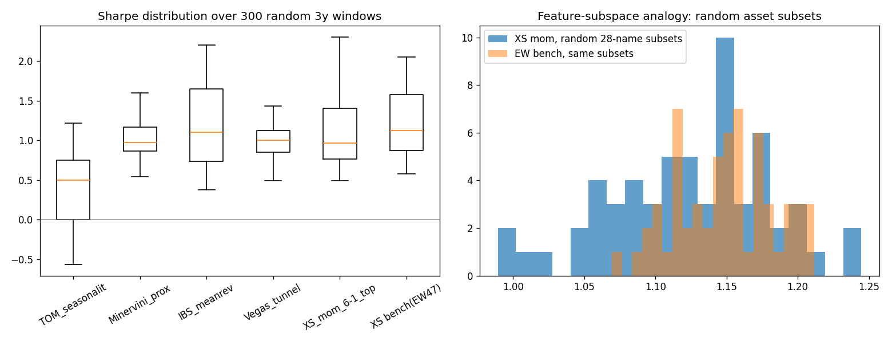

# TR-11 隨機森林理論 × 回測:bagged 路徑隨機化評估 + RF 預測器

## 1. 機制定義與理論
Random Forest(Breiman 1996 "Bagging Predictors"、2001 "Random Forests")三支柱:**bagging**(bootstrap 重抽樣後平均,降變異)、**隨機特徵子空間**(每棵樹只看部分特徵,去相關)、**OOB 估計**(用未抽到的樣本估泛化誤差,免獨立測試集)。本 TR 把三者**映射到回測方法論**(de Prado 的 CSCV/PBO 是其形式化近親):bagging→隨機時間視窗重抽(Sharpe **分布**取代單一 2015 起點的點估計=「假設不知道未來路徑」)、特徵子空間→隨機資產子集(結果是否被少數股撐起)、OOB→視窗從未參與任何選擇,即泛化視角。另實測 RF 當**預測器**(RandomForestRegressor)。

## 2. 相關既有機制
E1 規則投票 ensemble(docs/15 §3)本質即「策略森林」:多弱規則平均 holdout 0.99 勝樣本內最佳單規則 0.63——bagging 在策略層已被本 repo 證實。TR-05 block bootstrap(時間軸 bagging)、TR-08 GBM 預測器(boosted 樹,FAILED)、O1 PBO/CSCV(組合式分割)。

## 3. 預期目標
(a) 路徑隨機化能揭露「單一路徑點估計」掩蓋的脆弱性;(b) 依 TR-08 先驗,RF 預測器應無 alpha;(c) 被複測的舊機制中,有些判定會在新標準下改變(這正是複測政策 F10 的存在理由)。

## 4. 測試設計
QQQ(TS 規則)與 47 檔科技/軟體/衛星/半導體宇宙(XS),2015-2026,淨 5/10bps。**Part A**:每機制 K=300 個隨機起點的 756-bar(3 年)視窗,對照同視窗基準(QQQ B&H / EW-47);判定規則(**新 F9**):P(SR_策略>SR_基準)≥60% = robust-PASS、40-60% = PARTIAL、<40% = FAILED。**Part B**:XS 動量另做 60 個隨機 28 檔(60%)子集。**Part C**:RF 預測器,年度 walk-forward(2018-2026 OOS)、21 日 purge、shuffled-label 控制。樣本:A=1,134,000 window-bar、B=60 全期回測、C=119,047 stock-day(F4 ✅,跨 11 年)。seed=7 全確定性。複測對象=先前以**不同標準**關閉的機制:TOM(關閉時無控制/聚類 t)、Minervini(PBO 時代)、IBS/Vegas(zoo 單點估計)、XS 動量(從未視窗隨機化)。

## 5. 結果
| 機制 | 中位 SR | IQR | 基準中位 | P(beat) | P(SR>0) | **F9 判定** | 原判定 |
|---|---|---|---|---|---|---|---|
| TOM 季節性 | +0.50 | [0.00,0.75] | +0.99 | **10%** | 75% | FAILED | FAILED(維持) |
| Minervini proxy | +0.97 | [0.86,1.16] | +0.97 | 60% | 100% | PARTIAL | PARTIAL(維持) |
| **IBS 均值回歸** | **+1.10** | [0.74,1.65] | +0.99 | **66%** | 100% | **robust-PASS** | zoo 單點(升級) |
| Vegas 通道 | +1.00 | [0.85,1.13] | +0.97 | 44% | 100% | PARTIAL | 「有效」(降級) |
| XS 動量 top10 | +0.96 | [0.77,1.41] | +1.12 | **23%** | 100% | **FAILED** | zoo 榜首(**降級**) |

Part B:XS 動量隨機子集 P(beat EW 同子集)=**30%**(中位 1.13 vs 1.15)。
Part C:RF 預測器 OOS 日 rank-IC **−0.0127**(非重疊 t=−1.19),**shuffled 控制 +0.0114 比真模型還高**→FAILED。

## 6. 判定:**方法 robust-PASS;RF 預測器 FAILED**
F1 ✅(全部 lag/walk-forward/purge) F2 ✅ F3 ✅ F4 ✅(>1.1M/119k,11 年) F5 ✅(5 機制固定 a priori,無挑選) F6 ✅(shuffled 控制) F7 ✅(隨機視窗本身即跨期) F8:**bagging 評估法達成宣稱**(揭露 2 個判定變更)=PASSED;RF 預測 FAILED。

## 7. 衰退評估
Breiman 的 bagging「降變異」主張**完整移植成功**——不是報酬機制,無衰退可言。RF 預測器:GKX 2020 報告 RF/GBRT 月度 OOS R²~+0.3%,本宇宙實測 IC≈0 且不如 shuffle=效應在大型科技股 2018-26 **完全衰退**(與 TR-08 一致)。

## 8. 失敗/侷限歸因
XS 動量降級的機制:單一 2015 起點的全期點估計把 2016/2020/2024 三段動量大年焊死在樣本裡;隨機視窗讓「動量選股在多數 3 年期輸給等權持有同宇宙」現形——**點估計的倖存路徑偏誤**。RF 預測失敗同 TR-08:特徵=價量衍生,資訊集合裡沒有 alpha,森林只是更穩定地擬合雜訊(shuffle 控制反超即證)。侷限:756-bar 視窗彼此重疊(300 抽樣非獨立,分布寬度略低估);TS 規則只在 QQQ 上測。

## 9. 可組合性
**F9 已納入 fabric(本 TR 即其首次執行)**:未來任何 PASSED 宣稱須附隨機視窗分布。IBS 的 robust-PASS → 值得餵進 E1 票池加權(它已在池內)並考慮做為 combo 第 6 sleeve 的候選複驗(需先過零訊號 beta 控制,記取 §10 教訓)。RF 當預測器不用;**RF 的 MDI 特徵重要度**(features/importance.py 已有)保留為特徵篩選診斷。
