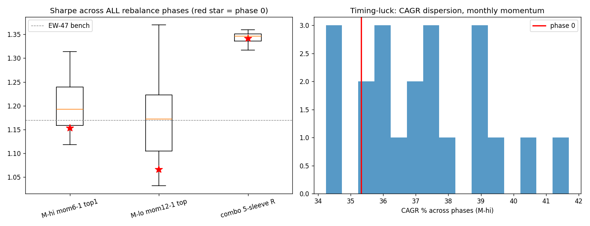

# TR-12 再平衡相位平均(F12)+ 2× 成本壓力(F2 v2)

## 0. F0 適用分類聲明(動工前預先承諾)
- **可證偽宣稱**:我們既有的相位-0 錨定結果落在相位分布內(從未調過相位,不應是 cherry-pick);但帶寬會是實質的(HSF 文獻:日曆策略常 >100bps/年);在「相位平均序列 × 2× 成本」下仍成立的判定才 robust。
- **功能分類**:驗證方法/風險塑形診斷。**原生棲地**:任何日曆再平衡策略(棲地無關)。**被測座位**:月度/季度 XS 動量槽位 + 旗艦 combo 的月度風險平價。**錯置風險:低**。
- **翻案條件**:不適用(方法類)。

## 1. 機制定義與理論
Hoffstein-Sibears-Faber(JII 2019)「Rebalance Timing Luck」:同一策略在不同再平衡錨定日之間的績效差是**非技能雜訊**,量級常超過策略間的比較差;正解=K 分批(每相位 1/K)或以相位平均序列作判定。2× 成本壓力=v1.2-A3(Novy-Marx-Velikov:中換手異常策略實測成本 20-57bps)。

## 2. 相關既有機制
F9 路徑隨機化(TR-11,時間軸的兄弟——F9 隨機化「評估視窗」,F12 隨機化「交易錨定」);docs/14 六槽位與 docs/18 §2 閘門表全部是相位-0 錨定產物。

## 3. 預期目標
量化各家族的 timing-luck 帶寬;檢驗相位-0 結果的位置;產出此後判定應引用的 tranche 序列數字;2× 成本下動量 vs EW 的結論是否翻轉。

## 4. 測試設計
47 檔宇宙(curated,相對性宣稱)2015-2026,net 10bps(+2× 壓力 20bps);M-hi(hold=21)全部 21 相位、M-lo(hold=63)全部 63 相位、combo(step=21)21 相位。樣本:105 個完整回測 × ~2,870 bar ≈ 301,000 策略-日(F4 ✅,11 年)。設計參數登記:相位數=hold(窮舉,無選擇);其餘參數沿用原槽位,未調。

## 5. 結果
基準 EW-47 buy&hold:CAGR +28.5%、Sharpe +1.17。

| 策略 | 相位數 | SR 中位[min,max] | SR@相位0(百分位) | **CAGR 運氣帶寬** | SR 中位@2× | **tranche SR** |
|---|---|---|---|---|---|---|
| M-hi 月動量 top10 | 21 | +1.19 [+1.12,+1.31] | +1.15(14%) | **746 bps/yr** | +1.17 | **+1.21** |
| M-lo 季動量 top5 | 63 | +1.17 [+1.03,+1.37] | +1.07(10%) | **1,753 bps/yr**(+34.9%~+52.5%) | +1.16 | **+1.21** |
| **combo 5-sleeve RP** | 21 | +1.35 [+1.32,+1.36] | +1.34(43%) | **30 bps/yr** | n/a* | **+1.35** |

*combo 成本在 sleeve 層引擎內計,未於此重跑壓力。
**動量 vs EW-47**:1× 成本下 57% 相位贏 EW(丟銅板);**2× 成本下只剩 38%**。

## 6. 判定:**方法 PASSED(如設計揭露 timing luck);對既有結論的三個修正生效**
F1-F9 ✅(相位窮舉無選擇、成本壓力列、樣本 30 萬策略-日、無新調參)。
1. **季度動量的一切單相位數字自此不足採信**(帶寬 17.5pp/yr>多數策略間差異)——docs/14 M-lo 的 2024 +95.8% 這類 outlier 年是相位產物。
2. **相位-0 percentile 10-14%:我們過往的動量 headline 其實是「偏倒楣」的相位**——誠實兩面:沒有 cherry-pick,但單相位就是不可靠;tranche(+1.21)才是該引用的數字。
3. **旗艦 combo 相位免疫**(30bps)——風險平價權重演化緩慢,天然 K-tranche 化;**旗艦通過 F12 無需修改**。

## 7. 衰退評估
HSF 報告年度再平衡策略帶寬 1-4%/yr;我們的季度集中組合(top-5)量到 17.5pp/yr——**集中度放大 timing luck**,與其機制(帶寬 ∝ 集中度×波動×再平衡稀疏度)一致,非衰退。

## 8. 失敗/侷限歸因
combo 的 2× 壓力未在本 TR 內重跑(成本埋在 sleeve 引擎,需另行參數化——列 backlog);相位間高度重疊(同一資料),分布是「錨定選擇的敏感度」非獨立樣本;curated 宇宙=僅相對性結論。

## 9. 可組合性
**立即制度化**:M 槽位判定改引 tranche 數字(docs/18 已註記);實盤如跑動量應 **K=4 分批**(每週入 1/4)以吃掉 746bps 帶寬;F12 正式生效——未來所有 hold≥21 的 TR 必附相位分布。
