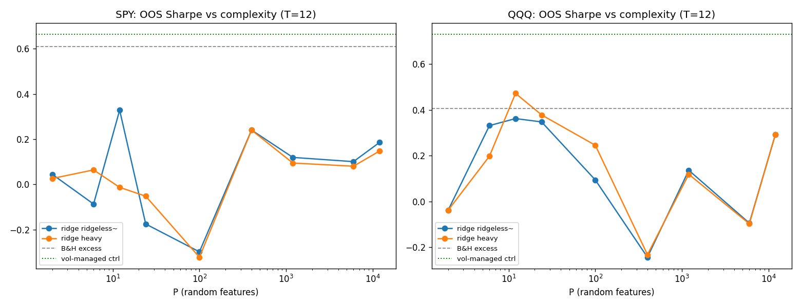

# TR-17 複雜度的美德(Kelly-Malamud-Zhou, JF 2024)— 本資料復現 + Nagel 控制

## 0. F0 適用分類聲明(動工前預先承諾,原文見腳本 docstring)
- **機制**:單資產擇時;固定訊號集 → Rahimi-Recht 隨機傅立葉特徵(P 最多 12,000);**T=12 月滾動** ridge(less);倉位=預測值。KMZ 定理:P>T 後 OOS 預期表現隨 P 嚴格遞增;實證 1926-2020 Sharpe 增益 ~0.47(R² 為負且無關)。
- **原生棲地**:美股大盤月頻 **95 年**、Goyal-Welch 15 個總經預測子、**無成本、倉位不設限**。**本次座位**:SPY 1993-2026(~389 OOS 月)+ QQQ 複製,15 個價格/利率可建構預測子(無總經序列)。**錯置風險:中——本測是「機制形狀」復現,非 alpha 宣稱**(F4:~730 月×2 相關資產,n_eff<3,000,先天不足以判 alpha,足以看曲線形狀)。
- **預先承諾判準**:R1 機制=P=12,000 的 OOS Sharpe > P=12(heavy ridge);R2 Nagel 控制=策略須勝 Moreira-Muir 波動管理(1/σ²)且對其 alpha-t≥2,否則=波動擇時 artifact;R3 fabric 現實=淨 5bps+截倉 [0,2]+波動正規化後仍勝 B&H 超額。PASSED=R1∧R2∧R3;PARTIAL=僅 R1;FAILED=無 R1。
- 設計登記:P∈{2,…,12000}×z∈{~ridgeless, heavy}=**18 變體入試驗登記簿**;γ=1、seed=3、特徵權重按 P 固定;訊號視窗內標準化。

## 1-4.(見 F0;實作=kernel 形式 ridge,T=12 使 12,000 特徵的解只需 12×12 線性系統)

## 5. 結果
| | B&H 超額 SR | **波動管理控制** | P=12(heavy) | P=400 | P=12,000(heavy) |
|---|---|---|---|---|---|
| SPY | +0.61 | **+0.67** | −0.01 | +0.24 | +0.15 |
| QQQ | +0.41 | **+0.73** | **+0.47** | −0.23 | +0.29 |

- **R1(機制形狀)**:SPY ✓(+0.15 > −0.01)但曲線**嘈雜非單調**(P=100 處 −0.32 深谷);QQQ 甚至 P=12 最佳(+0.47>+0.29)——**KMZ 的乾淨階梯在我們的樣本/訊號集上沒有出現**,只有微弱方向性。
- **R2(Nagel 控制)✗ 決定性失敗**:高複雜度策略 +0.15 遠低於最簡單的 1/σ² 控制 +0.67;對其 alpha-t=+0.48、相關 +0.09——在本座位上,**任何複雜度都不如一個波動旋鈕**。
- **R3(fabric 現實)✗**:淨成本+截倉+波動正規化後 +0.37 < B&H +0.61。

## 6. 判定:**PARTIAL**(機制方向性存在、經濟價值於本座位不成立)
效力範圍=本座位(短樣本×技術訊號集)。**不推翻 KMZ 定理**(其原生棲地=95 年×總經預測子,我們無法到達);**支持 Nagel/Buncic 的一側**:在可及的資料上,複雜度增益被波動擇時控制完全支配。TR-08/11 的 ML FAILED 判定**維持且強化**——連 KMZ 配方(RFF+ridge+滾動短窗)也沒有在我們的環境裡改變結論。

## 7. 衰退/差異歸因
非衰退,是**棲地差異**:(a) 95 年 vs 33 年(KMZ 的增益集中在含多次衰退的長樣本;我們只有 V 型崩跌);(b) Goyal-Welch 總經 vs 純價格訊號(資訊集合不同——G-S 均衡觀點:我們的 $0 成本訊號集在均衡下不該有 alpha);(c) KMZ 無成本無限倉。

## 8. 侷限
樣本功效不足(F4 註記);z 只取兩點(KMZ 掃全 log 網格);未做 KMZ 的「最適 shrinkage」推導值;波動管理控制本身未扣成本(對控制有利=對我們的結論保守)。

## 9. 可組合性
「keep it simple」在本框架**維持為實證結論而非教條**:F5 v2 已允許任何複雜度的模型進場,只要過同樣的控制——本 TR 示範了怎麼測。若未來取得長歷史+總經預測子(Goyal-Welch 資料集是公開的!**翻案條件:ingest GW 月度資料集重跑本腳本**),KMZ 原生棲地可完整復現。波動管理控制(+0.67/+0.73)本身值得注意——但 Cederburg(TR-02b)已警告其對靜態曝險的優勢通常不穩健,勿直接當策略。
