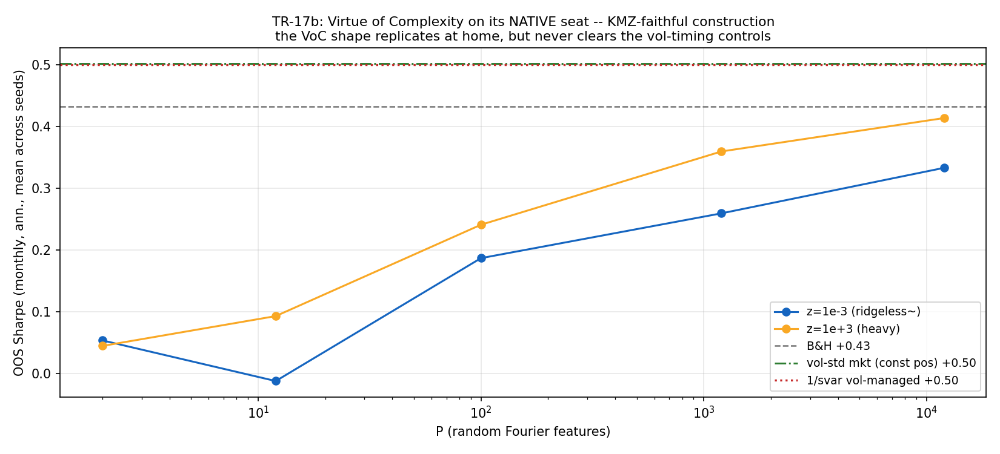

# TR-17b — 複雜度的美德:原生座位重開(Goyal-Welch 15 預測子,1929–2024)

> TR-17 的翻案條件(「ingest Goyal-Welch 資料集」)由 **$0 的 Goyal 官方資料**(更新至
> 2024-12)滿足,依 F10 重開。docs/24 行動 #1。
> 腳本:`scripts/tests/tr17b_kmz_native.py` · 圖:`docs/tests/img/tr17b_native.png`

## 判定:**REPLICATED-BUT-EXPLAINED** — VoC 形狀在原生棲地為真,但被波動擇時(+波動加權動能)張成;**Nagel 批評在源頭獲得確認,ML 章節維持關閉**

## 過程紀錄:一次被稽核逆轉的假陰性

第一次運行沿用 TR-17 機器(`voc_curve` 原封不動),印出 NO-VoC-SHAPE(全表 −0.25~+0.10 平坦)。
對抗稽核判定為**建構誘發的假陰性**——正是 F0 的 !R1 分支預先警告的情境:

1. **形狀殺手(CONFIRMED)**:TR-17 對預測子做 **12 個月視窗內 z-score**,使 RFF 高斯核在數值上
   退化為單位矩陣(非對角 ~3e-3),高 P 預測值被建構性歸零。單開關消融即重現平坦曲線。
2. **目標偏差(CONFIRMED)**:KMZ 的預測目標與交易報酬都是**波動標準化**的
   (ex_{t+1}/σ_t,未中心化 12 個月移動標準差;JF p.491),alpha 基準是 vol-std 市場的
   **靜態部位**——這正是 Nagel 故事的經濟核心。
3. 忠實建構(依稽核 + zivmi/voc_reproduction + KMZ fn.38-39):預測子除以**擴張窗**標準差
   (min_periods=36,保留水位);RFF sin/cos 成對、γ=2、無 1/√P;特徵除以訓練窗標準差;
   ridge 罰項 z·T 於原始特徵 Gram,log10(z)∈{−3..3};**多 seed 平均**(低 P 單 seed 噪音
   與效應同量級;KMZ 用 1000 次抽樣)。

F0 判準與判定層級**未改**;修的是機器,不是球門(TR-24 同款先例)。

## 結果(定案運行,n=1141 個月)

| P \ z | 1e-3 | 1e+0 | 1e+3 |
|---|---|---|---|
| 12 | −0.01 | +0.07 | +0.09 |
| 100 | +0.19 | +0.20 | +0.24 |
| 1200 | +0.26 | +0.26 | +0.36 |
| 12000 | **+0.33** | +0.33 | **+0.41** |

對照組:B&H 超額 +0.43 | **vol-std 市場(常數部位)+0.50** | **1/svar MM +0.50** | 波動加權動能(VTM)+0.40

- **R1 ✓**:曲線在每個 z 都單調上升到 P=12000,量級對上 KMZ 發表值(「SR 普遍超過 0.4」,
  KMZ:0.47)。**複雜度的美德在它出生的座位上是真的。**
- **R2 ✗(預先承諾閘門)**:高 P 集成 SR **+0.42 < MM +0.50**(也低於 vol-std 市場 +0.50)。
  補充診斷:對 vol-std 市場單獨的 alpha-t **+2.41**(呼應 KMZ 發表的 2.6–2.9)——但加入
  Nagel 的 VTM 對照(線性衰減 12 個月;與 RFF 部位相關 **+0.49**)後**塌到 +0.89**。
  12,000 個隨機傅立葉特徵學到的,約等於「波動擇時 + 波動加權動能」。
- **R3 ✓(誠實記錄)**:fabric 版(clip[0,2]、波動正規化、5bps)淨 +0.56 > B&H +0.43。
  但它對兩個 +0.50 的控制只有 +0.06 的邊際,且與 VTM 高相關、alpha 不顯著——不構成
  可宣稱的 alpha,只說明「這個包裝在成本後不自毀」。

## 侷限與敏感度

- γ 敏感度(稽核消融):高 P SR 隨 γ 2→1→0.5 從 +0.33 掉到 +0.21、+0.15——形狀存活,
  量級不穩(KMZ「對 γ 普遍不敏感」的說法在本座位偏樂觀)。
- GW `ret` 為 CRSP 計算的 S&P 系列(工作簿 ReadMe 自證),非 KMZ 的 CRSP-vw——稽核確認
  非問題(忠實反事實用同一欄位復現發表量級)。
- P-grid 為配合多 seed 縮為 5 點(2/12/100/1200/12000);R1 只需端點。

## 與 TR-17 的整合敘事

TR-17(SPY/QQQ 價格訊號座位)PARTIAL 維持:那裡的失敗是**棲地差異**;這裡證明棲地對了
**機制就復現**——然後死在同一個 Nagel 控制上。兩個座位合起來:**「複雜度的美德」是真實的
統計現象、不是可收割的 alpha 來源**。ML FAILED 判定(TR-08/11)維持且再強化。

## 後果

- docs/18:TR-17b 列;TR-17 行補「原生座位已重測」;擇時鐵律敘事新增 KMZ 案例
  (連 t≈2.4 的發表級 alpha 都被 VTM 對照吸收)。
- docs/22:KMZ 標記已執行(T1 重測完成:當初非角度錯誤,是機器不忠實——本次修正);
  Nagel 2025、Buncic 2024 的批評方獲原生座位證據。
- docs/24:行動 #1 完成;Goyal-Welch 資料源「已接線」(1848 個月×187101–202412)。
- 再翻案條件:出現**過 VTM+vol-std 雙控制**的複雜度變體(任何論文宣稱時);或 KMZ 後續
  以多資產座位發表同定理且免費資料可及。

*2026-07-11。第一次運行的 NO-VoC-SHAPE 為建構假陰性,經對抗稽核逆轉;F0 原文與判定層級未改,
POST-RUN AUDIT NOTE 見腳本 docstring。*
