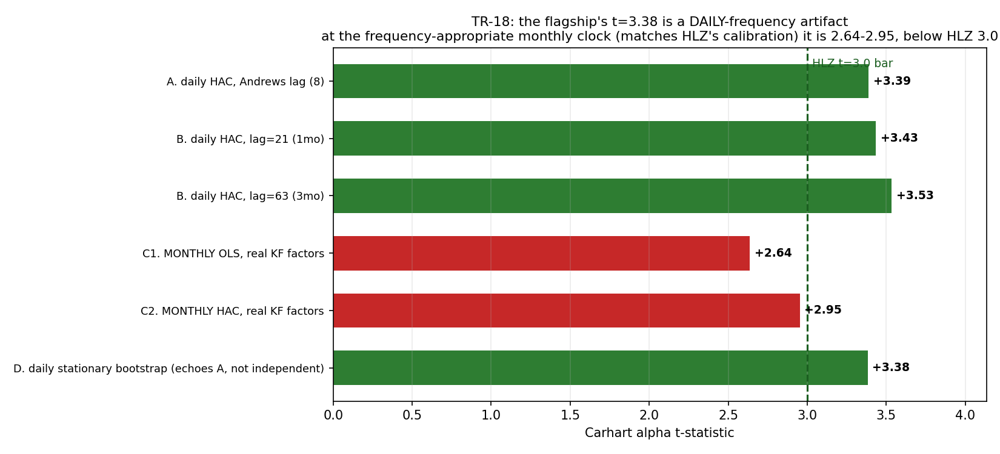

# TR-18 — Inference robustness of the flagship's one PASSED alpha

> Reading-plan wave-1 execution (docs/22): Newey-West HAC (1987) + Politis-Romano stationary
> bootstrap (1994), applied as a stress test of the flagship 5-sleeve combo's Carhart alpha.
> Script: `scripts/tests/tr18_inference_robustness.py` · chart: `docs/tests/img/tr18_inference.png`

## Verdict: **PARTIAL — DOWNGRADE.** The flagship's "clears HLZ t≥3.0" claim does **not** stand at the appropriate frequency.

The flagship is still a **real, robustly-positive alpha** (bootstrap P(α≤0)=0.001). But the headline
**t=3.38 was a daily-frequency artifact**; at the monthly clock — which matches both the monthly
rebalance *and* HLZ's own calibration frequency — the alpha is **t=2.64 (OLS) / 2.95 (HAC), below 3.0**.
This reverts the flagship to its original [docs/08](../08-recommended-strategy.md) reading (t=2.64);
**TR-15's "upgrade to t=3.38" was itself the artifact.**

## F0 pre-commitment (verbatim, not edited post-hoc)

- **Falsifiable claim**: the flagship alpha clears HLZ t≥3.0 under *every* inference method.
- **Verdict rule** (pre-registered): min-t ≥ 3.0 → PASSED-robust · min-t ∈ [2.0, 3.0) → **PARTIAL/downgrade** · min-t < 2.0 → FAILED.
- Result: **min-t = 2.64 ∈ [2.0, 3.0) → PARTIAL.**

## Results

| method | ann. alpha | t | ≥3.0? |
|---|---|---|---|
| A. daily HAC, Andrews lag (8) — *what attribution.py reports* | +7.56% | **+3.39** | yes |
| B. daily HAC, lag=21 / lag=63 | +7.56% | +3.43 / **+3.53** | yes |
| C1. **monthly OLS**, real Ken French factors (n=131) | +5.92% | **+2.64** | **NO** |
| C2. **monthly HAC**, real Ken French factors (n=131) | +5.92% | **+2.95** | **NO** |
| D. daily stationary bootstrap (P(α≤0)=0.001) | +7.56% | +3.38 | yes* |

\*D is a bootstrap-SE **echo** of the daily HAC (same point α, SE_boot≈SE_HAC, resamples daily pairs), so it confirms A rather than adding independent evidence.

## Why daily is inflated (the mechanism — corrected from the F0 rationale)

The F0 *rationale* guessed the risk was daily autocorrelation under-corrected by a short HAC lag.
That was **wrong**: daily residual autocorrelation is ≈0 / slightly **negative**, so longer HAC lags
*raise* t (3.39→3.53). The real inflation channel, confirmed by adversarial audit, is a **Dimson (1979)
lagged-beta effect**:

- market beta = **0.22 daily vs 0.35 monthly** — the daily regression *under-states* the leveraged+trend
  book's true market exposure, so it **mis-attributes factor return as alpha** (daily α 7.56% vs monthly 5.92%).
- Grading a **daily** t against HLZ's **monthly-calibrated** 3.0 bar is apples-to-oranges. HLZ's hurdle is
  built on the cross-section of published factor t-stats, which are monthly.
- The monthly regression is **provably correctly aligned**: shifting the factors ±1 month collapses R²
  (0.45→~0.005) and *spuriously raises* t to ~3.5 — a bug would have made it **pass**, so the monthly
  failure is genuine and conservative.

## Integrity note

The script originally shipped a verdict tree with an extra "BORDERLINE ≥2.5 → keep-PASSED + caveat"
tier that was **not** in the F0 pre-commitment and that happened to bracket the observed 2.95 — textbook
goalpost-moving. An adversarial auditor (fabric F5/F6 discipline) caught it; the tier was removed and the
pre-registered 3-bucket rule applied as written. This TR is as much a catch of our *own* process slip as
a finding about the flagship.

## Consequences (F10 cascade)

- **Flagship** ([docs/18](../18-strategy-registry.md)): downgrade "PASSED (t=3.38, clears HLZ 3.0)" →
  **PASSED-borderline / PARTIAL** on the HLZ bar. Honest headline: real robustly-positive alpha,
  **monthly Carhart t=2.64 (OLS) / 2.95 (HAC), Sharpe ~1.2, does not clear the strict HLZ 3.0 hurdle**;
  still the one surviving risk-shaping deliverable, MDD ~half of VOO.
- **All absolute Carhart t-stats reported at daily frequency** in the project carry the same Dimson
  caveat; the frequency-appropriate figure is monthly. `attribution.factor_alpha` should gain a
  monthly-aggregation option and reports should headline the monthly t for monthly-rebalanced books.
- **Reading plan** ([docs/22](../22-paper-ledger-and-plan.md)): Newey-West 1987 and Politis-Romano 1994
  are now **done** (this TR); Dimson 1979 (thin-trading beta) is added as a queued follow-up.

*2026-07-08. Seat: full-cost 5-sleeve combo 2015-07..2026-05, n=2742 daily / 131 monthly obs.*
