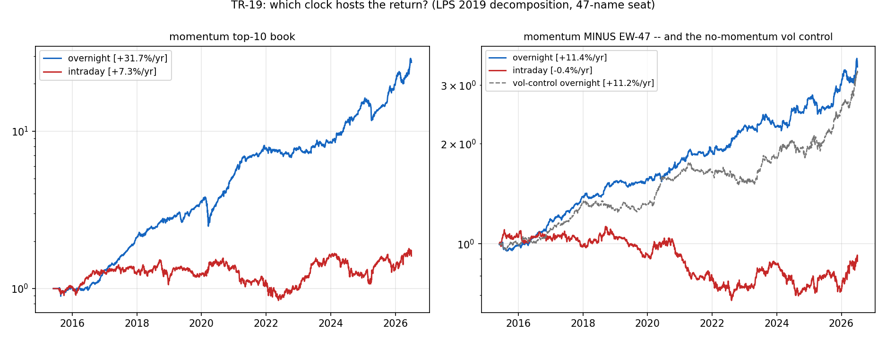

# TR-19 — 隔夜/日內拆解(Lou-Polk-Skouras 2019)— 診斷型

> docs/20 佇列項執行(讀計畫 wave-1)。腳本:`scripts/tests/tr19_overnight_intraday.py` ·
> 圖:`docs/tests/img/tr19_overnight.png` · 對抗稽核:機械面全過 + 兩處歸因敘事修正(已實作)。

## 判定:診斷完成(無 PASS/FAIL 閘門)。**book 的報酬 ~85–90% 住在隔夜;但隔夜超額的主詞是「高波動/beta 傾斜」,不是動量選股。**

**座位**:47 檔產業宇宙(動量 book 原生座位)、月頻 top-10 6-1 動量、等權、1-bar lag,2015–2026,
gross(拆解診斷,非策略)。adj_open = open×(adj_close/close),股利落隔夜腿(LPS 慣例;稽核以
1,140 個除息日驗證無雙計,股利僅占隔夜腿 +0.78pp/yr)。

## 結果(算術年化 mean×252;複利口徑隔夜占比更高 89%)

| book | 隔夜/yr | 日內/yr | SR 隔夜 | SR 日內 |
|---|---|---|---|---|
| 動量 top-10 | **+31.7%** | +7.3% | +1.70 | +0.30 |
| **vol top-10(無動量對照)** | **+31.4%** | +12.9% | +1.47 | +0.45 |
| EW-47 | +20.2% | +7.7% | +1.34 | +0.41 |
| SPY | +9.3% | +5.4% | +0.80 | +0.40 |
| 動量 − EW | **+11.4%** | −0.4% | +1.34 | −0.03 |
| vol 對照 − EW | **+11.2%** | +5.2% | +1.18 | +0.38 |

## 三個結論

1. **Clock 現象是市場層級的**:SPY 隔夜占比 63%、EW-47 72%、top-10 book 81%(複利 89%)——
   越高 beta/波動,隔夜占比越高。與 LPS/Hendershott 系「風險溢酬在隔夜累積」文獻定性一致
   (**同座位內定性一致;非「複製且未衰退」**——construct/宇宙/倖存者皆與 LPS 不同,且 2023-26
   子期日內超額轉正 +6.4%/yr,型態已偏離)。
2. **歸因修正(稽核抓到的關鍵)**:動量 book 的隔夜超額 +11.4%/yr 被**完全不用動量訊號**的
   trailing-vol top-10 對照複製(+11.2%/yr)→ 主詞是**高 vol/beta 傾斜承載宇宙隔夜溢酬**,
   不是動量選股。**與 TR-11 一致(動量=beta,選股增量 FAILED),本 TR 不推翻它。**
3. **對 F1 成交慣例的意涵(本 TR 的實際交付)**:報酬 85-90% 在隔夜的 book,same-close vs
   next-close 慣例是一階問題(IBS 之死的結構性原因再確認);月頻收盤成交的回測**持有過夜**,
   自然捕捉隔夜腿——旗艦不受影響。直接交易拆解仍被成本牆封死(隔夜毛 0.89 → 淨 −0.97,docs/13)。

**稽核驗證**:重組殘差 2e-16、open 品質乾淨(0 缺值、open==close 僅 0.43%,剔除 −12bps)、
shift(2) 反事實幾乎不動(無前視)、21 個再平衡相位隔夜超額 +9.7%~+13.0% 全正(F12)、
算術年化在此反而保守。

*2026-07-09。*
