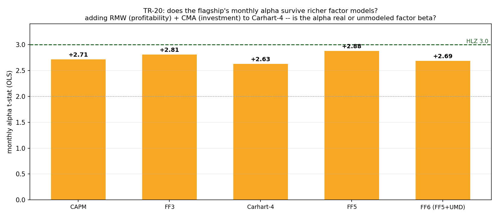

# TR-20 — Does the flagship's (borderline) alpha survive a richer factor model?

> Reading-plan wave-1 (docs/22): Fama-French 5-factor (2015, +RMW +CMA) and 6-factor (FF5+UMD)
> attribution of the flagship, at the monthly frequency established as appropriate in TR-18.
> Script: `scripts/tests/tr20_ff5_attribution.py` · chart: `docs/tests/img/tr20_ff5.png`

## Verdict: **ROBUST.** The flagship's residual alpha is real, not unmodeled profitability/investment beta.

TR-18 downgraded the flagship to *PASSED-borderline* — a real alpha (bootstrap P(α≤0)=0.001) but monthly
Carhart-4 t=2.64, below HLZ 3.0. The obvious next question: is even that residual just RMW/CMA beta a
Carhart-4 model can't see? **No.** Adding RMW (profitability) and CMA (investment) leaves the alpha
essentially unchanged, so the flagship stays PASSED-borderline against a *6-factor* bar.

## Results (monthly, n=131, Ken French factors)

| benchmark | ann. alpha | t (OLS) | t (HAC) | R² | RMW β(t) / CMA β(t) |
|---|---|---|---|---|---|
| CAPM | +6.64% | +2.71 | +2.78 | 0.30 | — |
| FF3 | +6.29% | +2.81 | +3.29 | 0.44 | — |
| **Carhart-4** (TR-18) | +5.90% | **+2.63** | +2.95 | 0.45 | — |
| FF5 (+RMW +CMA) | +6.43% | +2.88 | +3.48 | 0.45 | −0.09 (−1.0) / −0.12 (−1.0) |
| **FF6 (FF5+UMD)** | +6.02% | **+2.69** | +3.08 | 0.46 | −0.06 (−0.7) / −0.14 (−1.2) |

## Read

- The alpha-t is **remarkably stable at 2.63–2.88 across every model** — always positive, always just
  below HLZ 3.0. Adding RMW+CMA shrinks the Carhart-4 alpha by only **−2%** (5.90% → 6.02%, it even ticks up).
- **RMW and CMA betas are small and insignificant** (|t|≈1): the book has essentially no profitability or
  investment tilt, so those factors have nothing to absorb. The flagship's alpha is not disguised RMW/CMA beta.
- The book **does** load on UMD (it contains momentum sleeves): FF5-without-UMD reads a flattering HAC t=3.48,
  but the complete **FF6 (which nets out momentum) gives t=2.69** — the honest figure, and it survives.
- Consistent with TR-18: real, robustly-positive alpha, **persistently borderline below HLZ 3.0 at monthly
  frequency**. TR-20 removes one more "it's just unmodeled beta" objection; it does *not* move it above 3.0.

## Consequence

Flagship verdict unchanged (**PASSED-borderline**), but strengthened: the residual alpha is robust to a
5-/6-factor benchmark, not an artifact of an under-specified model. Reading plan (docs/22): **Fama-French
2015 five-factor done**; the **q-factor (Hou-Xue-Zhang, ROE+I/A from EDGAR)** remains queued as the
independent cross-check (it needs EDGAR-built factors, not Ken French).

*2026-07-08. Seat: full-cost 5-sleeve combo, monthly n=131, 2015-2026. F0 rule: FF6 t≥2.0 & alpha within ~30% of Carhart-4 → ROBUST (met: t=2.69, alpha −2%).*
