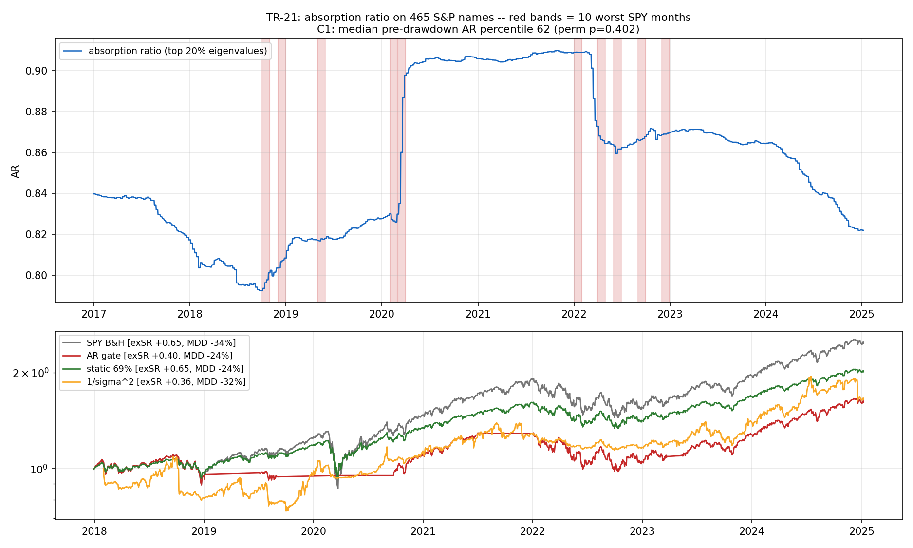

# TR-21 — Absorption Ratio(Kritzman-Li-Page-Rigobon 2010)脆弱度診斷 + 閘門

> 來源路徑:創作者 reel 線索 → 對回主要來源(KLPR, "Principal Components as a Measure of
> Systemic Risk", JPM 2011)→ F0 預先承諾 → 一天內判定(見 [docs/23](../23-creator-mechanisms.md))。
> 腳本:`scripts/tests/tr21_absorption_ratio.py` · 圖:`docs/tests/img/tr21_absorption.png`

## 判定:**FAILED(本座位)** — AR 在 465 檔 S&P 個股面板上既非領先診斷、閘門也輸給常數

**座位**:465 檔高覆蓋現任 S&P 成分股(curated,F11 已標)、日線、500 天窗、top 20% 特徵值、
AR 2017–2025-01。**原生棲地**:~51 個美國**產業組合** × 1998–2010(含 GFC 內生槓桿危機)——
錯置風險預先標 MEDIUM。

## 結果(F0 三分規則,照字面執行)

| 宣稱 | 結果 | 判 |
|---|---|---|
| C1 診斷「AR 領先大跌」(PIT 百分位) | 最差 10 個 SPY 月份前月 AR 百分位中位 **62**(置換 p=0.40;規則 ≥70 且 p<0.05) | **FAIL** |
| C1b 忠實 KLPR 尖峰版(前月 dAR>1) | **4/10**,對全月基準率 **39%**(p=0.60) | **FAIL** |
| C2「AR 看得到平均相關看不到的」 | corr(AR, 平均成對相關)= **+0.97** — 本座位上兩者幾乎同物 | (描述性)不成立 |
| C3 閘門(dAR>1 → BIL) | exSR **0.40** / MDD −24.5%;忠實三態版 0.40 / −20.6%;**靜態 69% 曝險 0.65 / −24.2%**;隨機閘門安慰劑 p95 = 0.88 | **FAIL** |

圖上半直觀呈現失敗原因:AR 在 2018Q4 與 2020-02 之前是**低檔**,COVID 後才跳上高原並停整個
2021(反應性);**2022 熊市期間 AR 一路下行**(前月 dAR 多為負)。閘門紅色平坦段=坐掉反彈。

## 對抗式稽核(雙向)與修正

稽核員雙向攻擊(錯殺 vs 美化),兩個 CONFIRMED 都已實作回腳本:

1. **反 AR 偏誤(錯殺方向)**:原 C1 用全樣本百分位排名,COVID 後的結構性 AR 高原機械性壓低
   2018–2020 事件排名(2020-02:全樣本 33 vs PIT 78)。**修正為 point-in-time 百分位:44 → 62,
   仍不過線。** 忠實 dAR-尖峰版也補上(C1b),同樣 FAIL。
2. **美化閘門(反向)**:原單門檻(dAR≤1 即滿倉)提早吃到 V 型反彈;**忠實 KLPR 三態**(>1→0%、
   <−1→100%、之間 50%)實作後 CAGR 更低(6.2%)——原版的不忠實方向是**高估**閘門,FAIL 更穩。
3. **維度病理檢查**:N=465、T=500(q≈0.93)雜訊地板高(iid AR≈0.52);稽核員把 465 檔重組成
   51 個等權組合(KLPR 同量級 q)重跑——**所有結論不變**。
4. 樣本限制誠實記錄:worst-10 = 最差 12% 月份,其中 8 個是利率/估值熊市(2018Q4、2022),
   非 AR 理論設計要抓的**內生系統性耦合**;唯一域內事件(COVID)上**忠實訊號確實有響**
   (2020-01/02 dAR≈+1.8、PIT 百分位 78/69)。一個樣本救不了判定,但外推「AR 無用」會過度。

## 翻案條件(標成資訊成本)

- 真 GICS **產業組合面板**(工程成本,免費資料可近似)+ **含 2008 的長歷史**(PIT 宇宙=付費/髒資料成本)→ 在原生棲地重測。
- 樣本內出現新的**內生槓桿累積型**危機(非外生衝擊)→ 事件驅動複測。

## 後果

- docs/18:AR 入 FAILED 表(機制)+ TR-21 列;「擇時鐵律」第三個確認案例(Markov、IBS 之後):
  **聰明風險模型的閘門價值再次被一個常數複製甚至超越**。
- E1 健康儀表:AR 不納入(診斷力未證);若日後產業面板版翻案再議。
- docs/22:KLPR 標記已執行(FAILED);Bun-Bouchaud-Potters 2017 入深讀(TR-03b 擴充的理論支撐)。

*2026-07-09。F0 規則:C1 pass & C3 pass → PASSED;C1 pass only → PARTIAL;C1 fail → FAILED(命中)。*
