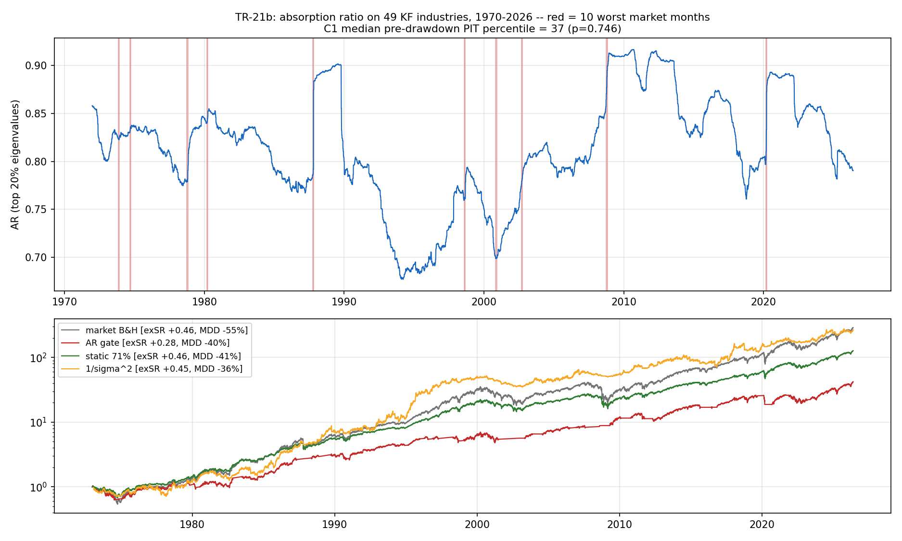

# TR-21b — Absorption Ratio 原生座位重開(Ken French 49 產業日頻,1970–2026)

> TR-21 的翻案條件(「真產業組合面板+含 2008 長歷史」)由 **$0 的 KF 49 產業日頻**(1926+,
> CRSP 建構、無存活偏差)滿足,依 F10 重開。docs/24 行動 #2。
> 腳本:`scripts/tests/tr21b_absorption_native.py` · 圖:`docs/tests/img/tr21b_native.png`

## 判定(稽核後三段式分裂):**閘門 FAILED(擇時鐵律第 5 次確認)/ 診斷 WEAK-PARTIAL**

- **水位宣稱反轉**:KLPR「高 AR = 脆弱」在自家棲地不成立——10 個最差市場月份**前月**的
  AR PIT 百分位中位數只有 **37**(逐事件 7–95,p=0.746)。1987-10 前月水位僅第 18 百分位
  但尖峰有命中:低水位快速**上穿**才是有訊息的形態,水位本身沒有。
- **位移(dAR>1 尖峰)弱存活**:KLPR 2011 招牌 exhibit 在原生座位 **7/10 命中 vs 全月基準率
  33%**(iid 置換 p=0.020;群聚保持 circular-shift 公平 null p=0.034)。**AR-特異**:同機制
  安慰劑——21 天實現波動 3/10(p=0.54)、平均成對相關 5/10(p=0.26)——儘管
  corr(AR, 平均相關)=+0.92,位移訊號確實分道。
- **閘門第 5 次死亡**:dAR>1→現金的閘門 exSR **0.28** vs 靜態 70.8% 曝險 **0.46**(隨機閘門
  安慰劑 p95=0.55;在 1000 個保留 run-length 的猴子閘門中排第 **7 百分位**)。免成本仍 0.28;
  忠實三態 MDD −25.7% 但 exSR 0.26,而槓桿不變性使任何靜態的 exSR 恆等於市場 0.46,
  MDD 優勢救不回。**閘門在 1987-10、2008-10、1974-09、2002-09 開盤即空手、2020-03 月中
  減半——躲過 4.5/10 個最差月仍輸**:至今最乾淨的「診斷真、擇時死」示範。

## 稽核紀錄(數字全數重現;問題在判定層)

1. **CONFIRMED(錯殺)**:預先承諾判定樹只鍵在 C1/C3,漏了 C1-fail + C1b-pass 分支,
   腳本照樹印出「does not replicate even at home」——被自己的 C1b PASS 證偽。依 TR-18
   教訓**不回改 F0**;判定以本檔與腳本 POST-RUN NOTE 的分裂判定為準。
2. **C1b 顯著性的誠實邊界**:僅在預先承諾的 K=10 過檻(公平 null 下 K=5 p=0.056、
   K=15 p=0.106、K=20 p=0.064);{C1,C1b} 雙檢定 Bonferroni×2:iid 0.040、公平 null 0.068。
   **報告為「暗示性(suggestive)」,不得寫成乾淨的 p=0.02 單點。**
3. **領先性是一季寬的 regime 標記,不是前月尖峰**:命中剖面 t-3 6/10、t-2 7/10、t-1 7/10、
   同月 5/10、t+1 8/10(t+1 最高=15d/500d 機制的反應滯後);7 個命中中 3 個(2008-10、
   2020-03、1974-09)前月本身已跌 >8%;只看前月平靜(>−5%)的事件 4/7 vs 基準 32%,
   p≈0.17 單獨不顯著。敘事=「dAR>1 episode 通常在大跌月前約一季內展開,部分為事中反應」。
4. 面板與機件乾淨:49 欄 1926-07..2026-05、−99.99 遮罩正確、1970+ 覆蓋率 >0.99、
   EW 產業均值 vs KF Mkt 相關 +0.968;dAR>1 基準率跨年代穩定(事件年代加權 34.9% ≈ 全樣本 33%)。

## 與 TR-21 的整合敘事

尖峰診斷具**棲地特異性**:個股座位(TR-21)4/10、p=0.46 全滅、唯 COVID 有響 → 產業座位
7/10 弱存活。水位與閘門在**兩個座位皆亡**。AR 至多是 E1 健康儀表板的**候選輸入之一**
(帶「一季寬、部分事中」的標籤),**永不作為交易閘門**。

## 後果

- docs/18:TR-21b 列;擇時鐵律案例 #5(Markov、IBS、AR 個股、KMZ 之後)。
- docs/22:KLPR 原生座位重測已執行(T1 類:當初非角度錯誤,是座位錯置——換座位後
  診斷半條命回來,擇時結論不變)。
- docs/24:行動 #2 完成;KF49 資料源「已接線」。
- 再翻案條件:樣本內出現新的內生槓桿累積型危機 → 事件驅動複測 C1b(K=10,公平 null)。

*2026-07-11。F0 判定樹缺 C1b 分支屬起草缺口,經對抗稽核以分裂判定登錄;原樹文字未改。*
