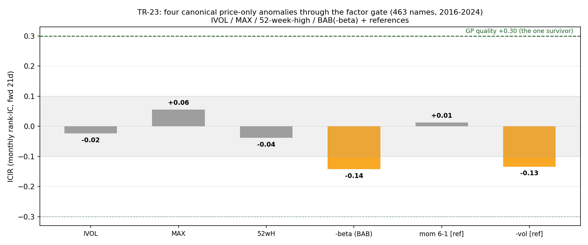

# TR-23 — 讀計畫 wave-1 批次:四個純價量橫斷面經典異象

> 一次過因子閘門:**AHXZ 2006 特異波動、Bali-Cakici-Whitelaw 2011 MAX、George-Hwang 2004
> 52 週高、Frazzini-Pedersen 2014 BAB(-beta,lite)**。座位:463 檔幽靈股修正後現任 S&P、
> 月頻、fwd 21d rank-IC、2017-2024(n=95 月)。腳本:`scripts/tests/tr23_anomaly_batch.py` ·
> 圖:`docs/tests/img/tr23_anomalies.png` · 對抗稽核:**零 CONFIRMED-BUG**(本系列首見),
> 三個判讀精修已註記。

## 判定:**四個經典全數未過閘門——「唯一倖存橫斷面訊號=GP 品質」的 headline 成立且強化。**

| 因子 | ICIR | 半期(17-19/20-24) | D10-D1/yr | 判定 |
|---|---|---|---|---|
| IVOL(AHXZ) | −0.02 | −0.00 / −0.00 | +10.1% | **FAIL** |
| MAX(BCW) | +0.06 | −0.01 / +0.03(翻號) | +14.8% | **FAIL** |
| 52wH(George-Hwang) | −0.04 | −0.02 / +0.00 | −11.3% | **FAIL**(6/12 月期限反事實也 ~0 → 強化) |
| −beta(FP-lite BAB) | −0.14 | 兩半期同號負 | −18.7% | **WEAK,raw 反向**;**alpha-level ≈ 0**(見下) |
| mom 6-1 [校準] | +0.01 | — | +1.6% | 吻合 docs/09(動量死) |
| −vol [校準] | −0.13 | — | −23.0% | 吻合 docs/09(−0.11,反向低波動) |

## 三個稽核精修(判讀層,零機械 bug)

1. **BAB 的「反向」只在 raw 層**:高 beta D1 +28.6%/yr vs 低 beta D10 +9.9%——整個 −18.7% 是
   **beta × 大牛市的機械補償**。FP 的原始主張是 alpha 層;用 **EIV-clean 對沖**(disjoint 前一
   504d 窗的 beta 當工具變數,beta 秩持續性 0.86)後 **IC −0.01 ≈ 0**。結論:**BAB 在本座位是
   FLAT,不是被反轉**——與 TR-06(SML 反轉)一致但更精確:反的是 raw 補償,不是 FP 的 alpha 宣稱。
   (注意:同窗 beta 自我對沖會得到假的 +0.13,是 EIV 假象——方法教訓入庫。)
2. **檢定力**:n=95 月下四者 ICIR 95% CI 全部蓋住 ±0.20——**FAIL=「本座位/樣本偵測不到」,
   不是「證明為零」**。
3. **IVOL 非單調**:D1–D9 平坦(+14~18%/yr),D10 獨自 +26%/yr(t≈1.8-2.2)——與 F0 宣告的
   high-beta-wins prior 一致的尾部反向效應;rank-IC 把非單調剖面讀成 ≈0 是正確行為。

## 意義

- **墳場再添四座**:2015-24 大型股 AI 牛市座位上,防禦/彩券類溢酬(IVOL、MAX、BAB)全數
  死平或 raw 反轉、動量族(52wH)死——風險在此樣本被持續**獎勵**,唯一站得住的橫斷面訊號
  仍是**基本面品質(GP,ICIR +0.30)**。與 G-S 均衡一致:$0 價量資訊在效率大型股宇宙賺 $0。
- **校準列的內部效度**:momentum ≈0 與 −vol −0.13 獨立重現 docs/09 的數字。
- **對 Minervini rulebook 的提示**:52wH 接近度在本宇宙橫斷面**無 IC**——rulebook 中 52 週高
  條件的價值(若有)在結構過濾,不在選股排序。
- **翻案條件**:小型股/國際 PIT 宇宙(彩券溢酬原生棲地在散戶高持股小型股)、含熊市完整週期
  的長歷史;alpha-level BAB 需 FP 原版 rank-weighted 建構+槓桿約束敘事(資訊成本=宇宙擴充)。

*2026-07-09。同輪完成 fabric 接線:`factor_alpha_monthly()` 入庫(TR-18 月頻教訓),與 TR-18 數字
bit-level 吻合(5.92%/yr、OLS t=2.64、HAC 2.95、n=131)。*
