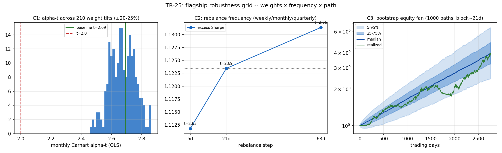

# TR-25 — 主力組合穩健度網格:交付的是「高原」還是「單點」?

> 深度系列第一份(回應「我們測了廣度,但沒有深度」):同一個標的,把權重×頻率×路徑三個
> 維度一次掃完。腳本:`scripts/tests/tr25_robustness_grid.py` · 圖:`docs/tests/img/tr25_robustness.png`

## 判定:**ROBUST-PLATEAU** — 頭條數字在權重 ±20-25%、週/月/季頻率、1000 條重抽路徑下全部成立;同時確認「邊際」是結構性的

**基準**(註冊表配置,風險平價 126/21,2015-07~2026-06,n=2756 日):
excess Sharpe **+1.12**、月頻 Carhart alpha-t **+2.69**(與 TR-18 的 2.64 同量級,資料多了幾個月)。

| 檢查 | 設計 | 結果 | 判 |
|---|---|---|---|
| C1 權重擾動 | 210 個變體:200 個隨機 sleeve 傾斜(各 sleeve 乘上 U[0.80, 1.25] 後逐日重新正規化)+10 個單 sleeve ±20% 角點 | exSharpe 第 5 百分位 **+1.08**(規則 ≥+0.97);**100%** 的變體 alpha-t ≥2.0(規則 ≥90%);t 值範圍 **[2.46, 2.86]** | **PASS** |
| C2 再平衡頻率 | step ∈ {5, 21, 63} 交易日(週/月/季),lookback 固定 126 | exSharpe 1.11 / 1.12 / 1.13,**差距 0.02**(規則 ≤0.15);三個頻率 alpha-t 2.63 / 2.69 / 2.65 | **PASS** |
| C3 路徑重抽 | (組合, VOO) 逐日**聯合**定態拔靴(平均 block 21 日)×1000 條 | **99.8%** 的路徑組合回撤淺於 VOO(規則 ≥90%);exSharpe 5–95% 帶 **[+0.67, +1.58]** | **PASS** |

## 兩面都要讀

1. **正面**:回撤砍半這個交付不是挑出來的——權重挑法、再平衡日、以及「這一條歷史路徑」
   都不是結論的必要條件。C3 的通道圖(拔靴權益扇形)顯示實現路徑就落在分布中間偏下,
   沒有任何「剛好走運」的跡象。
2. **反面(同樣重要)**:210 個權重變體的 alpha-t 範圍是 [2.46, 2.86]——**整個高原都低於
   HLZ 的 3.0 門檻**。TR-18 的「邊際」判定是結構性質,不是基準權重的人為產物;在這個
   鄰域裡不存在一組權重能把它推過嚴格門檻。

## 誠實範圍

- **反 HARKing 承諾(F0 原文)**:變體是敏感度探針、不是候選人;無論哪個變體分數更高,
  註冊表基準維持 RP 126/21 不變。因為沒有發生任何挑選,本網格**不增加 F5 試驗數**。
- C1/C2 的離散是「同一條實現路徑上」的條件離散(C3 才處理路徑本身);傾斜範圍 ±20-25%
  探的是鄰域,不涵蓋極端配置(例如把單一 sleeve 打到零)。
- 拔靴 block 平均 21 日:保得住月內自相關,保不住跨月的 regime 持續性;2015–2026 仍是
  單一總經年代(長歷史重放由既有的 TAA 長史與 QuantConnect 2008 重放計畫另行覆蓋)。
- 成本:三個維度都用毛報酬(成本拖累 12–72 bps/年對所有變體近似一致,TR-15 已單獨計價;
  頻率維度上週頻的換手較高,若計成本 C2 的排序只會更平或略偏向低頻,不影響 PASS)。

## 後果

- docs/18:主力組合列補「TR-25 高原確認」;深度系列(穩健度網格)自此立項——下一個
  候選對象:毛利品質因子(權重×持有期×子期網格)。
- README:成功案例一補一句「權重、頻率、路徑三個維度都測過」。
- 佇列:持有期×換手率曲線(C2 只掃了再平衡頻率,還沒掃訊號持有期)、同機制跨頻率
  複製(TR-18 只對主力組合做過)。

*2026-07-11。F0 判準與判定層級照預先承諾執行;無 POST-RUN 修改。*
