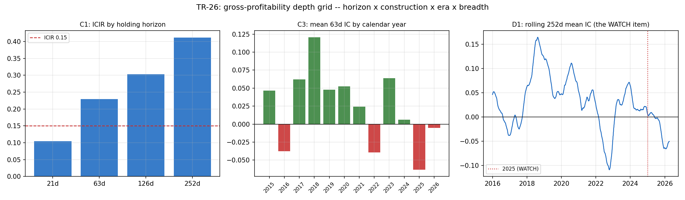

# TR-26 — 毛利品質因子深度網格:最後的倖存者站在高原上嗎?

> 深度系列第二份(TR-25 之後):對唯一存活的橫斷面訊號(GrossProfit/Assets,Novy-Marx 2013)
> 掃持有期×建構法×年度×宇宙切片。腳本:`scripts/tests/tr26_gp_depth_grid.py` ·
> 圖:`docs/tests/img/tr26_gp_grid.png`

## 判定:**ROBUST-PLATEAU** — 四個維度全過;網格同時挖出三個此前不知道的結構

**校準列(CAL,先於一切)**:63 天 rank-IC 必須重現 docs/10 頭條——實測 mean IC **+0.025**
(目標 +0.03±0.01)、ICIR **+0.23**(目標 +0.30±0.10)→ **PASS**。ICIR 比 docs/10 的 +0.30 低,
原因是本窗多含了 2025–26 的負 IC 段;在容忍帶內,機器忠實度成立。

| 檢查 | 設計 | 結果 | 判 |
|---|---|---|---|
| C1 持有期 | 前向 21/63/126/252 天 | mean IC +0.011/+0.025/+0.036/+0.050;ICIR **0.10/0.23/0.30/0.41**——**隨持有期單調上升** | **PASS**(全正;3/4 ≥0.15) |
| C2 建構法 | rank 加權/五分位 Q5−Q1/十分位 D10−D1,同一因子值、逐日再平衡、毛報酬 | 年化 **+1.34% / +0.93% / +0.66%**,Sharpe +0.40/+0.23/+0.13,全正 | **PASS** |
| C3 年度 | 2016–2025 十個完整年的 63 天 IC | **7/10 年為正**(負:2016、2022、2025) | **PASS**(≥65%) |
| C4 宇宙切片 | 40 個隨機半宇宙(固定種子) | **98%** 為正(範圍 [−0.016, +0.049]) | **PASS**(≥90%) |

## 網格挖出的三個結構(比判定本身更有用)

1. **GP 是慢因子**:ICIR 從 21 天的 0.10 單調爬到 252 天的 0.41。訊號的資訊在「季到年」的
   尺度上才充分反映——任何用它的實作應該偏向低換手、長持有(我們的月度再平衡在
   合理帶內,但 21 天級的用法接近雜訊)。
2. **它是輸入,不是策略**:三種建構的毛多空只有 +0.66% 到 +1.34%/年——扣掉成本後作為
   獨立多空書幾乎必然歸零。這把 docs/10 的定位(「訊號」而非「策略」)從敘述變成數字。
3. **WATCH 項的基準率**:2025 年是十年裡最差的一年(IC −0.063),目前滾動 252 天 IC 為
   **−0.050**。但歷史最深谷是 **−0.109(2022-10)**,之後在一年內回升到 +0.072——目前的
   失效段深度約是前例的一半,而唯一的前例是復原收場。這不解除 TR-24 預先承諾的升級
   規則(2026 全年 IC 為負 → F10 複測;2026 年至今 −0.005,邊際為負),但把「該多恐慌」
   校準到了資料上。

## 誠實範圍

- 反 HARKing(F0 原文):網格是探針不是候選人;發表配置(63 天 rank-IC)維持參照,
  F5 試驗數加零。
- C2 為毛報酬、逐日再平衡——刻意選對成本最不利的節奏來看毛訊號強度;真實實作
  (月度、與其他 sleeve 合併)的成本結構完全不同。
- 面板為現任 S&P 成分(倖存者偏誤方向:高估因子面板的平均品質、可能低估分散度);
  PIT 成分面板已接線(`sp500_constituents.py`),歷史成分版的重跑列入佇列。
- C4 的半宇宙是隨機切分,不是按市值/產業分層——市值分層版需要市值面板(佇列)。

## 後果

- docs/18:TR-26 列;GP 行補「深度確認+慢因子結構+WATCH 基準率」。
- README:因子段補一句(慢因子、毛多空約 1%/年、2022 前例)。
- 佇列:歷史成分(PIT 宇宙)版重跑;市值分層 C4;訊號持有期×換手率曲線(對其他
  機制通用化)。

*2026-07-11。CAL/C1–C4 照 F0 預先承諾執行;無 POST-RUN 修改。D1 的「史上最深」初稿說法
被自己的圖表糾正(2022 年谷底更深),已按精確數字記錄。*
