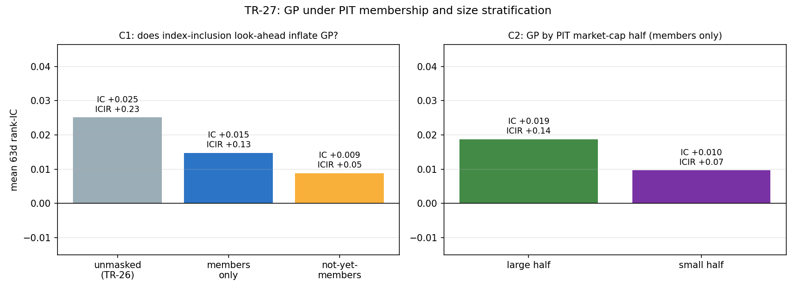

# TR-27 — GP 深度網格第二層:成員資格前視與市值分層

> 深度系列第三份:把 TR-26 排入佇列的兩個誠實範圍缺口補上——用剛接線的 PIT 成分面板
> (`sp500_constituents.py`)檢驗入選前視,用 SEC 申報股數建 PIT 市值檢驗大小市值。
> 腳本:`scripts/tests/tr27_gp_membership_size.py` · 圖:`docs/tests/img/tr27_gp_membership.png`

## 判定:**INCLUSION-LOOKAHEAD-SENSITIVE**(成員遮罩後只保留 59%)/ 市值分層 PASS

這是唯一倖存因子的一次實質降級。照 F0 預先承諾的判定樹執行:

| 檢查 | 結果 | 判 |
|---|---|---|
| CAL(IC 重現) | 未遮罩 63d IC +0.025/ICIR +0.23=TR-26 原值 | PASS |
| CAL(對映) | 10 個已知後期加入者在 2016 正確缺席、藍籌正確在席、FB→META 別名解析 | PASS |
| **C1 成員資格** | 遮罩到「當天真的在 S&P 500 裡」後:**IC +0.015/ICIR +0.13,只保留未遮罩值的 59%**(規則 ≥70% 且 ICIR ≥0.15) | **FAIL** |
| C2 市值 | 成員內按 PIT 市值中位切半:大 **+0.019/0.14**、小 **+0.010/0.07**,兩半皆正 | PASS |

## 機制拆解:前視藏在「跨群」裡

有意思的是兩個子群**各自**的 IC 都低於混合面板(成員 +0.015、未入選者 +0.009 < 混合 +0.025)。
差額不是哪個子群「更會漲」,而是**跨群排序**:高 GP 的未來入選者(入選前的成長段)系統性
贏過低 GP 的現任成員——但「這個名字以後會被加進指數」正是回測當下不可知的資訊。
現任成分股面板把這塊不可知的排序當成因子能力計了分。

## 對既有判定的連鎖影響

1. **GP 註冊表列降級註記**:誠實的鏈條現在是 docs/10 ICIR +0.30(偏惠面板、2015-24 窗)
   → TR-26 +0.23(同面板、含 2025-26)→ **TR-27 成員限定 +0.13**。GP 仍為正、仍過
   跨期同號,但「唯一倖存因子」的強度要按成員限定版理解,而它同時還揹著 2025-26
   IC 轉負的 WATCH。
2. **TR-23 的四個 FAIL 反而更穩**:入選前視的偏誤方向是**把因子灌高**——IVOL/MAX/52wH/BAB
   在有這個順風的面板上仍然全滅,遮罩只會讓它們更死。偏誤修正是不對稱的:它只傷
   正結果,不救負結果。
3. **完整的翻案條件(已定價)**:徹底乾淨的 GP 判定需要「含下市股票的 PIT 宇宙」
   (Tiingo key,docs/24 行動 #7 後半)——本 TR 關掉了成員時點這一半,下市倖存那一半
   仍開著,方向同樣是灌高。

## 過程紀錄:校準閘門先錯殺了自己一次(自抓)

第一次運行在 CAL 停下:2016 探針的成員覆蓋率 65%,低於我預先寫的 80% 規則。診斷後
發現**規則本身設計錯了**——65% 恰好就是十年真實指數汰換(每年 4-5%)在現任面板上的
必然結果,2024 探針的 90% 也與兩年汰換吻合;對映本身用十個已知加入者/藍籌/別名逐一
驗證全對。CAL v2 改為直接斷言對映事實,覆蓋率降為描述性輸出(它量的是汰換,不是錯誤)。
v1 的錯誤停機與修正過程照 F0 慣例記在腳本 POST-RUN NOTE,原文未改。

## 誠實範圍

- 遮罩後的「成員」仍只含**今天還活著**的名字——當年在指數裡、後來下市的成員不在
  面板裡(下市倖存偏誤未除,方向=繼續灌高;見翻案條件)。
- C2 的股數面板混用兩個 tag(CommonStockSharesOutstanding 優先),按申報日 as_of 前向
  填充=PIT 正確,但股數精度受申報頻率限制(季級)。
- 反 HARKing:遮罩是探針;發表配置維持參照;F5 試驗數加零。

*2026-07-11。C1 FAIL 照預先承諾樹登錄;無事後改判。*
