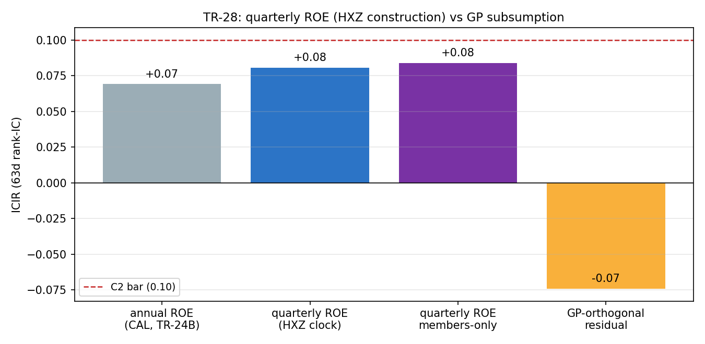

# TR-28 — 季頻 ROE(HXZ 建構):TR-24B 的翻案項,執行完畢

> TR-24B 判「年度 ROE 被 GP 吸收」時留了一個誠實但書:HXZ 的 q-factor 用的是**季頻**
> 盈餘除以落後一季的帳面權益,年報可能只是太舊。10-Q 面板已在庫(43k 筆季度損益、
> 495 檔、2009 起),翻案成本 $0。腳本:`scripts/tests/tr28_quarterly_roe.py` ·
> 圖:`docs/tests/img/tr28_qroe.png`

## 判定:**SUBSUMED-CONFIRMED** — GP 在年頻與季頻兩種時鐘下都吸收 ROE;q-factor ROE 章節對本面板關閉

| 檢查 | 結果 | 判 |
|---|---|---|
| CAL(年度 ROE 重現 TR-24B) | ICIR +0.07(容忍帶 +0.11±0.05) | PASS |
| C1 季頻 ROE 單獨 | mean IC +0.008/**ICIR +0.08**(門檻 0.15) | **WEAK** |
| **C2 GP 正交殘差**(翻案的核心問題) | mean IC **−0.007/ICIR −0.07**(規則:mean>0 且 ICIR≥0.10) | **SUBSUMED** |
| 補充(不設門,TR-27 教訓) | 成員限定季頻 ROE ICIR +0.08——**沒有** GP 那種入選前視折價,但本來就弱 | 描述性 |

## 建構(事前定案,含一個先抓到的地雷)

- 動工前抽查 AAPL FY2024 發現:庫存的 10-Q 損益值是 **YTD 累計**(Q2=57.6B 是上半年,
  不是單季),且同文件夾帶前一年度比較值。單季 NI 因此用**同會計年度內 YTD 差分**還原
  (Q1=YTD₁;Q2=YTD₂−YTD₁;Q3=YTD₃−YTD₂;Q4=10-K 全年−YTD₃),每組取 period_end 最新
  的那筆(剔除比較值)。
- 帳面權益是時點值(無 YTD 問題),取「期末嚴格早於該季」的最近一筆=落後帳面權益。
- PIT 時鐘:每個季度數字的可知日=兩個組成部分中**較晚**的申報日;日頻寬表按可知日
  前向填充。共還原 25,031 個季度事件(485 檔,2009-07~2026-06)。

## 解讀

1. **「年報太舊」的假說被否決**:換到 HXZ 的季頻時鐘,ROE 的單獨訊號只從 +0.07 動到
   +0.08,而 GP 正交殘差直接轉負——ROE 相對 GP 沒有增量資訊,反而殘差略帶反向。
   Novy-Marx 的論點(毛利比淨利乾淨,會計層級越往下雜訊越多)在本面板獲得第二次確認。
2. **連鎖**:docs/18 的 GP 列自此可寫「subsumes ROE at both clocks(TR-24B 年頻、
   TR-28 季頻)」;q-factor 的 ROE 腿在本面板不再有獨立測試價值。
3. **與 TR-27 的關係**:本 TR 的門檻沿用未遮罩面板(與 TR-24B 可比);成員限定讀數
   已附上。ROE 弱到遮不遮罩都不改判定。

## 誠實範圍

- 差分還原假設同一 fy 的 YTD 序列同源一致;會計重述(restatement)會讓個別季度失真,
  但屬雜訊性質、非系統性方向。
- 面板=現任成分(TR-27 已量化該偏誤方向為灌高)——對一個「弱到被吸收」的結論,
  這個偏誤只會讓真實情況更差,判定方向安全。
- 反 HARKing:單一預先登記建構,F5 試驗數加零。

*2026-07-11。CAL/C1/C2 照 F0 預先承諾執行;無 POST-RUN 修改。*
