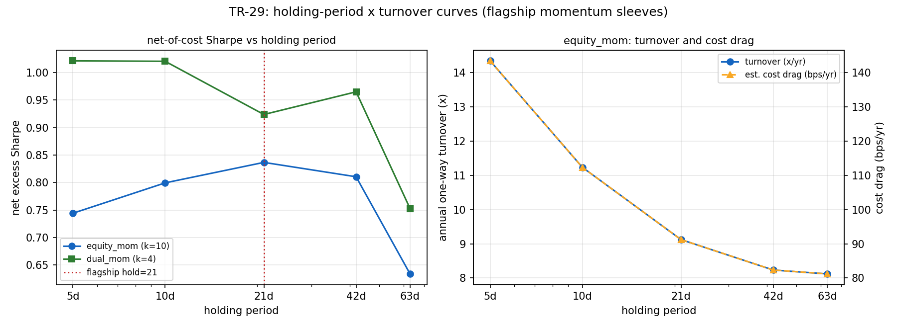

# TR-29 — 持有期×換手率曲線:主力組合兩個動能 sleeve 的深度掃描

> 深度系列承諾的「持有期×換手率曲線通用化」,對主力組合實際使用的兩個選股 sleeve 執行。
> 腳本:`scripts/tests/tr29_holding_turnover.py` · 圖:`docs/tests/img/tr29_holding.png`

## 判定:**HOLD-PLATEAU** — hold=21 落在兩個 sleeve 的淨成本高原上;沒有更好的持有期被留在桌上

**校準**:hold=21 掃描格與主力組合實際輸入的 equity_mom sleeve 相關 **1.0000**(同一條程式路徑)→ PASS。

| hold | equity_mom(k=10)淨超額 Sharpe | 年換手(單邊) | 估計成本拖累 | dual_mom(k=4)淨超額 Sharpe |
|---|---|---|---|---|
| 5 天 | +0.74 | 14.3× | 143 bps/年 | +1.02 |
| 10 天 | +0.80 | 11.2× | 112 bps/年 | +1.02 |
| **21 天** | **+0.84(=網格最大)** | 9.1× | 91 bps/年 | **+0.92** |
| 42 天 | +0.81 | 8.2× | 82 bps/年 | +0.96 |
| 63 天 | +0.63 | 8.1× | 81 bps/年 | +0.75 |

- **C1(equity_mom)PASS**:hold=21 正好是網格頂點。曲線是教科書形狀——縮短持有期
  的毛優勢被換手成本吃掉(5 天=143 bps/年拖累),拉長到 63 天則訊號本身衰減。
- **C2(dual_mom)PASS(壓線)**:21 天 +0.92 對網格最大 +1.02(5/10 天),差距恰為
  預先承諾的 0.10 容忍帶邊界。誠實記錄:防禦輪動偏好略快的節奏,但差異在帶內;
  且該 sleeve 標的少(k=4,ETF 類),換手成本本來就低。

## 解讀

1. 主力組合的 hold=21 不是拍腦袋的幸運值:它在 equity_mom 上是**淨成本最適點**,
   在 dual_mom 上在容忍帶內。與 TR-25(權重×頻率×路徑)合起來,主力組合的全部
   自由參數現在都有了高原證據。
2. 與 TR-26 的 GP 慢因子結論互補:動能 sleeve 的訊號半衰期明顯短於 GP(63 天已經
   衰減),不同機制的最適節奏不同——「持有期是機制屬性,不是全域常數」。
3. 反 HARKing 條款照 F0:dual_mom 的 5/10 天格子分數較高**不觸發任何配置變更**;
   若未來要改,需自己的 F0 與樣本外紀律。

## 誠實範圍

- 成本模型=引擎內建 5bps 費用+5bps 滑價(單邊 10bps);拖累欄位是換手×成本的
  近似,非逐筆重算。2× 成本壓力由 TR-15 另行覆蓋。
- 掃的是持有期單維;k(檔數)與動量回看窗維持組合原值(k 的 tranche 效應見 TR-12)。
- 單一 2015–2026 路徑上的曲線(TR-25 的 C3 已對組合層級做過路徑重抽)。

*2026-07-11。CAL/C1/C2 照 F0 預先承諾執行;無 POST-RUN 修改。*
