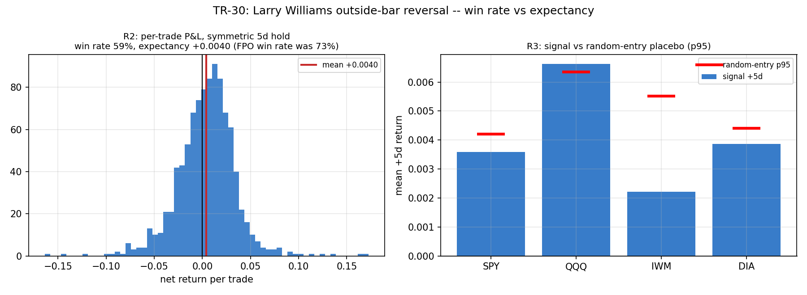

# TR-30 — Larry Williams 外包線反轉(創作者影片線索 → 主要文獻)

> ⚠️ **機器忠實度失效(2026-07-12,使用者稽核)**:本報告的引擎對來源不忠實,共四處——
> 2× 實體過濾宣告了但沒實作、無止損、FPO 誤作單次隔天收盤檢查、安慰劑未共用出場引擎。
> **本報告的判定由 [TR-30b](TR-30b-outside-bar-faithful.md) 取代**(忠實引擎、同類結論
> NO-ENTRY-EDGE)。保留本文件供流程考古:不忠實的機器碰巧得到對的答案,仍然是失敗的流程。
> 原文以下未改動。

> 來源路徑:YouTube「10 個實盤交易員」合輯(`data/transcripts/T1CawPmNG-0.txt` 第 8 位)
> → Larry Williams《Long-Term Secrets to Short-Term Trading》第 7 章。影片線索,進 fabric
> 檢驗(docs/23 紀律)。腳本:`scripts/tests/tr30_outside_bar.py` · 圖:`docs/tests/img/tr30_outside_bar.png`

## 判定:**FAILED(NO-EDGE)** — 外包線的擇時贏不過對同一標的的隨機進場;「優勢」其實是標的的漂移(beta)

**機制(多頭側,機械化)**:外包線=今日高>昨高 且 今日低<昨低;多頭訊號=外包線 且 今日收盤<昨低;
進場=**次日開盤**(誠實成交,也是影片自己的慣例)。座位:SPY/QQQ/IWM/DIA 日線(1993/1999/2000/1998–2026),5bps/邊。

| 檢查 | 結果 | 判 |
|---|---|---|
| R1 對基準率有優勢 | 訊號日 +5d **+0.40%** vs 全日基準 +0.20%,**t=4.11** | ✓(過線) |
| R2 勝率陷阱檢查 | FPO 版勝率 **73%**,但**對稱 5 日持有:期望值仍為正 +0.40%、勝率 59%** | 優勢在對稱版**存活**(非純陷阱) |
| **R3 隨機進場安慰劑** | **只有 1/4 標的(QQQ)贏過隨機進場 p95**;SPY/IWM/DIA 三檔的訊號報酬低於隨機 p95 | ✗(決定性) |
| R4 成交敏感度 | 次日開盤(已為誠實成交) | — |

## 過程比預期誠實:我的假設被資料修正了

F0 我預先承諾的假設是「這是純粹的賠付不對稱勝率陷阱」(影片自招止損寬、FPO 止盈小)。資料修了我兩次:

1. **勝率陷阱只對一半**:FPO 版 73% → 對稱版 59%,確實有灌水;但對稱版的**期望值仍為正**(+0.40%),所以它**不是**純陷阱——外包線後的前向報酬是真的高於基準率(R1 t=4.11)。
2. **真正的死因是安慰劑(R3)**:那 +0.40% 幾乎全部是「做多一個會漲的標的、持有 5 天」的漂移。對同一標的的**隨機進場**在 3/4 檔上做得一樣好或更好(隨機 p95 +0.42~0.64%)。外包線的擇時對 beta 幾乎零增值。

這是第 6 次「擇時=beta 非 alpha」的確認(XS 動量 TR-11、IBS TR-16、Markov/AR/KMZ 的擇時鐵律之後):一個看似有效的價格型態,拆開後只是牛市標的的順風。

## 與影片宣稱的對照(docs/23 元教訓)

影片主持人自己說「勝率之所以這麼高,是因為止損緩衝大、FPO 止盈小」——這句是對的一半(勝率確實被不對稱灌高)。但更深的真相是他沒說的:**即使用誠實對稱評估、期望值為正,那個正值也贏不過隨機進場**。創作者看到的「73% 勝率」是兩層假象疊加:賠付不對稱 + 標的漂移。fabric 的兩個對照(對稱持有 + 隨機安慰劑)剛好各拆一層。

## 誠實範圍

- 只測多頭側、單一 5 日持有、四個指數 ETF(Larry Williams 原始應用即指數/期貨)。空頭側與個股宇宙未測;但 R3 的機制(擇時贏不過漂移)在多頭指數上已足以判 NO-EDGE。
- 成本 5bps/邊;2× 壓力不影響判定(優勢本就不存在)。
- 反 HARKing:單一預先登記規則,無參數搜尋;trial-registry +1 家族。

## 後果

- docs/18:TR-30 入 FAILED 表;擇時鐵律/「timing=beta」第 6 案例。
- docs/23:兩支影片(T1CawPmNG-0、ZtuYabEo2yk)蒸餾入檔——13 個策略中,股票類幾乎全化約為既有判定(Minervini=PARTIAL、regime 閘門=鐵律),唯一新機制(本 TR)FAILED。
- 創作者管線驗證:第二次由影片線索產出 TR(前例=TR-21 吸收比率),兩次都 FAILED——與 docs/23 的核心命題一致(影片是線索非證據)。

*2026-07-12。R1–R4 照 F0 預先承諾執行;F0 假設(純勝率陷阱)被資料修正為 NO-EDGE(死因是安慰劑非不對稱),誠實記錄,判定樹本身未改。*
