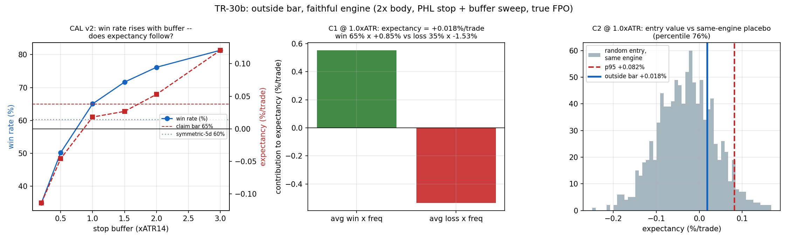

# TR-30b — 外包線忠實引擎重測(使用者稽核觸發的機器忠實度翻案)

> 翻案基礎:**使用者稽核(2026-07-12)**——「TR-30 因為 Larry Williams 在真實世界發生過超額報酬,
> 是否我們驗證的方式錯了?」對照逐字稿逐條檢查後,質疑成立:TR-30 的機器對來源**不忠實,共四處**。
> 這正是 T1 機器忠實度規則(TR-17b 教訓)應先做而未做的步驟——第一次由使用者而非對抗稽核員抓到。
> 腳本:`scripts/tests/tr30b_outside_bar_faithful.py` · 圖:`docs/tests/img/tr30b_outside_bar_faithful.png`

## TR-30 的四個忠實度缺口(對照 `data/transcripts/T1CawPmNG-0.txt` 逐條驗證)

| # | 影片/書的規則 | TR-30 實作 | 缺口性質 |
|---|---|---|---|
| 1 | 外包線實體 ≥ 前一根 **2 倍**(影片預設 minRatio=2) | 完全沒實作 | **F0 計畫有寫、程式碼漏掉=真 bug**(四檔共 966→756 訊號,22% 是不該進的) |
| 2 | 止損=外包線低點 −緩衝(預設 0.2×ATR14) | 沒有止損(5 天時間出場代替) | 機制核心缺件 |
| 3 | FPO=**每天開盤**檢查,第一個獲利開盤出場 | 只檢查隔天收盤一次 | 成交價與檢查頻率皆錯 |
| 4 | (fabric 要求)安慰劑須共用出場引擎才能隔離進場價值 | 安慰劑比裸 5 日報酬 | 對照設計缺陷 |

另有一處 CAL 設計錯誤在執行中被抓到(見下)。

## 判定:**NO-ENTRY-EDGE(與 TR-30 同類,但這次機器忠實)**——影片的勝率宣稱被完整重現並定位,進場對同引擎隨機安慰劑零增值

**忠實引擎**:2× 實體過濾、次日開盤進場、止損=外包線低點 −b×ATR(14)(跳空穿越以開盤成交)、
FPO=第一個獲利開盤出場、5bps/邊。座位:SPY/QQQ/IWM/DIA 日線(真實成交開盤價)。

### CAL v1→v2(POST-RUN AUDIT NOTE;判定樹未改)

CAL v1 假設影片預設緩衝(0.2×ATR)就重現「勝率奇高」→ **失敗**(勝率 35%、62% 觸損、中位持有 0 天)。
但逐字稿自己說了原因:影片展示時「止損的緩衝區**放的比較大**」——大於預設、數值未公布。
**含未公布參數的宣稱必須在參數空間裡定位,不能假設預設值。** CAL v2 改為預先宣告網格
{0.2, 0.5, 1.0, 1.5, 2.0, 3.0}×ATR 掃描,**判定固定在最小達標緩衝**(非表現最佳格),陷阱預測預先寫死:
勝率應隨緩衝上升、期望值應貼零。

### 結果

| 緩衝(×ATR) | 0.2 | 0.5 | **1.0** | 1.5 | 2.0 | 3.0 |
|---|---|---|---|---|---|---|
| 勝率 | 35% | 50% | **65%** | 72% | 76% | 81% |
| 期望值/筆(淨) | −0.114% | −0.046% | **+0.018%** | +0.027% | +0.053% | +0.121% |
| FPO 出場占比 | 38% | 55% | 71% | 79% | 84% | 89% |

**影片的宣稱被完整重現且定位**:勝率是止損緩衝的單調函數(35%→81%),正是「緩衝大+FPO 小」的
賠付不對稱機制——影片自招的那句話,量化成一條曲線。

| 檢查 | 結果 | 判 |
|---|---|---|
| CAL v2 | 緩衝 1.0×ATR 達勝率 65%(對稱 5 日持有僅 60%) | ✓ 宣稱定位成功 |
| C1 期望值 @1.0×ATR | **+0.018%/筆**(微乎其微);平均賺 +0.85%×65% vs 平均賠 −1.53%×35%,賠付比 0.56 | 正但薄如紙 |
| **C2 進場價值(乾淨問題)** | 同引擎隨機進場 p95=+0.082%;外包線 +0.018% 落在**第 76 百分位** | **✗(決定性)** |
| C3 年代誠實(SPY) | 樣本內尾段 1993–1998:n=40、勝 62%、**期望 −0.036%**;發表後 1999–2026:+0.018% | 樣本內年代反而更差 |

## 回答觸發本翻案的三個問題

**1. TR-30 的驗證方式錯了嗎?——對,四個具體缺口+一個 CAL 設計錯,使用者稽核完全成立。**
但忠實重測後判定同類:進場零增值。教訓精確化為:**「不忠實的機器碰巧得到對的答案,仍然是失敗的
流程」**——TR-30 的結論存活是運氣,不是品質。

**2. Larry Williams 的真實紀錄能否重現?** 三個證據物必須分開:
- **1987 Robbins 盃($10k→$1,137,600)**:真實、經賽事稽核;但那是期貨槓桿+裁量+參賽者右尾選擇
  (他自己說過年中曾從高點回撤約 2/3)。即使拿到對帳單,驗證的是「那個交易員那一年」,不是這個型態。
- **書中回測表格**:自報、樣本內;取得=買書(小資訊成本,已記)。
- **書寫下的規則**:唯一可重現物=本 TR。結果:在他樣本內年代尾段(SPY 1993–98)期望值為**負**;
  掃遍緩衝,最佳格 +0.121%/筆 × 每檔每年約 7 筆 ≈ **無槓桿 0.9%/年**——沒有任何槓桿能把這個薄度
  放大成冠軍報酬而不先破產。該回報來自機制以外的東西。

**3. 1982–1992 完整期貨座位可達嗎?** $0 內不可達:Yahoo ^GSPC 開盤價幾乎全年代造假
(1975–81 有 94%、1982–98 有 67%、連 1996–2002 都 95%+ 開盤=前收——FPO 機制依賴真實開盤價,
此資料不可用);Stooq 有 JS 驗證牆。真實期貨 PIT 資料=付費(翻案資訊成本,Grossman-Stiglitz 定價)。

## 制度化修正(寫入 fabric 慣例)

1. **創作者影片也適用 T1**:動工前先從逐字稿抽出**完整規則表**(訊號過濾/進場/止損/止盈逐條),
   每個引擎元件映射到逐字稿原句;TR-30 跳過此步。
2. **含未公布參數的宣稱→在預先宣告的網格中定位,判定固定在最小達標格**(CAL-locate 模式)。
3. **判進場價值時,安慰劑必須共用出場引擎**(TR-30 的裸報酬安慰劑量錯了對象)。

## 誠實範圍

- 只測多頭側(TR-30 同範圍);空頭側規則影片有給,未測。
- FPO 歧義:逐字稿主句說每日開盤檢查,另有一句暗示獲利收盤也可出場;採 Williams 正典版(第一個
  獲利開盤),歧義已記。
- 影片自己說「非常依賴品種的選擇,要廣泛回測選出合適品種」=公開建議標的選擇後見之明;我們的
  四檔座位是預先承諾的,無選擇。
- 試驗會計:+0 家族(TR-30 同家族的機器修正);緩衝掃描為 CAL 定位非選擇。

*2026-07-12。使用者稽核觸發;CAL v1 設計錯誤照 TR-27 慣例修 v2 並記錄;F0 判定樹未改;TR-30 判定
由本報告取代(同類結論、忠實機器)。*
