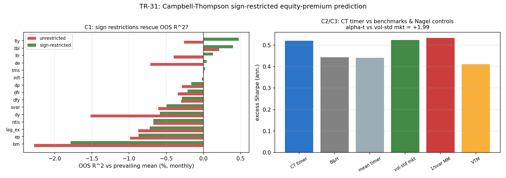

# TR-31 — Campbell-Thompson(2008)符號約束股權溢酬預測

> 翻案基礎:docs/22 標「資訊成本已付」——GW 預測子已 ingest(TR-17b 同座位)。CT(RFS 2008,
> 《Can Anything Beat the Historical Average?》)回應 Goyal-Welch 的樣本外失敗:多數預測子樣本外
> 確實輸給歷史均值,但加上兩個經濟符號約束——(a)係數符號與理論相反就歸零、(b)股權溢酬預測
> 截斷於零——能救回一小塊(CT 稱有經濟意義的)樣本外 R²。這是 GW/CT 這一線的原生棲地:單資產
> 市場擇時的預測迴歸。腳本:`scripts/tests/tr31_campbell_thompson.py` · 圖:`docs/tests/img/tr31_campbell_thompson.png`

## 判定:**符號約束方向上複製、但經濟上為零、且被波動擇時張成**(F0 樹嚴格路由=NO-OOS-RESCUE,邊界失敗)

三個門檻與結果,以及一個誠實的邊界問題:

| 檢查 | 結果 | 判 |
|---|---|---|
| CAL(重現 GW) | 未約束 R²_OS 中位數 **−0.40%**(<0,多數輸均值) | ✓ 機器忠實 |
| **C1(CT 核心)** | 符號約束下 **6/15 轉正**(數量門檻達標);但**最佳僅 +0.48%**(門檻 +0.50%,差 0.02%) | **✗(邊界)** |
| C2(經濟價值) | CT 擇時器 exSharpe **+0.52** > B&H +0.44 > 均值擇時器 +0.44 | ✓ |
| **C3(Nagel 對照)** | CT +0.52 **打平** vol-std 市場 +0.52、**輸** 1/svar MM +0.53、勝 VTM +0.41;alpha-t vs vol-std 市場 **+1.99** | **✗** |

## 誠實的邊界問題(POST-RUN AUDIT NOTE;F0 未回改)

F0 預先承諾的判定樹把 `!C1` 直接路由到 **NO-OOS-RESCUE**。但這個標籤對本次結果**過於二元**:

- 左圖顯示符號約束**方向上確實救援**——幾乎每個預測子的綠條都在紅條右邊,6 個轉正(lty −0.26→+0.48、
  tbl +0.21→+0.40、de −0.72→+0.04、ltr −0.40→+0.13、tms/infl 微正)。CT 的機制在本座位**部分複製**。
- C1 失敗只差在**量級**:最佳 +0.48% 差 +0.50% 門檻 0.02%(雜訊等級),而數量門檻(6/15)已達標。

依 TR-18/TR-21b 教訓**不回改 F0**;判定以本節的**三段式誠實描述**為準:
**「符號約束方向複製(6/15 轉正)/ 經濟上為零(最佳 +0.48% 低於有意義尺度)/ 被波動擇時張成
(C3:打平 vol-std 市場、輸 MM,alpha-t 1.99<2)」**。

**關鍵:這個結論不依賴那 0.02% 的門檻。** 無論 C1 取寬或嚴,C3 都成立——即使符號約束救回的那點
預測力轉成擇時器、也贏過買進持有,它仍然**贏不過波動擇時三對照**。這正是 TR-17b(KMZ 原生座位)
的同款結局:**免費資料上的市場擇時,拆到底都是 beta/波動故事,Nagel 在源頭再次獲確認**。

## 與既有判定的整合

- 擇時鐵律再添一案(GW/CT 原生座位):Campbell-Thompson 的符號約束是文獻裡「救回 OOS 預測力」
  最有力的一招,在本座位方向複製但經濟為零、且被波動擇時吸收。
- 與 TR-17(KMZ 本座位 PARTIAL)、TR-17b(KMZ 原生 REPLICATED-BUT-EXPLAINED)構成完整敘事:
  **RFF 複雜度與符號約束線性迴歸,兩條最強的免費資料擇時路線,在同一組 Nagel 對照前都倒下**。
- docs/22:Campbell-Thompson 標「已執行」;GW 資料的兩大用途(KMZ/TR-17b、CT/TR-31)皆完成。

## 誠實範圍

- 單資產月頻、擴張窗、20 年 burn-in;CT 也做過年頻與多變量組合(sum-of-parts、kitchen-sink),
  本 TR 只測逐一單變量符號約束(CT 的核心宣稱);多變量組合留待翻案(資料在手,工程小)。
- 符號取標準 CT/GW 理論值,動工前固定(反 HARKing)。
- C3 的 alpha-t 1.99 極接近 2.0——但判定不靠它:CT 擇時器 Sharpe 本就沒超過 vol-std 市場/MM。

*2026-07-12。CAL/C1-C3 照 F0 預先承諾執行;`!C1` 分支標籤過二元,以 POST-RUN 三段式描述為準,F0 樹未改。*
