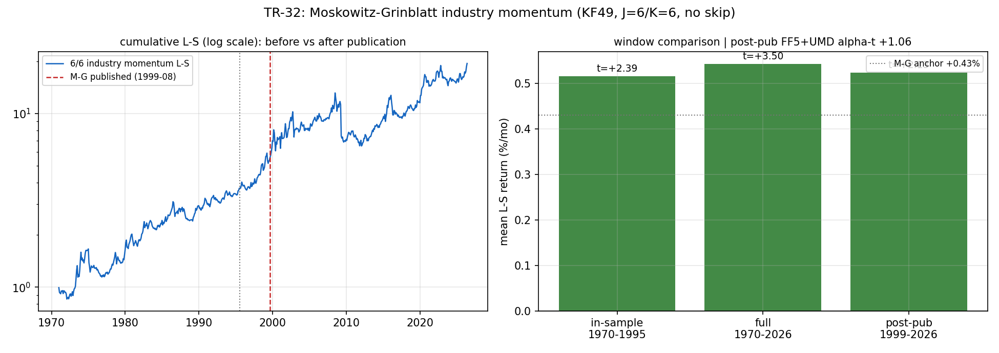

# TR-32 — Moskowitz-Grinblatt(1999)產業動量

> 翻案基礎:docs/22 佇列、資訊成本已付——KF 產業組合已為 TR-21b ingest,FF5+UMD 月頻 loader
> 現成(TR-20/24/25)。M-G(JF 1999《Do Industries Explain Momentum?》)宣稱:買過去 6 個月
> 最強產業、放空最弱,月均約 +0.43%,**不跳最近一月時最強**(與個股動量的指紋差異),且吸收
> 個股動量的大半。我們的橫斷面帳:廣個股動能死(docs/09)、XS top-K 動量=beta(TR-11)——
> M-G 是文獻上「動量的真身在產業層」的反命題。
> 腳本:`scripts/tests/tr32_industry_momentum.py` · 圖:`docs/tests/img/tr32_industry_momentum.png`

## 判定:**REPLICATED-BUT-SPANNED——樣本內複製、發表後只衰退 2%、但整條報酬流是「穿產業外衣的 UMD」,無獨立 alpha**

**座位**:KF49 價值加權產業組合月頻 1970-01–2026-05;J=6/K=6 重疊組合(Jegadeesh-Titman 法)、
頭尾 15%(7/49)、等權持有;訊號層判定(1998 年前產業籃子不可直接交易;成本描述性列報)。

| 檢查 | 結果 | 判 |
|---|---|---|
| CAL(M-G 樣本內重疊窗 1970–1995) | 月均 **+0.516%**(錨 +0.43%,帶 [0.15%, 0.85%]),NW t=+2.39 | ✓ 複製 |
| C1 全樣本 1970–2026 | 月均 **+0.543%,NW t=+3.50**;月換手 26%,10bps 單邊淨後 +0.491% | 原始報酬過 HLZ 量級 |
| **C2 發表後 1999-08–2026** | 月均 +0.524%,t=+2.13,**衰退僅 −2%**(McLean-Pontiff 平均 −58%) | **未衰退——罕見** |
| **C3 FF5+UMD 張成** | 全樣本 alpha **+0.042%/mo(t=+0.40)**;發表後 +0.165%(t=+1.06);2015+ +0.276%(t=+1.34) | **✗ 決定性:被 UMD 完全吸收** |
| C4 指紋診斷 | 樣本內 no-skip +0.516% **<** skip-1m +0.637%——**與 M-G 的「不跳月更強」指紋相反** | 機制指紋不符 |

## 兩面讀法

**支持面(左圖)**:累積 L-S 五十六年單調向上、穿越發表線不減速——這是我們測過的機制裡
**發表後衰退最少的一條**(−2% vs McLean-Pontiff 平均 −58%)。產業層動量作為「現象」是真的、
持久的。

**反對面(右側+C3)**:它不是新東西。對 FF5+UMD 迴歸後,alpha 在**每一個窗都歸零**
(全樣本 t=0.40、發表後 t=1.06、2015+ t=1.34)——持有這條策略等於持有動量因子 UMD 的
產業曝險版。而 C4 指紋反轉(跳月版反而更強)進一步說明:在 KF49 座位上,M-G 宣稱的
「短期產業特有延續」不存在,活著的只是標準動量因子本身。**「產業動量解釋動量」在本座位
反過來:動量因子解釋產業動量。**

### 為什麼它沒衰退卻仍不可用?

未衰退的是**因子曝險**(UMD 本身發表更早、且以 crash 風險為代價存活),不是**超越因子的
alpha**。要交易它,等於決定「要不要持有動量因子」——那是 docs/09 已經回答過的問題
(我們宇宙 ICIR≈0、2009 動量崩盤型尾部)。近期窗印證:2009–2026 月均 +0.377%(t=1.20)、
2015–2026 +0.605%(t=1.76),方向為正但不顯著,與 docs/09 的「廣動能弱」一致。

## 與帳本的整合

- 橫斷面拼圖補完:個股動能死(docs/09)→ XS top-K=beta(TR-11)→ **產業動量=UMD 曝險
  (TR-32)**。橫斷面唯一倖存的獨立訊號仍是 GP 品質(+0.13~+0.30 誠實鏈)。
- 與 TR-24(q-factor)方法呼應:同窗張成迴歸是判「新因子 vs 舊因子新衣」的標準刀。
- docs/22:M-G 標已執行。

## 誠實範圍

- 座位差異已宣告:KF49 分類(非 M-G 自建 20 產業)、1970 起(M-G 1963-07 起)、月頻 VW。
  CAL 帶寬 [0.15%, 0.85%] 就是為此而寬。
- M-G 的另一半宣稱(「產業動量吸收**個股**動量」)需要個股×產業對映的面板,未測——但方向
  相反的張成結論(UMD 吸收產業動量)使該半宣稱在本座位失去實務意義。
- K=6 重疊使殘差自相關,NW 6 lags 已處理;試驗會計 +1 家族(單一預先登記配置,skip 變體為
  指紋診斷非候選)。

*2026-07-13。CAL/C1–C4 照 F0 預先承諾執行;判定樹嚴格路由(C2 t=2.13≥2 → 進 C3 分支 →
alpha-t 1.06<2 → REPLICATED-BUT-SPANNED),無 POST-RUN 修改。*
