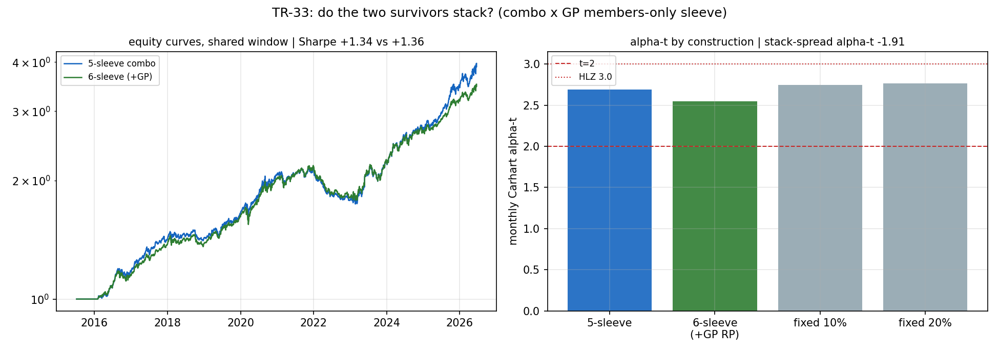

# TR-33 — 兩個倖存者能疊加嗎?主力組合 × GP 品質 sleeve

> 翻案基礎:docs/22 佇列「combo × GP 交互」。整場戰役恰好剩兩個倖存者:5-sleeve 風險平價主力
> (唯一邊界 alpha,月頻 Carhart t=2.64,TR-18/20/25)與 gross profitability(唯一倖存橫斷面
> 訊號,誠實鏈 +0.30→+0.23→成員限定 +0.13,TR-26/27)。TR-26 已警告 GP 毛多空僅 ~1%/yr=
> 「訊號而非策略」;本 TR 是組合層級的終審:成員限定 GP 純多頭 sleeve 加進主力帳簿,是增量
> alpha 還是稀釋?
> 腳本:`scripts/tests/tr33_combo_gp_stack.py` · 圖:`docs/tests/img/tr33_combo_gp_stack.png`

## 判定:**NO-STACK——GP 在組合層級零增量(疊加價差 alpha 為負),主力維持 5-sleeve;TR-26「訊號非策略」的組合層級確認**

**座位**:日頻引擎、t 形成 t+1 生效(build_combo 慣例);GP sleeve=當日實際 S&P 成員(TR-27
誠實遮罩)中 GP 頂五分位、等權、21 日再平衡、換手 10bps/邊;6-sleeve 用同一套 risk_parity
再加權;推論一律月頻時鐘(TR-18 教訓)。共同窗 2015-07–2026-06(132 個月;F4 小樣本註記)。

| 檢查 | 結果 | 判 |
|---|---|---|
| CAL a(主力錨) | 5-sleeve 月頻 Carhart **t=+2.69**(帶 2.0–3.2,錨 2.64) | ✓ |
| CAL b v2(GP 機器) | 成員限定 63d 排名 **ICIR +0.097**(TR-27 錨 +0.13,帶 [0.03, 0.25]) | ✓ |
| C1 帳簿指標 | Sharpe 1.34→1.36、MDD −19.3%→−18.4%、**alpha-t 2.69→2.55**(HAC 2.91→2.76) | 表面「改善」 |
| **C2 疊加價差(決定性)** | 6-sleeve − 5-sleeve:**−1.19%/yr,Carhart alpha-t −1.91(HAC −2.05)** | **✗ 增量為負** |
| C3 描述性 | 固定 10%/20% 混合:alpha-t 2.75/2.76(HAC 3.05/3.15);GP sleeve 平均 RP 權重 16% | 見下方誠實註記 |

## CAL v1→v2(POST-RUN AUDIT NOTE;判定樹未改)

CAL-b v1 用「頂五分位跑贏等權成員」當健全性檢查 → **失敗(−3.56%/yr)**——但失敗暴露的是
**設計錯誤而非機器 bug**:docs/10 的證據是**排名 IC**,排名 IC 為正**不蘊含**頂桶跑贏。機器
忠實度的正確錨=TR-27 實際量測的統計量(成員限定 ICIR)本身;v2 用同一面板+遮罩重現 +0.097,
過帶。v1 的桶傾斜降級為診斷——而它是**本報告最有價值的數字**(見下)。

## 最有價值的診斷:+0.13 的 IC 到底住在哪?

| 桶(成員限定、等權、21d、淨) | 相對等權成員基準 |
|---|---|
| GP 頂五分位(多側) | **−3.56%/yr** |
| GP 底五分位(空側) | **−3.60%/yr** |
| 頂 − 底(可交易 L-S) | **+0.04%/yr ≈ 零** |

**兩側尾桶都輸給中段**——在 S&P 成員宇宙、等權建構、淨成本後,GP 的排名資訊完全轉不成
桶間報酬價差。ICIR +0.097 是真的(CAL 過),但它的賠付薄到蓋不過建構與成本;分布中段
(往往是巨型股聚集處)在本窗最強。這是誠實鏈的終點站:
**docs/10 +0.30 → TR-26 +0.23 → TR-27 成員限定 +0.13 → TR-33 組合層級 +0.04%/yr ≈ $0**。

## C1「改善」與 C3 的誠實註記(反 cherry-pick)

- C1 的 Sharpe/MDD 微幅改善是**風險平價稀釋效果**:加入任何一條分散的股票報酬流都會平滑
  波動——但 alpha 水準同時被稀釋(2.69→2.55),疊加價差的 alpha 是**負的**。
- C3 固定權重格的 HAC t 升破 3(3.05/3.15)**不可提報為通過**:(a) 描述性、非預先承諾;
  (b) t 上升來自分母(波動平滑)而非分子(alpha 增量為負);(c) 事後挑 10%/20% 格=F5 違規。
  預先承諾的決定性檢查(C2)說增量為負——判定以它為準。

## 後果

- **主力組合維持 5-sleeve,不改產品**。GP 的正確用途=資訊(選股工作中避開爛 GP 的濾網、
  基本面品質的監測儀表),不是可入帳的 sleeve——TR-26 的「訊號非策略」在組合層級蓋章。
- 慣例新增:**桶單調性永不作 CAL 假設**;校準對象=上游 TR 實際量測的統計量;桶傾斜留作診斷。
- docs/22:combo × GP 交互標已執行。

## 誠實範圍

- 純多頭 sleeve(帳簿不做空);GP L-S 疊加未測(+0.04%/yr 的價差已宣告其無意義)。
- n=132 個月(F4);等權基準只含「有基本面資料的成員」(蘋果對蘋果);中段勝尾桶的凹形
  以描述性看待(未做顯著性宣稱)。
- 試驗會計 +1 家族(單一預先登記 sleeve 建構;固定權重格為描述)。

*2026-07-13。CAL v1 設計錯誤照 TR-27/30b 慣例修 v2 並記錄;C1/C2/C3 照 F0 執行;判定樹未改,
嚴格路由 C2 FAIL → NO-STACK。*
