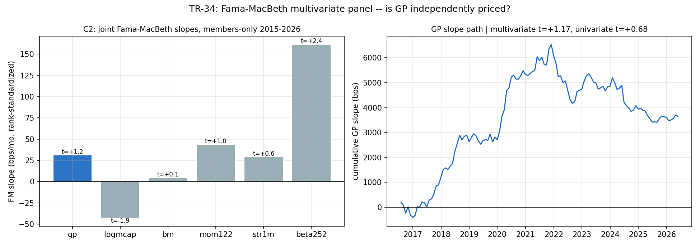

# TR-34 — Fama-MacBeth 多變量特徵面板(方法補完)

> 翻案基礎:docs/22 佇列最後一項「資料在手」。至今所有橫斷面判定都是**單變量**(每因子排名 IC,
> docs/09/10、TR-26/27)。資產定價的標準問題是**聯合**的:市值、動能、短期反轉、beta、帳面市值比
> 同時放進右手邊之後,GP 還是不是獨立被定價的特徵?Fama-MacBeth(1973)月頻橫斷面迴歸是正典
> 機器;本 TR 同時把機器留下當可重用模組。
> 腳本:`scripts/tests/tr34_fama_macbeth.py` · 圖:`docs/tests/img/tr34_fama_macbeth.png`

## 判定:**WEAK-INDEPENDENT(t=1.17)——但年代拆分才是重點:GP 在 2015–2020 顯著獨立定價(t=+2.67),2021 之後歸零(t=−0.85)。WATCH 條件被量化。**

**座位**:成員限定(TR-27 遮罩)月頻橫斷面 2015-07–2026-05(119 個月、每月中位 194 檔同時具備
六特徵),次月報酬對月內排名標準化([−0.5, +0.5])特徵做 OLS,斜率序列取 NW t(3 lags)。
特徵:gp、logmcap(PIT 股數×價)、bm(PIT 股東權益/市值)、mom122、str1m、beta252。

| 檢查 | 結果 | 判 |
|---|---|---|
| CAL a(GP 機器) | GP 單變量斜率 +16.9bps/mo(符號正)、63d ICIR +0.097(帶 [0.03,0.25]) | ✓ |
| CAL b v2(面板機器) | **單變量 beta 斜率 +161bps/mo(t=+2.51)重現 TR-06 的 SML 反轉錨(+1.9%/mo,t=2.69)** | ✓ |
| **C1 多變量 GP(決定性)** | **+30.7bps/mo,NW t=+1.17**(單變量 +16.9,t=0.68;控制市值/beta 後反而更乾淨) | 1≤t<2 → WEAK |
| C2 斜率全表 | 見下 | 機器可信度面板 |
| C3 季頻時鐘 | GP +96.6bps/q(t=+1.09)——慢時鐘同級,無升級 | — |
| **C4 年代拆分** | **2015–2020:+98.6bps/mo(t=+2.67);2021–2026:−25.8bps/mo(t=−0.85)** | **WATCH 量化** |

### C2 聯合斜率表(排名標準化=頂底價差,bps/mo)

| 特徵 | 斜率 | t | 文獻符號 | 讀法 |
|---|---|---|---|---|
| **gp** | **+30.7** | **+1.17** | + | 弱獨立 |
| logmcap | −42.4 | −1.91 | − | 符號正確(小型溢酬方向) |
| bm | +3.8 | +0.13 | + | **價值死透**(docs/09 失落十年,聯合面板確認) |
| mom122 | +43.0 | +1.03 | + | 弱(docs/09 一致) |
| str1m | +28.6 | +0.62 | − | **符號翻轉**——大型股月頻反轉已死(docs/13 一致) |
| **beta252** | **+161.0** | **+2.39** | 0/− | **本年代唯一顯著定價特徵=反轉的 SML**(TR-06 聯合面板級確認) |

## CAL v1→v2(POST-RUN AUDIT NOTE;本週期第三堂校準課)

CAL-b v1 用「STR 斜率必須為負(文獻最穩健符號)」當機器檢查 → **失敗(+28.6bps/mo)**——
設計錯誤是 TR-33 教訓換件外套:v1 進口了**別的宇宙/年代估出的文獻符號**(CRSP 全市值、月頻
反轉還活著的年代);大型股月頻反轉 2000 後已死,我們自己的 docs/13 也早測過反轉類全滅。
**校準必須錨在我們自己在本座位稽核過的量測**:TR-06 在同宇宙跑過單變量 beta FM(SML 反轉,
+1.9%/mo,t=2.69)→ CAL-b v2 重現它(+161bps/mo,t=2.51)過。STR 符號降為 C2 報告項——
它是**關於本座位的發現**,不是機器的門檻。

三堂課同根:TR-30b(未公布參數→網格定位)、TR-33(桶單調性≠排名 IC)、TR-34(文獻符號≠
本座位事實)。**CAL 只能錨定「在相關座位上實際量測過的統計量」。**

## 讀法與後果

- **GP 誠實鏈的最終形狀**:不是「弱但恆定」,而是**「前半段真實、後半段消失」**——右圖累積
  斜率 2017–2021 陡升至峰值後橫盤下滑。TR-26 的滾動 IC 觀察(2025–26 轉負)在聯合面板下前移:
  **2021 起就已歸零**。WATCH 從「2026 全年 IC 仍負則 F10 複測」升級為:**F10 複測時以本 TR 的
  C4 為基準面板**。
- **本年代唯一顯著定價特徵是 beta(SML 反轉)**——高 beta 大勝是 2015–2026 的主宰事實,任何
  在此窗顯著的「因子」都必須先過 beta 控制(本面板已內建)。
- 價值(bm t=0.13)與反轉(符號翻轉)在聯合面板確認死亡;動能弱正(t=1.03)。
- 方法交付:`fm_slopes()` 排名標準化 FM 機器可重用;未來任何新特徵宣稱先進這個面板。

## 誠實範圍

- n=119 個月、每月約 194 檔(六特徵交集+成員遮罩;BM 的股東權益覆蓋是瓶頸)——F4 小樣本,
  WEAK 級距(1≤t<2)本就不支持任何交易決策。
- 特徵皆 PIT(as_of ffill;排名標準化天然抗離群值);次月報酬為因變數,無重疊。
- 試驗會計 +1 家族(單一預先登記規格,無規格搜尋)。

*2026-07-13。CAL-b v1 設計錯誤照慣例修 v2 並記錄(第三堂校準課);C1–C4 照 F0 執行,判定樹
未改,嚴格路由 t=1.17 → WEAK-INDEPENDENT。*
