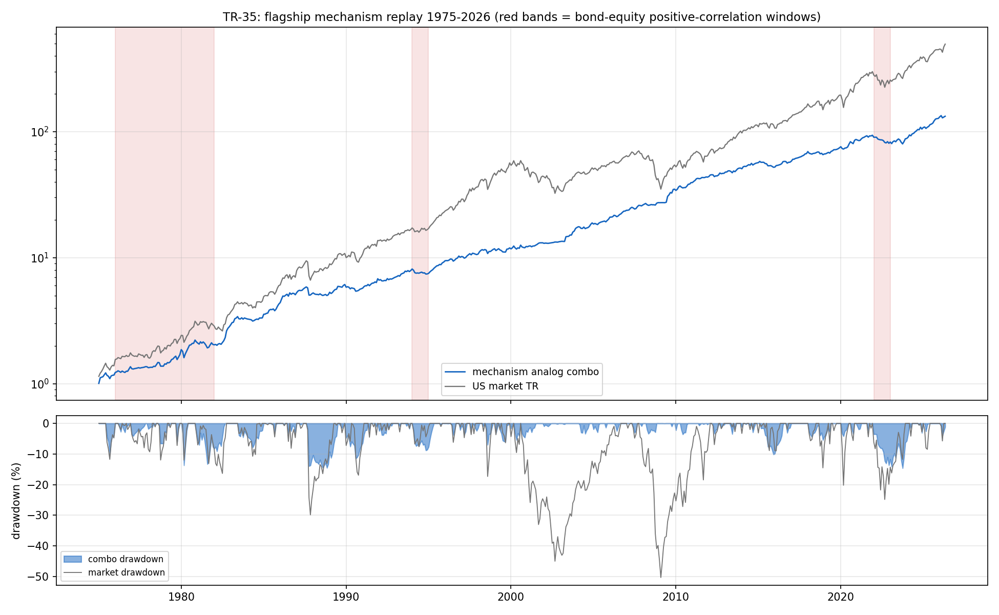

# TR-35 — 主力機制 50 年回放(docs/25 攻擊 2/計畫 A1)

> 主力的回撤交付只活過一個總經弧(2015–2026)。docs/25 攻擊 2:58% 債券權重+科技 beta 在
> 利率主導 regime 是同向死,TR-25 的拔靴造不出沒見過的 regime。本 TR 用免費長史 sleeve 類比
> (KF49 產業動量/GEM 雙動量/2× 市場趨勢/倫敦金/DGS10 十年債)把**機制**回放 1975–2026。
> 腳本:`scripts/tests/tr35_mechanism_replay.py` · 圖:`docs/tests/img/tr35_mechanism_replay.png`

## 判定:**保護不對稱——股災主導的回撤被砍到 0.07–0.16 倍(壯觀),利率主導的回撤零保護(ratio≈1)**;「回撤砍半」交付自此掛上 regime 範圍條件(F0 樹嚴格路由=REGIME-CHILD,證據更微妙,見 POST-RUN)

### 機器忠實度(CAL,含一次對齊修正)

| CAL | 結果 | 判 |
|---|---|---|
| CAL-1 債券代理(EOM DGS10 par-bond 重定價)vs IEF | corr **+0.993** | ✓ |
| CAL-2 金價(月均,datahub/Bundesbank)vs GLD 同口徑月均 | corr **+0.997** | ✓ |
| CAL-3 類比組合 vs 真實主力(2015-07–2026-05 月頻) | corr **+0.72**;MDD/市場比 0.59(真實 0.73,帶 0.37–0.77) | ✓ |

**對齊修正記錄(T1)**:首輪 CAL-1/2 失敗(0.74/0.70)——原因是 FRED GS10 與 Bundesbank 金價都是
**月平均**序列,對上月底型 ETF 是 Working(1960)時間聚合誤差。修正:債券腿改 DGS10 日頻取月底
(EOM 真值);金價無免費 EOM 長史,保留月均+同口徑 CAL+誠實註記(月均平滑使金 sleeve 波動被低估,
IV 權重略高估)。**「月均 vs 月底」自此列入代理資料的標準檢查。**

### 結果

**52 年頭條:類比組合 CAGR +10.0%/MDD −14.6% vs 市場 +12.8%/−50.3%**——用市場 29% 的最大回撤
拿 78% 的複利,半世紀不破 −15%。

| C1 十年期 | 組合 MDD | 市場 MDD | ratio |
|---|---|---|---|
| 1975–1984 | −13.7% | −16.4% | 0.84 ✗(雙淺) |
| 1985–1994 | −14.6% | −29.9% | **0.49** |
| 1995–2004 | −7.0% | −45.0% | **0.16** |
| 2005–2014 | −3.6% | −50.3% | **0.07** |
| 2015–2026 | −14.6% | −24.8% | **0.59** |

| C2 股債正相關窗(核心問題) | 組合 | 市場 | ratio |
|---|---|---|---|
| W1 停滯性通膨 1976–1981 | −13.7% | −13.1% | **1.04** |
| W2 債券大屠殺 1994 | −8.8% | −7.6% | **1.16** |
| W3 2022 | −10.5% | −20.5% | 0.51 |
| **內生正相關 regime 合併(36m 滾動 corr>0,佔樣本 52%)** | −14.6% | −29.9% | **0.49** |

## POST-RUN AUDIT NOTE:樹路由與證據的張力(F0 未改)

F0 規則「≥2 個命名窗 ratio≥1.0 → REGIME-CHILD」被 W1(1.04)+W2(1.16)觸發。但這個標籤
隱含的「交付在 2015–2026 之外蒸發」與證據不符:

1. **ratio 在雙淺回撤時失義**:W1/W2 裡市場自己只跌 8–13%(名目),組合「追平市場的淺回撤」
   ≠「機制死亡」——是**不加保護**,不是放大損失。設計缺陷:REGIME-CHILD 條件缺量級門檻。
2. **合併正相關 regime(佔 52% 樣本!)ratio 0.49**、4/5 十年期達標、52 年 MDD 0.29 倍——
   機制在世俗尺度上穩健。

依 TR-31 慣例,樹輸出照記,**判定以三段式為準**:
**「股災主導回撤:強保護(0.07–0.16)/利率主導回撤:零保護(≈1.0,退化為市場同型淺回撤)/
52 年世俗尺度:穩健(MDD 0.29 倍)」**。

交付語言更新:**「回撤砍半」→「股災回撤砍半;利率衝擊 regime 預期與市場同淺、無超額保護」**。

## C3 停滯性通膨解剖(預先陳述的預測:金而非債——證實)

1975–1981 各 sleeve 單獨 CAGR:**金 +12.1%** vs 債 +3.6%(名目;實質為深負)。貢獻表:五腿
貢獻均勻(1.6–2.7%/yr),但**防通膨的腿是金,債券在利率螺旋裡是拖累**——現行帳簿 58% 債券
權重在該 regime 下正是脆弱腿。這是可操作的架構輸入(→ docs/25 C1 風險引擎 L2 相關 regime
煞車的實證依據)。

## C4 1973–74(四腿、無金,描述性)

組合 MDD **−9.0%** vs 市場 −46.5%——1973–74 股災(主窗外)被趨勢閘門+債券攔下,即使沒有金。
股災型保護不依賴金腿;金腿專職通膨 regime。

## 誠實範圍

- 月頻時鐘低估日頻 MDD(CAL-3 給出換算感);類比≠實際帳簿(KF49 產業代理 47 檔科技股、
  2× 市場代理 3× TQQQ、月再平衡非日引擎);名目報酬(1970s 實質回撤遠深於名目)。
- 金腿月均平滑(Working):金 sleeve 波動低估→IV 權重略高估,方向上**美化**停滯性通膨窗的
  組合表現——W1 的 1.04 是樂觀讀數,強化而非削弱「利率窗零保護」結論。
- 1975 起點跳過 1973–74(C4 已補);配置器用 IV(TR-22 DGU 代表)。
- 試驗會計 +1 家族(單一預先登記類比組;無類比搜尋)。

## 後果

- README 主力段落掛上 regime 範圍條件;registry 主力列同步。
- docs/25 攻擊 2 結案:主力最大未答問題已回答——**機制不是 2015–2026 之子,但它的保護
  是股災特化的;利率 regime 是已量化的裸露面**。風險引擎 v2(C1)的優先目標從此有實證錨:
  L2 股債相關 regime 煞車+金/實質資產腿的權重邏輯。

*2026-07-18。CAL 對齊修正照 T1 記錄;F0 樹未改,張力以 POST-RUN 三段式收束。*
