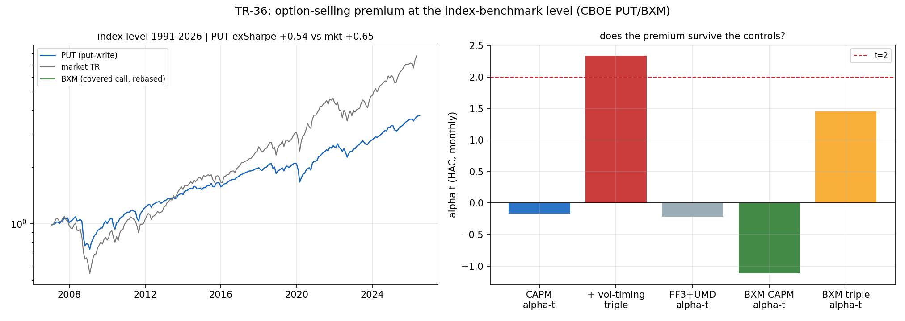

# TR-36 — 選擇權賣方溢酬:指數基準層檢定(docs/25 突破口 #1/計畫 A5)

> docs/25 排序第一的突破口:變異/賣權溢酬是唯一 $0 可及、有強文獻背書、且**不是擇時**的
> 新風險溢酬(Carr-Wu 2009)。CBOE PUT 指數(SPX 現金擔保 ATM 賣權、月滾倉)在滾倉點嵌入
> **真實選擇權報價**,指數層存在性今天就可測;自建鏈可實作性留 B3。
> 腳本:`scripts/tests/tr36_vrp_index.py` · 圖:`docs/tests/img/tr36_vrp_index.png`

## 判定:**NO-PREMIUM——2007–2026 指數層賣權溢酬在股票 beta 之外歸零;B3(自建鏈)優先級大幅下修**

**座位資料真相(首輪 CAL 抓到)**:CBOE 免費檔 2007 年前只有 7 個零星點(143 個缺月→假的
25% 月頻波動)。可用日頻年代=**2007+**;白皮書引用的 1986–2006 黃金年代不在免費檔內
(記為資訊成本)。座位重新宣告為無缺口日頻段——資料限制,非移動球門。

| 檢查 | 結果 | 判 |
|---|---|---|
| CAL(風格化事實) | PUT 年化波動 **10.8%**(帶 8–14%)、CAPM beta **0.59**(帶 0.45–0.80)、缺月 0 | ✓ |
| 頭條 | PUT exSharpe **+0.54** vs 市場 **+0.65**(2007–2026 賣權連 Sharpe 都輸給市場) | — |
| **C1 CAPM alpha(決定性)** | **−0.25%/yr(HAC t=−0.17)** | **✗ 無溢酬** |
| C2 波動三對照張成 | +3.56%/yr(t=+2.34)——見下方好奇心註記 | (C1 敗後失去效力) |
| C3 溢酬的代價 | MDD **−32.7%**、最慘月 **−17.7%**(2008-10)、**下跌 beta 0.85 vs 上漲 beta 0.45** | 不對稱量化 |
| C4 穩健性 | BXM CAPM alpha −1.60%/yr(t=−1.12);PUT FF3+UMD alpha −0.29%(t=−0.21) | 零的一致性 |

## 讀法

1. **「賣權有不錯的 Sharpe」是 beta 的會計幻覺**:0.59 的 beta 拿走 85% 的下檔、只給 45% 的
   上檔(C3)。把 beta 記帳後,二十年(含 2008/2020/2022 三次壓力測試)的殘餘溢酬是**零**。
   這正是 TR-30b「勝率 vs 期望值」同款拆解在選擇權上的重演:好看的比率,拆開是風險補償。
2. **C2 好奇心註記(反過度解讀)**:加入波動三對照後 alpha 轉正顯著(+3.56%,t=2.34)——
   因為 PUT 對「波動管理型市場曝險」**負載**(反彈期上檔被蓋掉,而 MM/vol-std 恰在反彈期
   最強)。這個殘差要收割得同時放空對照組,不是可交易溢酬;預先登記的經濟檢定是 C1。
   四個控制項高度共線,截距不穩,僅作描述。
3. **文獻對照的誠實邊界**:Carr-Wu 的 VRP 正典是**變異交換/delta 對沖**的純波動曝險;
   PUT/BXM 是**未對沖**的股票+波動混合。本 TR 判死的是「可用指數基準實作的版本」;
   純 VRP(需日頻對沖+完整鏈)$0 不可測,留在 B3——但先驗已大幅下修。
4. 年代註記:2007–2026 含兩次波動災難,對空波動策略偏逆風;但年代由檔案決定非我們挑選,
   且 20 年全週期是公平的存在性檢定。

## 後果

- **docs/25 突破口 #1 重排**:B3(自建鏈 VRP 可實作性)從「綠燈候選」降為「低優先」——
  指數層存在性已死,自建鏈只該在「純 delta-對沖 VRP」的問題上重啟,且需先有明確的
  成本模型(Muravyev:選擇權價差是頭號殺手)。
- 突破口排序遞補:**台股棲地(B4)升為第一**;選擇權收集器照跑(資料本身仍是護城河,
  IV skew/期限結構的其他用途未判)。
- 擇時鐵律不受影響(本 TR 測的是風險溢酬存在性,非擇時)。

## 誠實範圍

- 指數不含實作者成本(價差/費用)——本判定是「存在性上界」:連上界都是零。
- PUT 檔起點 2007(檔案限制);月頻 HAC(TR-18 時鐘);試驗會計 +1 家族。

*2026-07-18。首輪 CAL 抓到檔案覆蓋陷阱(零星點→假波動);座位重宣告後全檢照 F0 執行,
樹嚴格路由 !C1 → NO-PREMIUM。*
