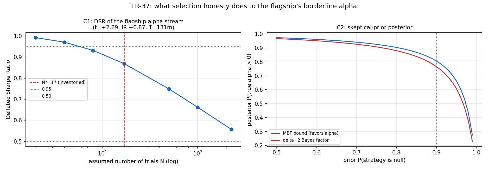

# TR-37 — 戰役層級 deflated alpha(docs/25 攻擊 1+7/計畫 A2)

> 主力的月頻 Carhart t=2.64 從未被「選出它的過程」收費。TR-22 的 PBO 蓋 12 個配置器 config、
> TR-25 蓋權重,但 sleeve 候選家族與全戰役搜尋從未捲成一個 deflated 數字。本 TR 用
> Bailey-López de Prado DSR 對主力的 **alpha 流**(Carhart 殘差+alpha)計算選擇誠實後的
> 存活機率,加 Harvey-Liu 式懷疑先驗後驗。
> 腳本:`scripts/tests/tr37_campaign_deflation.py` · 圖:`docs/tests/img/tr37_campaign_deflation.png`

## 判定:**FRAGILE-SURVIVES——盤點的 17 次組合層級試驗下 DSR=0.87;悲觀全戰役 226 下 0.56;「邊界」標籤從此有了選擇誠實的數字**

### 試驗盤點(動工前固定)

組合層級**實際跑過**的評估(誠實點估計 N*):TR-22 配置器家族 12 + 品質傾斜變體 2(docs/10 §4c)
+ TAA-vs-combo 1(docs/13 §7)+ 六槽位 combo-2× 1(docs/14)+ ensemble-vs-combo 1(docs/15)
= **N\*=17**。曲線端點 {2, 4, 8, 17, 50, 100, 226}:226=全戰役具名變體(蓄意悲觀上界——
其中多數從未競爭「成為主力」);家族內 n_eff 3–4(登記簿)=下端。**曲線才是誠實的展品,
單格不是。**

| 檢查 | 結果 |
|---|---|
| CAL | 月頻 Carhart alpha +6.04%/yr,t=+2.69(錨帶 2.0–3.2),T=131 ✓ |
| alpha 流 | 年化 IR +0.87、偏態 +0.47、峰度 4.2(DSR 已用高階矩校正) |

### C1 DSR 曲線(判定固定在 N\*=17)

| N | 2 | 4 | 8 | **17** | 50 | 100 | 226 |
|---|---|---|---|---|---|---|---|
| DSR | 0.992 | 0.971 | 0.932 | **0.869** | 0.749 | 0.662 | 0.557 |

預先承諾級距:[0.50, 0.95) → **FRAGILE-SURVIVES**。讀法:給定我們真的做過的組合層級選擇,
主力 alpha 為真的機率約 **87%**;若把整場戰役 226 個具名變體全部當候選(不公平的悲觀),
仍略優於擲硬幣(56%)。

### C2 懷疑先驗後驗(報告,不設門檻;首輪抓到 BF 方向反置並修正)

| 先驗 P(null) | 0.50 | 0.75 | **0.90** | 0.95 | 0.99 |
|---|---|---|---|---|---|
| 後驗 P(α>0)(MBF 上界,偏袒 alpha) | 0.97 | 0.93 | **0.81** | 0.66 | 0.27 |
| 後驗(δ=2 realistic BF) | 0.97 | 0.91 | **0.77** | 0.61 | 0.23 |

即使抱持「九成策略是假的」的懷疑先驗,主力 alpha 為真的後驗仍約 **0.77–0.81**。
(首輪 realistic BF 的 H1/H0 比值方向寫反→後驗塌到 0 並與 MBF 上界矛盾;一致性檢查抓到,
修正後 realistic ≤ MBF 恢復成立——「後驗必須≤偏袒上界」自此列入貝氏計算的標準檢查。)

### C3 頻率學派交叉檢查(Šidák)

raw p=0.0081 → N=17 調整後 **0.129**(5% 水準不顯著)、N=226 → 0.840。與 DSR 曲線同向。

## 讀法與後果

- **「邊界」的完整量化語言(README 底線表更新)**:t=2.64/2.69 月頻、不過 HLZ 3.0;
  選擇誠實後 P(真)≈0.87(盤點 N\*)~0.56(悲觀);懷疑先驗(90% null)後驗 ≈ 0.8。
  一句話:**大概率是真的,但沒有任何一個誠實的角度能把它說成「確定」**——這正是
  風險塑形交付(而非 alpha 交付)一直以來的正確定位。
- 攻擊 1+7 結案:sleeve 選擇家族已入帳(N\* 盤點);後驗語言已交付。
- 與 TR-22/25 的分工:PBO(過擬合機率)、高原(參數穩健)、**DSR(選擇通膨)**——三把刀
  各切一面,主力全部挨過。

## 誠實範圍

- N\* 盤點只計「組合層級」評估;sleeve 個體層的淘汰(它們死於個體閘門,非組合競爭)不計入
  ——這是 DSR 文獻的標準界定,悲觀端點 226 已涵蓋反對意見。
- DSR 假設試驗 SR 同分布(近似);MBF 是理論上界非估計;δ=2 為慣例效應量。
- 試驗會計 +1 家族(meta-inference)。

*2026-07-18。盤點先於計算(反 HARKing);C2 方向錯誤由一致性檢查抓到並修正;C1 級距照
F0 嚴格路由 → FRAGILE-SURVIVES。*
