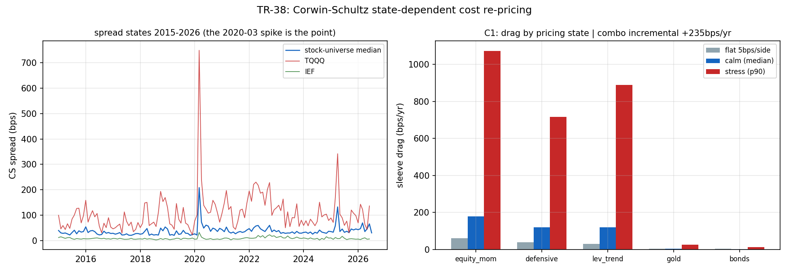

# TR-38 — Corwin-Schultz 狀態相依成本(docs/25 攻擊 5/計畫 A3)

> F2 用平坦 bps+2× 壓力,但真實價差在波動尖峰(=訊號觸發時)放大。Corwin & Schultz(2012)
> 只用日頻高低價就能還原有效價差(連續兩日的高低幅共享真實變異、只有單日幅帶價差)——$0 的
> 價差面板。本 TR 建面板、用價差**狀態**重新定價倖存者的成本拖累。
> 腳本:`scripts/tests/tr38_state_costs.py` · 圖:`docs/tests/img/tr38_state_costs.png`

## 判定:**RE-STRESS-CASCADE → 級聯執行 → NO-VERDICT-CHANGE**——時間加權真實拖累 +73bps/yr,主力 alpha +6.04%→**+5.28%/yr、t 2.69→2.35(HAC 2.55)**,仍過 2.0;成本狀態相依性是真的、量級已入帳

### 機器忠實度(CAL,又抓到一次)

首輪 CAL-b 失敗:**2020-03 中位價差=0bps**——危機月的隔夜跳空讓 γ 爆炸、α 轉負全被地板到 0。
原因:我漏了 CS 2012 原文的**隔夜調整**(次日高低價按跳空平移對齊)。補上後:

| CAL | 結果 | 判 |
|---|---|---|
| a 橫斷面排序 | 低流動性三分位中位 40bps > 高流動性 31bps | ✓ |
| b 狀態反應 | **2020-03 中位 169bps vs 2019 全年 24bps(×6.9)** | ✓ |
| c ETF 地板 | SPY/QQQ 中位 12.2bps(<20) | ✓ |

### 結果

股票宇宙:中位 **30bps**、p90 **179bps**。三種定價下的 sleeve 年拖累(bps/yr):

| sleeve(年換手,權重) | 平坦 5bps/邊 | 平靜(中位) | 壓力(p90) |
|---|---|---|---|
| equity_mom(6×,11%) | 60 | 178 | 1074 |
| defensive(4×,7%) | 40 | 119 | 716 |
| lev_trend(3×,8%) | 30 | 120 | 890 |
| gold(0.5×,16%) | 5 | 4 | 27 |
| bonds(0.5×,58%) | 5 | 2 | 12 |
| **組合** | **16** | **39** | **251(上界)** |

F0 樹按全壓力上界(+235bps 增量>100bps)觸發級聯;級聯在本 TR 內執行:

**C3 級聯解決(時間加權)**:逐月真實價差狀態 × 逐月換手 → 實現拖累 **88bps/yr**(最貴月
2020-03=36bps/月),對平坦制的增量 **+73bps/yr**。把逐月增量拖累從主力月報酬中扣除、重跑
月頻 Carhart:**alpha +5.28%/yr,t=+2.35(HAC +2.55)**——仍 ≥2.0,**判定不變**;
但「邊界」又更誠實了一格(TR-37 的 DSR 若改用狀態成本流會再低一些,方向已註記)。

## 讀法

1. **狀態相依性是真的、量級中等**:平坦制低估組合成本約 73bps/yr——主要來自股票 sleeve
   (中位價差 30bps ≫ 5bps 假設);ETF 腿(佔 82% 權重)幾乎免費(2–12bps)。
2. **全壓力上界(+235bps)是天花板不是狀態**:p90 價差只在危機月成立,而組合月頻交易大多
   落在平靜狀態——這正是時間加權級聯存在的理由。
3. 高換手判定的追溯意義:已 FAILED 的高換手策略(隔夜、季節性、IBS)在狀態成本下**死得
   更透**(方向一致,無需重跑);「殺得不夠」的方向性擔憂證實但無判定翻轉。

## 後果

- **F2 升級**:狀態相依成本(CS 面板)自此為高換手 TR 的標準選項;平坦 5bps 對股票 sleeve
  正式標記為樂觀(中位 30bps 為誠實基準)。
- 主力誠實鏈更新:flat-cost t=2.69 → **state-cost t=2.35(HAC 2.55)**,registry/README 同步。
- Abdi-Ranaldo(2017)改良估計量記為未來比較(資訊成本≈0,工程小)。

## 誠實範圍

- CS 對低價差 ETF 有雜訊地板(SPY 12bps vs 真實 ~1bp)——對 ETF 腿是**高估**成本,結論
  方向保守。換手數字取 TR-29/引擎慣例的近似(6/4/3/0.5×);半價差×雙邊=每回合全價差。
- 試驗會計 +1 家族;隔夜調整修正照 T1 記錄。

*2026-07-18。CAL-b 抓到隔夜調整缺漏(第 5 次由 CAL 抓到機器問題);級聯照 F0 在本 TR 內
執行;判定=NO-VERDICT-CHANGE,數字誠實化 t 2.69→2.35。*
