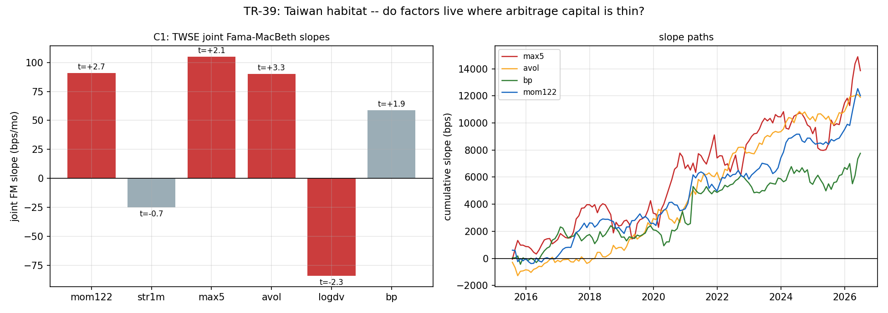

# TR-39 — 台股棲地 FM 因子面板(docs/25 B4/突破口 #1)

> ⚠️ **POST-RUN(2026-07-19,TR-39b)**:候選判定由 [TR-39b](TR-39b-taiwan-delisted.md) 取代——
> **mom122/avol/logdv 確認,max5 判倖存者假象退役**。並記錄:本 TR as-run 的面板受兩個後門影響
> ——pandas `pct_change()` 預設 ffill 把死股尾巴變假 0% 報酬、幽靈過濾器因此精準剔除死股;
> 及 54/72 已下市代號帶幽靈列(未截斷)。b 系列已修正。原文以下未改。

> 六次證明說 $0 美股大型股座位已開採殆盡(docs/25 II)。台股=可及範圍內套利資本最稀薄的
> 市場(Barber-Lee-Liu-Odean 2009:散戶主導、行為偏誤全市場鐵證)。F0 於滴灌 863/1220 時
> **預先登記**(commit `aca867a`),閘門在資料收齊(1,220/1,220、全程零失敗、一個下午)後開啟。
> 座位:TWSE 4 碼普通股 1,151 檔日頻 2014–2026(FinMind 價格+日頻 PER/PBR)、月頻 FM、
> TR-34 機器原封重用。腳本:`scripts/tests/tr39_taiwan_panel.py` · 圖:`docs/tests/img/tr39_taiwan_panel.png`

## 判定:**SIGNAL-CANDIDATE(S) × 4——mom122/max5/avol/logdv 聯合 |t|≥2;稀薄套利假說獲得第一個支持證據;但全部四個候選都暴露在「向上灌水」方向的倖存者偏誤下,下市補丁是唯一的下一步關卡**

### CAL(三腿,本 TR 內三次抓錯修正)

| CAL | 結果 | 判 |
|---|---|---|
| a v2:**成交金額加權**面板市場 vs TAIEX | corr **+0.942** | ✓ |
| b:2330 FinMind vs Yahoo 跨供應商月報酬 | corr **+1.000** | ✓ |
| c:六特徵聯合覆蓋 | 最低 **751 檔/月**(門檻 600) | ✓ |

修正記錄(T1):(1) FinMind 停牌列帶 **close=0** → pct_change 產生 ±inf 毒穿面板(全 NaN 斜率),
清洗零價+inf 防護;(2) 先切窗再算特徵的差一錯(首月 mom/str 全 NaN,CAL-c 抓到);
(3) **CAL-a v1 拿等權面板對比市值加權 TAIEX=蘋果比橘子**(台積電佔指數 30%+,EW-vs-VW 在台股
本來就 ~0.78;v1 的 0.908 是 inf 月份被 dropna 剔除的假高)→ v2 改成交金額加權同口徑,門檻
不變 0.90。**「市場重建 CAL 必須同權重口徑」入慣例。**

### C1 聯合 FM(132 個月、中位 876 檔/月)

| 特徵 | 斜率(bps/mo) | NW t | 文獻先驗 | 判 |
|---|---|---|---|---|
| **mom122** | **+91.0** | **+2.67** | 0/+(亞洲弱) | **候選——動能在台股活著,強於先驗** |
| str1m | −24.9 | −0.72 | − | 不顯著 |
| **max5** | **+105.0** | **+2.11** | −(樂透) | **候選——但符號與美國文獻相反(見下)** |
| **avol** | **+90.1** | **+3.31**(全場最強) | −(過度交易) | **候選——異常量=延續而非反轉** |
| **logdv** | **−84.1** | **−2.28** | 0/− | **候選——低流動性溢酬(規模效應活著)** |
| bp | +58.8 | +1.87 | +(價值) | 差一步(記錄) |

**符號合起來是一個連貫的故事:台股是「延續市場」**——動能正、異常注意力正、高 MAX 正——
散戶羊群的**延續**,而不是美國式的樂透**高估**(美國 MAX 謎題=高 MAX 低報酬;台股相反)。
C3 分期:**2021–2026 反而更強**(avol t=3.2、mom t=2.2)——與美股因子的衰退軌跡相反,
與「套利資本稀薄→異象存活」的假說一致。

## 倖存者偏誤:方向翻轉警告(本報告最重要的誠實段落)

F0 預先陳述的方向分析針對的是「MAX **負**效應」情境(死掉的樂透股缺席→偏向零→顯著負=
保守-強)。**實際觀察到的是 MAX 正效應——偏誤方向翻轉為「向上灌水」**:崩潰下市的樂透股
(其後續 −100%)不在面板裡,動能/注意力輸家同理。四個候選**全部**暴露在同一方向。
因此判定**明確條件化**:SIGNAL-CANDIDATE 的地位以**下市補丁(TWSE 終止上市名單)重跑存活**
為前提——這是 b 系列的第一關,先於任何經濟性計算。

## 誠實範圍與後續關卡(F0 已預先承諾)

1. **b1 下市補丁**:TWSE 終止上市名單 → 宇宙補全 → 四候選重跑(檢定它們是不是倖存者幻覺)。
2. **b2 成本關卡(F2)**:台股來回 ~45bps(手續費 0.1425%×2+證交稅 0.30% 賣方);斜率
   ~90bps/mo 的頂底價差要在真實換手下淨額存活。
3. **b3 桶經濟性**:斜率→十分位組合、TR-33 式黃金診斷(頂/底桶 vs 等權中段)。
4. 漲跌幅限制(7%→2015-06 起 10%)壓縮 max5 的量測;月頻時鐘;無放空可行性假設
   (台股借券限制——多頭側先行)。
5. 試驗會計 +1 家族(新棲地,單一預先登記規格);F0 於資料收齊前提交=無 HARKing 空間。

## 與帳本的整合

- **docs/25 攻擊 4 的第一個實證回答**:「因子已死」確實是座位陳述——換到套利資本稀薄的
  棲地,四個特徵立即顯著且近期更強。稀薄套利假說從推測升級為「有第一證據、待去倖存確認」。
- 對使用者的實際意義:台股是你可實際交易的市場;若四候選過 b 系列,這是整個專案第一次
  出現「可操作的橫斷面訊號」候選群。
- FinMind 資料棧:1,220 檔×12.5 年×(價格+估值)已入庫,collector 可週期補新。

*2026-07-19。F0 預先登記於 commit `aca867a`(資料收齊前);CAL 三次抓錯全記錄;判定嚴格
按預先承諾級距路由;倖存者方向翻轉警告=判定條件化的依據。*
