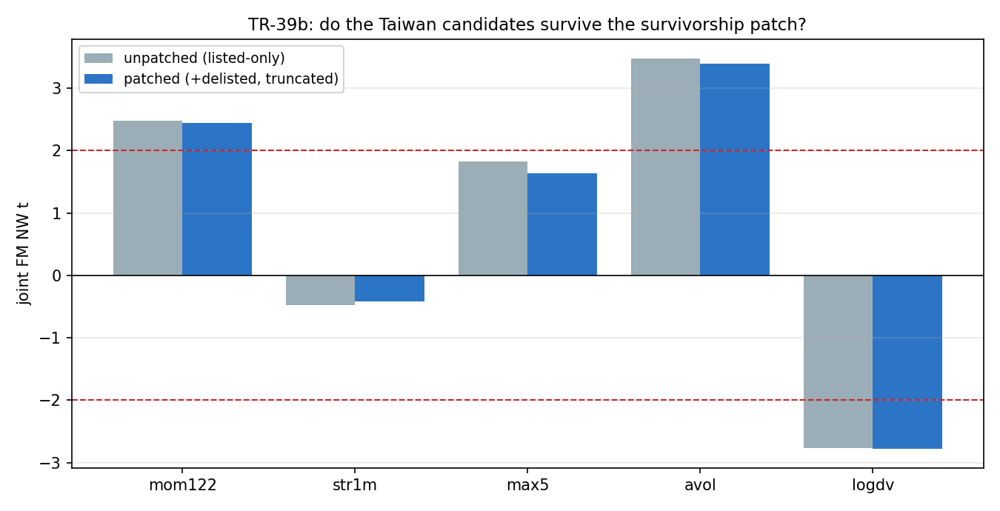

# TR-39b — 台股面板去倖存補丁(b1 關卡)

> TR-39 的四個候選是倖存者條件化的。本 TR 用 TWSE 官方終止上市名單(72 檔 2015+ 四碼普通股)
> +官方下市日截斷補丁面板,依預先登記的規則(commit `6ad4c42`,補丁資料判讀前寫死)逐候選審判。
> 腳本:`scripts/tests/tr39b_taiwan_delisted.py` · 圖:`docs/tests/img/tr39b_taiwan_delisted.png`

## 判定:**SPLIT——mom122/avol/logdv 三候選確認(CONFIRMED-CANDIDATE),max5 判倖存者假象退役;確認組進入 b2 成本關卡**

### 補丁過程的三個發現(每個都比預期深一層)

1. **FinMind 的宇宙其實含歷史條目**:72 檔已下市股全部本來就在 TaiwanStockInfo/主滴灌裡——
   「currently-listed only」的憂慮在宇宙層意外不成立。
2. **但幽靈列污染是真的**:54/72 檔在官方下市日之後仍有零星資料列(共 411 列;代號重用/橋接,
   如 2311 下市 2018-04 卻有列到 2026-07)——TR-39 跑的時候這些污染在面板裡。補丁=官方日截斷。
3. **pandas `pct_change()` 預設 ffill 的教科書陷阱(本 TR 最大單一發現)**:預設
   `fill_method='pad'` 把下市股的死尾巴前向填補成常數價 → 每天生出假 0% 報酬(3474:713 個
   存活日「生出」2,420 個零報酬日)→ zero_share 0.79 → 幽靈過濾器**精準殺光死股**。
   **這回溯適用於 TR-39 as-run**:序列自然終止的死股同樣被此後門剔除——TR-39 的倖存者暴露
   比宇宙層診斷所示的更真實,b1 關卡設對了。修正:全部 `pct_change(fill_method=None)` +
   零報酬占比改以存活日為分母。CAL-d(≥50 檔死股須實際進面板)第一輪 14/72 抓到此 bug,
   修正後 66/72。

### CAL(四腿全過)

DVW 市場 vs TAIEX **0.943**、2330 跨供應商 **1.000**、五特徵覆蓋最低 **783 檔/月**、
死股入面板 **66/72**。

### C1 逐候選審判(主面板=五特徵價量版;基準=同規格無死股)

| 候選 | 無補丁(同規格) | **補丁後** | 判定 |
|---|---|---|---|
| mom122 | +82.9(t=+2.47) | **+84.0(t=+2.44)** | **CONFIRMED** |
| avol | +90.7(t=+3.47) | **+93.6(t=+3.39)** | **CONFIRMED(仍是最強)** |
| logdv | −104.8(t=−2.77) | **−105.6(t=−2.77)** | **CONFIRMED** |
| **max5** | +90.9(t=+1.82) | **+84.6(t=+1.64)** | **SURVIVORSHIP-ARTIFACT,退役** |

max5 的死因拆解(誠實記錄):TR-39 發表值 t=2.11 → 修 pct_change 後門後的乾淨基準 1.82 →
加入死股 1.64。**約一半來自 ffill bug 修正、一半來自死股補丁**——兩個修正都指向同一方向,
與 F0 預告的「MAX 正效應下偏誤=向上灌水」完全一致。**預先登記的方向分析叫中了自己的靶。**

C3 六特徵次要面板同型(max5 t=1.95、bp t=1.88,皆 <2);bp 依 F0 不可晉升。

## 台股棲地的最終候選組

**動能(+84bps/mo)、異常量/注意力(+94)、低流動性(−106)**——三個確認候選,聯合顯著性
仍遠超美股座位(那裡除 beta 全滅)。「延續市場」敘事修正:**延續是真的(動能+注意力),
樂透溢價是倖存者幻覺**——這反而更符合 Barber 系列的台灣證據(散戶追逐熱門股的損失由
死掉的熱門股承擔,活下來的面板看不見)。

## 後續(F0 已排program)

- **b2 成本關卡**:台股來回 ~45bps;三候選斜率 84–106bps/mo,換手決定生死。
- b3 桶經濟性(TR-33 式黃金診斷:頂/底桶 vs 等權中段)。
- 慣例新增:**`pct_change(fill_method=None)` 為含死股面板的強制參數**;零報酬幽靈過濾器
  分母=存活日。

## 誠實範圍

- TWSE 名單=上市板;是否涵蓋全部終止型態(合併/轉板/破產)依官方口徑;2 檔 manifest 名
  不在面板(FinMind 無資料,記錄)。
- 截斷用官方終止日;停牌至終止間的最後成交價=退出價(台股下市多數交易到最後,崩潰損失
  大體已入價;殘餘 F13 註記)。
- 試驗會計 +0(同家族修正宇宙);F0 於補丁資料判讀前提交。

*2026-07-19。CAL-d 第一輪抓到 pct_change ffill 後門(第 6 次由 CAL 抓到機器問題);修正後
四腿全過;判定照預先登記逐候選路由=SPLIT。*
