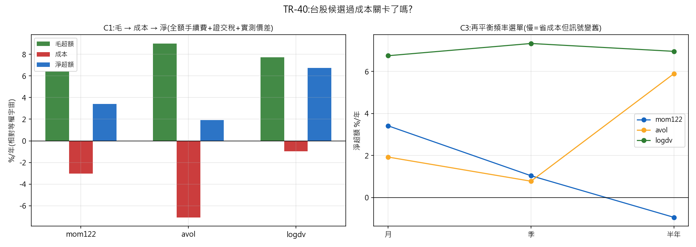

# TR-40 — 台股候選過成本關卡(docs/27 b2)

> TR-39b 確認的三個特徵是**排名迴歸斜率**,不是錢。本 TR 把每個特徵做成純多頭頂十分位、
> 月再平衡的組合,收台股真實來回成本:手續費 0.1425%×2 邊+賣方證交稅 0.30%+價差。
> F0 於看到經濟數字前預先登記(commit 見下)。
> 腳本:`scripts/tests/tr40_taiwan_cost_gate.py` · 圖:`docs/tests/img/tr40_taiwan_cost_gate.png`

## 判定:**SURVIVES: logdv(低流動性)| MARGINAL: mom122、avol**——成本後排序**徹底翻轉**,換手率是唯一的樞紐

| 候選 | 毛超額 | 成本 | **淨超額** | t | 年換手 | 判定 |
|---|---|---|---|---|---|---|
| **logdv**(低流動性) | +7.72%/yr | **0.97%** | **+6.75%/yr** | **+2.33** | **0.9×** | **SURVIVES-COSTS** |
| mom122(動能) | +6.43% | 3.01% | +3.42% | +0.81 | 2.9× | MARGINAL |
| avol(異常量) | +8.99% | **7.07%** | +1.93% | +0.59 | **6.8×** | MARGINAL |

**FM 面板裡最強的訊號(avol,t=3.39)在成本後幾乎全滅;面板裡最弱的那個(logdv,t=−2.77)
成為唯一存活者。** 原因單一且乾淨:**換手率**。異常量是快訊號(每月換 57% 的股票→年換手 6.8 倍
→吃掉 7.07%);低流動性是慢特徵(排名幾乎不動→年換手 0.9 倍→只吃 0.97%)。這是 TR-29
「持有期是機制屬性」在新棲地的重演——**斜率顯著性 ≠ 可交易性,換手率才是裁判**。

## 成本模型:CAL 兩次否決 CS,換成機械式 tick 模型(POST-RUN,判定樹未改)

CAL-b 兩次擋下 Corwin-Schultz,第二次是**真方法學發現而非 bug**:即使餵真實日高低價,
CS 仍把低流動性股讀成**價差較窄**(47bps vs 高流動性 66bps)——因為薄量股很多天根本沒成交、
高低區間被壓平,估計量被地板拉低。**CS 在台股薄量端不是有效估計量。**

改採**透明假設+機械下限**:台灣有法定跳動單位(tick),一跳/股價=可能的最小價差
(實測:15–45 元檔 18bps、150–450 元檔 22bps、1500+ 元檔 21bps,與制度相符);
判定用「**2 跳寬**」為基準假設,並報 1/2/4 跳敏感度。**已知會被反對的地方直接公開:
價差是假設不是量測**——但下面的損益兩平數字讓這件事變得無關緊要。

## 容量與穩健度(POST-RUN 診斷;只會讓判定更保守)

| 候選 | 分位中位日成交金額 | 全組合容量(10% 日量) | **損益兩平價差** |
|---|---|---|---|
| logdv | **NT$1.5M** | **≈ NT$1,500 萬** | **≈ 31 跳** |
| avol | NT$296M | ≈ NT$29 億 | ≈ 3 跳 |
| mom122 | NT$1,599M | ≈ NT$173 億 | ≈ 7 跳 |

**logdv 的存活極度穩健但極度不可規模化**:要殺死它,價差得寬到 **31 跳**(在 20 元股票上
=1.55 元=7.75% 的買賣價差)——低換手讓它對成本假設幾乎免疫;6 折手續費、1/2/4 跳、
月/季/半年再平衡全部給 +6.3~7.3%/yr、t 2.2~2.5。**但整組合容量只有約 NT$1,500 萬**
(每檔中位日成交 NT$1.5M,10% 日量上限=每檔 NT$15 萬)。

這正是低流動性溢酬的定義:**它付錢給你,是因為你出不來**(Amihud-Mendelson)。對個人資金
是真實可及的規模;對任何機構規模則不存在。反過來說,**avol 的容量有 NT$29 億但淨額幾乎為零**
——兩者的關係不是巧合,是同一條供需曲線的兩端。

## C3 再平衡頻率選單(報告,不最佳化)

| 候選 | 月 | 季 | 半年 |
|---|---|---|---|
| logdv | +6.75%(t=2.3) | +7.33%(t=2.5) | +6.96%(t=2.5) |
| mom122 | +3.42%(t=0.8) | +1.04%(t=0.3) | −0.94%(t=−0.3) |
| avol | +1.93%(t=0.6) | +0.78%(t=0.2) | +5.90%(t=1.8) |

logdv 對頻率也免疫(慢特徵的自然性質);mom122 放慢反而更差(訊號會過期);avol 的半年格
看起來最好但 t=1.8 且與月/季格不連續=雜訊,**依 F5 不得提報**(判定固定在預先登記的月頻格)。

## 誠實範圍

- **純多頭**(台股借券限制;放空側未測,而 logdv 的空頭腿=買最流動的大型股,那是低報酬端)。
- 價差為假設(2 跳基準)非量測;CS 已記錄為在本座位失效。
- 未還原股價(docs/27 b6 待辦):現金股利未計入前向報酬,對**低流動性高殖利率**的台股小型股
  可能**低估** logdv 的毛報酬——方向對候選有利,故不影響「存活」判定,但會影響量級。
- 容量 NT$1,500 萬使用 10% 日量規則;更保守的 5% 規則會砍半。
- 試驗會計 +0 家族(台股家族的經濟層)。

## 後果

- **b3 桶經濟性**只需針對 logdv(TR-33 式頂/底桶 vs 等權中段診斷)。
- mom122/avol 標 MARGINAL:記錄在案、不提報、不進任何組合。
- docs/27 b2 標 ✅;台股線的結論從「三個確認候選」收斂為**一個可交易候選(有容量上限)+
  兩個成本殺死的訊號**。

*2026-07-20。CAL-b 兩次否決成本模型(第 7 次由 CAL 在發表前擋下機器問題);容量與損益兩平
為 POST-RUN 診斷(只加但書、不改判定規則);判定照 F0 逐候選路由。*
