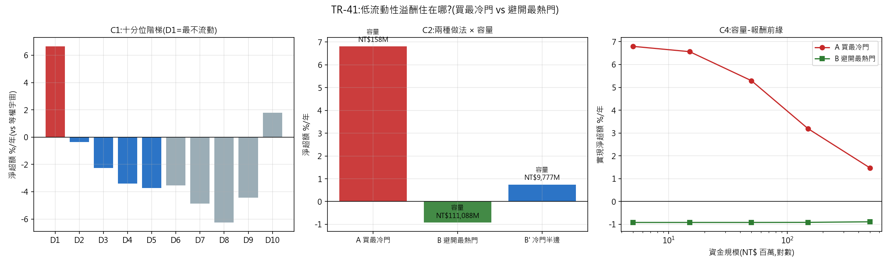

# TR-41 — 台股低流動性溢酬住在哪?買最冷門 vs 避開最熱門(docs/27 b3)

> TR-40 只留下一個可交易候選:低流動性分位,淨 +6.75%/yr(t=2.33)但容量受限。實作有兩條路,
> 容量差約 100 倍——**A 買最冷門**(D1)與 **B 避開最熱門**(D1–D9)。若溢酬是梯度,B 能用
> 大得多的容量吃下一部分;若集中在尾端,那個天花板就是真的。F0 於看到桶報酬前預先登記。
> 腳本:`scripts/tests/tr41_taiwan_bucket_economics.py` · 圖:`docs/tests/img/tr41_taiwan_buckets.png`

## 判定:**CONCENTRATED——溢酬只住在最尾端那一格;而且「避開最熱門」是個賠錢策略(−0.92%/yr,t=−2.34)**

CAL 過(D1 淨超額 +6.65% vs TR-40 的 +6.75%,機器無漂移)。

### C1 十分位階梯:不是梯度,是懸崖

| | D1(最不流動) | D2 | D3 | D4 | D5 | D6 | D7 | D8 | D9 | D10(最流動) |
|---|---|---|---|---|---|---|---|---|---|---|
| 淨超額/年 | **+6.65%** | −0.35% | −2.26% | −3.42% | −3.74% | −3.54% | −4.86% | −6.25% | −4.43% | +1.78% |
| t | +2.28 | −0.17 | −1.42 | −2.48 | −3.03 | −3.11 | −3.42 | −3.90 | −2.11 | +0.44 |

**溢酬完全集中在 D1**:D2 就已經歸零、D3 起是負的。D2+D3 合計 −2.61% → 判定 CONCENTRATED。

### C2 兩種做法對決(這是你問的那題)

| 做法 | 淨超額/年 | t | 檔數 | 容量 |
|---|---|---|---|---|
| **A 買最冷門(D1)** | **+6.81%** | **+2.32** | 100 | NT$158M |
| **B 避開最熱門(D1–D9)** | **−0.92%** | **−2.34** | 898 | NT$1,111 億 |
| B' 只買冷門半邊(D1–D5) | +0.75% | +0.58 | 499 | NT$98 億 |

**「避開最熱門」不只沒用,它是顯著虧損的。** 直覺(「不買最擁擠的就好」)在這裡完全錯誤,
原因看 C1 就懂:D2–D9 這一大片本身是負的,你把 D10 排除掉,等於把資金**重壓在最爛的中段**。
B' 半邊版接近零(+0.75%,t=0.58)——同樣是被中段稀釋。

### C3 黃金診斷:啞鈴型,與美股相反

**最冷門 +6.81% | 中段 D4–D7 −2.34% | 最熱門 +1.94%**(全對等權宇宙)。
兩端都贏中段=**啞鈴**,與 TR-33 在美股 GP 上的發現(兩端都輸中段)**方向相反**。
台股 2015–26 的錢在兩頭:一頭是被忽視的極冷門(流動性補償),另一頭是台積電那一類的巨型股
(D10 的 +1.78% 幾乎就是那個故事)。**中段是死區。**

**停滯價檢查通過**:跳一個月形成→持有(對抗買賣價差彈跳與停滯收盤價)後,D1 仍有
**+6.61%/yr(t=2.31)** vs 原始 +6.65%——溢酬不是微結構假象。這是本 TR 最重要的一項排除。

### C4 容量-報酬前緣(部位上限=該檔 10% 日量 × 5 個交易日)

| 資金規模 | A 買最冷門 | 填滿率 | B 避開最熱門 |
|---|---|---|---|
| NT$5M | +6.79% | 100% | −0.92% |
| NT$15M | +6.56% | 96% | −0.92% |
| **NT$50M** | **+5.29%** | 75% | −0.92% |
| NT$150M | +3.19% | 43% | −0.91% |
| NT$500M | +1.48% | 19% | −0.89% |

**與 TR-40 的容量數字對帳**:TR-40 報 ≈NT$1,500 萬(單日 10% 日量);本表放寬為「5 個交易日
建倉/出場」,所以名目容量 ×5。兩者都對,只是進出速度假設不同——**實務上的可用區間是
NT$5,000 萬以下(仍有 +5.29%),到 NT$1.5 億就掉到 +3.19%,NT$5 億基本消失。**

## 這代表什麼(實作意涵)

1. **沒有高容量替代方案。** 唯一能吃到溢酬的做法就是直接持有最冷門的 100 檔,而且要接受
   NT$5,000 萬上下的天花板。想用大資金稀釋著吃=吃不到。
2. **「避開擁擠」的直覺被證偽。** 這是本 TR 最反直覺的一課:排除一個好的桶,不會讓剩下的
   變好,只會讓你重壓在壞的桶上。任何「排除法」策略都必須檢查剩餘部位的分布。
3. **溢酬的本質確認為流動性補償**:它集中在最尾端、隨資金規模單調衰減、且通過停滯價檢查
   ——三個特徵都符合 Amihud-Mendelson 的理論,而不是符合「異象」的樣貌。

## 誠實範圍

- 純多頭、月頻、未還原股價(docs/27 b6;低流動性小型股的現金股利未計入前向報酬,方向對
  D1 **不利**,故 +6.65% 可能是低估——但這也意味著實測值含未知的股利成分,量級待 b6 修正)。
- D1 的 100 檔中位日成交 NT$1.5M:**這是「你出不來」的價格**,回測的月頻收盤價成交假設在
  這一端最脆弱;C4 的填滿率模型是我們在 $0 資料下能做的最誠實近似。
- 台股借券限制使空頭側不可行;D8/D9 的顯著負值(−6.25%/−4.43%)在可放空的市場會是另一半
  機會,在此僅為記錄。
- 試驗會計 +0 家族(台股家族的桶層分解)。

*2026-07-20。CAL 過;判定照 F0 的 GRADIENT/CONCENTRATED 規則路由;C3 跳月檢查與 C4 前緣
為預先登記項目,非事後補做。*
