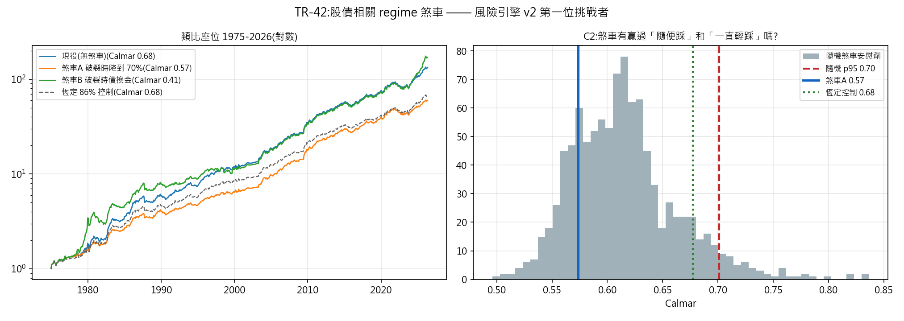

# TR-42 — L2 股債相關 regime 煞車(風險引擎 v2 第一位挑戰者)

> TR-35 定位出主力唯一的結構性裸露面:利率主導窗零保護(債券腿在最需要時停止分散)。
> 本 TR 是風險引擎 v2 的第一位挑戰者——偵測「分散假設破裂」的 regime 並據以行動。
> F0 於動工前把陷阱寫明:七次擇時宣稱死於同一個對照(笨的恆定曝險),相關煞車雖非報酬預測,
> 仍可能敗給恆定——若如此,就是第八次。腳本:`scripts/tests/tr42_correlation_brake.py`
> 圖:`docs/tests/img/tr42_correlation_brake.png`

## 判定:**EIGHTH TIMING FAILURE——煞車輸給同平均曝險的恆定部位(Calmar 0.57 vs 0.68),也輸給隨機煞車(第 20 百分位)。擇時鐵律從「報酬擇時」延伸到「風險輸入型擇時」。**

CAL 過(類比座位重現 TR-35:MDD −14.6%、CAGR +10.0%)。訊號=36 月滾動股債相關 >0,
落後一期,佔樣本 48% 的月份。

### C1/C2 全樣本 1975–2026

| | CAGR | MDD | **Calmar** |
|---|---|---|---|
| 現役(無煞車) | +10.0% | −14.6% | **0.68** |
| 煞車A(破裂時降到 70%) | +8.3% | −14.4% | **0.57** |
| 煞車B(破裂時債換金) | +10.5% | −25.5% | 0.41 |
| **恆定 86% 曝險(同平均曝險對照)** | +8.5% | **−12.6%** | **0.68** |
| 隨機煞車安慰劑 p95 | | | **0.70** |

**恆定對照在兩軸都贏煞車**:回撤更淺(−12.6% vs −14.4%)、報酬更高(8.5% vs 8.3%)。
而且煞車只落在隨機安慰劑的**第 20 百分位**——**訊號比「隨機挑同樣多的月份踩煞車」還差**。
煞車B(債換金)更糟:金的自身波動把 MDD 推到 −25.5%。

### C3 它在被設計來解決的窗口裡確實有效——這才是重點

| 利率主導窗 | 市場 | 現役 | **煞車A** |
|---|---|---|---|
| 停滯性通膨 1976–81 | −13.1% | −13.7%(比 1.04) | **−9.7%(比 0.74)** |
| 債券大屠殺 1994 | −7.6% | −8.8%(比 1.16) | **−6.2%(比 0.82)** |
| 2022 | −20.5% | −10.5%(比 0.51) | −10.5%(比 0.51) |

**煞車在 TR-35 指出的兩個裸露窗裡真的補上了保護**(比率從 1.04/1.16 降到 0.74/0.82)。
但那 48% 的「破裂」月份裡,絕大多數並沒有壞事發生——**在那些月份少賺的複利,超過了在兩次
真事件裡省下的回撤**。這正是七次擇時失敗的同一個機制:閘門在目標事件上有效,但機會成本
在其餘時間吃掉一切。

### C4 實際座位 2015–2026(一致性檢查)

現役 CAGR +13.3%/MDD −18.2%/alpha-t +2.69 → 煞車A +11.1%/−16.7%/**+2.51**。
同一個型態:回撤小改善、報酬與 alpha 雙降。

## 這次失敗的價值(比通過更有用)

1. **鐵律的範圍擴大了。** docs/25 攻擊 3 說鐵律是「免費日頻資料的定理」;現在知道它也覆蓋
   **風險輸入型擇時**——不只是「別預測報酬」,而是「**別根據任何 regime 訊號調整曝險**,
   在本座位上」。這是比第七次更強的陳述,因為相關煞車是最有理論根據的一種(它不預測報酬,
   只宣稱風險模型的輸入變了)。
2. **TR-35 的裸露面依然存在,而且現在知道它「便宜的解法無效」。** 想補利率 regime 的保護,
   靠 regime 偵測是不行的;剩下的路只有**結構性的**(例如常設的實質資產配置——注意這正是
   「恆定」而非「擇時」),或接受它作為已知的範圍條件。
3. **風險引擎 v2 的優先序要改。** L2 的期望價值剛被實證砍到接近零;剩下 L1(HAR-RV 波動
   預測)與 L3(EVT 尾部)——兩者都是**估計品質**問題而非**時機**問題,在鐵律的射程之外。

## 誠實範圍

- 兩個預先登記變體、閾值全部動工前固定(36 月/相關>0/降到 70%),**無參數搜尋**——若做網格
  必然找得到「有效」的格子,那正是 F5 禁止的事。
- 類比座位承載判定(利率 regime 只存在於長史);實際座位僅含 2022,為一致性檢查。
- 煞車B 的失敗有第二層解讀:債換金在停滯性通膨窗(比率 1.74)反而更糟——TR-35 的「金扛通膨」
  是**單腿層級**的事實,不等於「危機時把債全換金」在組合層級可行(金的波動太大)。
- 試驗會計 +1 家族(風險引擎挑戰者);本 TR 是該家族第一筆,後續 L1/L3 共用此計數。

## 後果

- docs/25 C1 的 L2 列標 **REJECTED**;docs/27 風險引擎表的優先序改為 L3 > L1 > L4。
- 擇時鐵律計數 **7 → 8**,並加註「含風險輸入型」。
- 主力帳簿**不做任何改動**——這正是「打不贏現役者不入列」的框架該有的結果。

*2026-07-20。CAL 過;判定照 F0 嚴格路由(輸恆定對照即第八次失敗);C3 的「設計窗有效但
全樣本失敗」誠實記錄,不作為翻案理由。*
