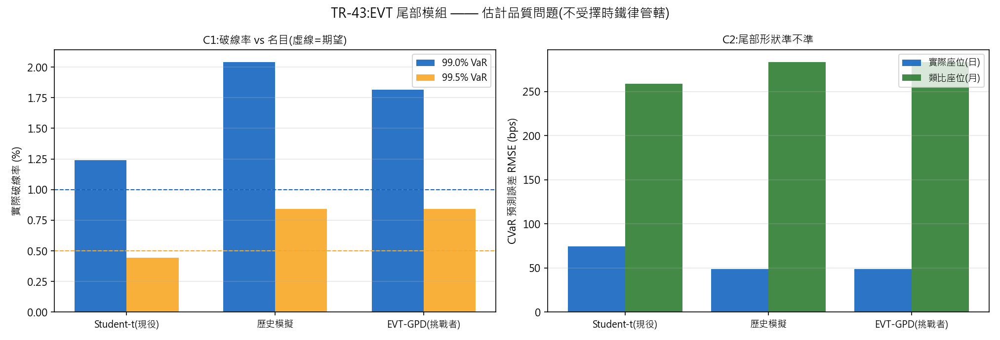

# TR-43 — L3 EVT 尾部模組 vs 現役 Student-t(風險引擎 v2 第二挑戰者)

> TR-42 否決了 L2(依 regime 訊號調曝險=擇時,已敗八次)。剩下的是**估計品質**問題——
> 不是決定「何時曝險」,而是決定「該為多少損失編預算」——這類問題不受擇時鐵律管轄。
> 本 TR 是其中第一個:條件式 EVT(對 EWMA 去波動化殘差的超額值配適 GPD)對上現役 Student-t
> 與歷史模擬基準。腳本:`scripts/tests/tr43_evt_tail.py` · 圖:`docs/tests/img/tr43_evt_tail.png`

## 判定:**REJECTED——EVT 在兩個座位上都沒有優於現役 Student-t,而且它被拒絕的次數更多(3 vs 1)**

CAL 過(重現 TR-04b:常態 VaR 99% 被 Kupiec 拒絕 p<0.0001,Student-t 未被拒絕 p=0.267)。

### C1/C2 實際座位 2015–2026(日頻,樣本外 2,256 期)

| 模型 | 99% 破線率 | Kupiec p | 99.5% 破線率 | Kupiec p | CVaR-RMSE |
|---|---|---|---|---|---|
| **Student-t(現役)** | **1.24%** | **0.267** | **0.44%** | **0.697** | 90 / 59 bps |
| 歷史模擬 | 2.04% | **0.000** ✗ | 0.84% | **0.036** ✗ | 47 / 52 bps |
| **EVT-GPD(挑戰者)** | 1.82% | **0.000** ✗ | 0.84% | **0.036** ✗ | 47 / 51 bps |

**EVT 在兩個信心水準都被 Kupiec 拒絕,現役都沒有。** EVT 的破線率(1.82%)接近歷史模擬
(2.04%)而非名目值——條件式 EVT 在這條報酬流上**低估了尾部**。它唯一的優勢是 CVaR-RMSE
略低(47 vs 90bps),但那是「已破線之後的形狀」較準;**破線頻率本身錯了,形狀準沒有用**。

### C4 類比座位 1975–2026(月頻,regime 多樣,樣本外 497 期)

三個模型**完全相同**(破線 0.20%、Kupiec p=0.029、CVaR-RMSE 166–400bps):月頻資料下
三者都**過度保守**(實際破線遠低於名目),差異落在雜訊內。長史座位無法分辨它們。

### C3 這個模組真正餵養的決策(誠實的一段)

| 模型 | 單日 99% 損失 | 允許 L |
|---|---|---|
| Student-t(現役) | −1.66% | 0.12 |
| 歷史模擬 | −1.74% | 0.11 |
| EVT-GPD | −1.71% | 0.12 |

**三個模型給出的槓桿刻度一模一樣。** 就算 EVT 贏了統計檢定,它也**改變不了任何決策**——
這正是 F0 預先寫下「BETTER-BUT-INERT 不入列」那條規則要處理的情況。實際結果更乾脆:
它連統計檢定都沒贏。

## 讀法

1. **現役 Student-t 是對的工具。** TR-04b 選它是因為常態被拒絕;現在它又在更嚴格的比較裡
   (含獨立性檢定與 CVaR 誤差、兩個座位)守住位置。**不改。**
2. **條件式 EVT 在這裡低估尾部的原因**:EWMA 去波動化假設條件常態的骨架,而主力組合的
   極端日多半是**多腿同時失效**(相關跳升)而非單腿波動放大——去波動化把這種結構性事件
   壓回常態尺度,GPD 再從被壓平的殘差外推,自然不夠寬。這與 TR-05 的教訓同源:
   **對這個帳簿,尾部的來源是相關結構,不是邊際波動。**
3. **風險引擎 v2 目前 0/2**:L2 敗於擇時鐵律、L3 敗於估計品質檢定。剩 L1(HAR-RV 波動預測)
   與 L4(component-CVaR 配置器,先驗最低,TR-22 已證配置器互換)。**這個框架正在如設計般
   運作**——「打不贏現役者不入列」的預設答案就是「不入列」。

## 誠實範圍

- 閾值 10%、兩個信心水準動工前固定,**無網格搜尋**(EVT 的閾值選擇是文獻上出名的自由度,
  一搜就會找到「有效」的格子——那正是 F5 禁止的事)。
- 日頻座位的極端事件樣本仍小(99.5% 名目=約 11 次破線);月頻座位更小,故 C4 只能說
  「分不出來」而非「一樣好」。
- CVaR 的 Student-t 版用模擬求解;EVT 的 CVaR 在 shape≥1 時退化為 VaR×1.5(保護性處理)。
- 試驗會計:與 TR-42 共用「風險引擎挑戰者」家族計數(累計 2)。

*2026-07-20。CAL 過;判定照 F0 嚴格路由(EVT 拒絕次數多於現役 → REJECTED);C3 的 L 刻度
無差別結果照 F0 預先寫下的 BETTER-BUT-INERT 條款記錄。*
