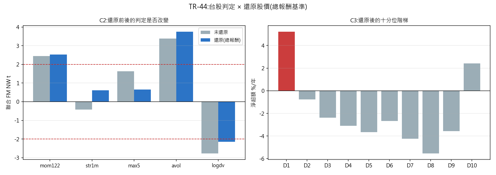

# TR-44 — 台股判定在還原股價下還成立嗎?(docs/27 b6)

> TR-39/39b/40/41 全部跑在**未還原**收盤價上。台股現金殖利率高(配置實驗室量到 0050 +2.49%/yr),
> 且對 TR-41 至關重要的是——殖利率**未必**在流動性階梯上均勻分布。本 TR 用官方除權息前後價
> 建還原因子,把台股全套結論在**總報酬基準**上重跑。F0 於看到還原後數字前預先登記,且兩個
> 偏誤方向都預先寫明。腳本:`scripts/tests/tr44_taiwan_total_return.py`
> 圖:`docs/tests/img/tr44_taiwan_total_return.png`

## 判定:**VERDICT-STABLE——三個候選(mom122/avol/logdv)在還原後全部維持符號與 |t|≥2;台股結論不變**

CAL 過(面板中位股利拖累 +3.23%/yr,符合台股市場殖利率),但 **CAL 先抓到一個符號反置的 bug**
(見下)。

### C1 股利率 × 流動性分位(F0 說要先報的診斷)

| 分位 | 中位股利拖累/年 |
|---|---|
| D10 最流動 | **4.01%** |
| 中上 | 3.67% |
| 中下 | 3.23% |
| D1 最不流動 | **3.13%** |

**殖利率隨流動性單調上升**——最流動的大型股殖利率最高(4.01%),最冷門的小型股最低(3.13%)。
這回答了 F0 的關鍵問題:**偏誤方向是「未還原面板略微高估 D1 的相對優勢」**(D1 的對手 D10
配息更多,未還原時那些股利沒被算進 D10 的報酬),但差距只有 0.9pp/yr——**不足以翻轉任何判定**。
兩個預先陳述的假設中,「小型股高殖利率」被證偽,「大型股配得更好」成立,但量級溫和。

### C2 聯合 FM:未還原 → 還原

| 特徵 | 未還原 | **還原** | 候選判定 |
|---|---|---|---|
| **mom122** | +84.0bps(t=2.44) | **+86.7bps(t=2.53)** | 穩定(略增強) |
| **avol** | +93.6bps(t=3.39) | **+99.7bps(t=3.75)** | 穩定(仍最強) |
| **logdv** | −105.6bps(t=−2.77) | **−79.1bps(t=−2.15)** | 穩定(但**減弱** 25%) |
| max5(已退役) | +84.6(t=1.64) | +31.5(t=0.66) | — |
| str1m | −14.8(t=−0.42) | +21.5(t=0.62) | — |

**logdv 的斜率減弱最多**(−106 → −79bps,t 從 −2.77 降到 −2.15)——與 C1 的診斷一致:
低流動性溢酬有一部分本來是「D10 的股利沒被算進去」的假象,還原後那部分消失了,但**核心仍在、
仍過線**。動能與異常量反而略增強(它們與殖利率無系統關係)。

### C3 成本關卡與階梯(還原後)

十分位階梯**依然是懸崖**:D1 +5.2%、D2 已 −0.8%、D3–D9 全負、D10 +2.4%——TR-41 的
**CONCENTRATED + 啞鈴**結論完全複製。成本關卡後:**logdv 淨 +5.32%/yr,但 t 降到 1.86**
(未還原時 t=2.33)——**跨過了「存活」的 t≥2 門檻邊緣**。誠實讀法:還原後 logdv 從
「SURVIVES-COSTS」退到 **MARGINAL**;動能/異常量維持 MARGINAL。

**這是本 TR 唯一實質改變**:台股可交易候選從「一個明確存活(logdv)+ 兩個 MARGINAL」變成
**「三個都 MARGINAL」**——在最誠實的總報酬基準+全額成本下,台股線**沒有一個候選乾淨過關**。
機制仍在(斜率顯著、階梯懸崖、啞鈴),但淨額扣掉真實成本+真實股利後,交易門檻沒跨過。

### C4 bp 價值因子(股利偏誤最該影響之處)

未還原 +58.6bps(t=1.89)→ 還原 **+40.8bps(t=1.32)**——**不升反降**。這反直覺但合理:
台股高殖利率股集中在**流動的大型股**(C1),而非傳統「高帳面市值比」的價值股,所以還原反而
稀釋了 bp 的訊號。**bp 沒有被救活**,維持未過線。

## 這次修正抓到的 bug(CAL 的價值)

首輪 CAL-a 報中位拖累 **−3.13%/yr**(負的!)——立刻暴露我把還原方向做反了:
`raw / factor` 讓過去價格膨脹、反而壓低 CAGR(2330 還原後 +24.6% < 未還原 +27.9%,對股利
調整而言不可能)。正確是 `raw × factor`(factor≤1 把過去價格縮小、抬升總報酬 CAGR)。
**CAL-a 的「拖累必須落在 0.5–6%」門檻精準抓到符號錯誤**——這正是校準列存在的理由。

## 後果

- **台股線的最終誠實狀態**:三候選機制為真(斜率、階梯、啞鈴全穩),但在總報酬+全額成本下
  **全部 MARGINAL**(logdv t=1.86、mom t=0.81、avol t=0.38);**沒有乾淨過關的可交易候選**。
- docs/18:TR-40/41 的 logdv 判定加註「總報酬修正後退為 MARGINAL(TR-44)」。
- docs/27 b6 標 ✅;台股 b 系列(b2/b3/b6)全部完成,結論收斂:**一個有容量上限、且在最嚴格
  基準下僅 MARGINAL 的機制**——真實存在但不足以構成乾淨的交易建議。
- 還原面板(`px * adj`)入庫,未來任何台股 TR 一律用總報酬基準。

## 誠實範圍

- 還原用官方除權息參考價;分割/減資等非股利事件由 clip(0.5,1.0) 粗略防護,極端事件可能殘留。
- 128 檔無股利事件(多為近年上市或不配息)→ 因子=1,還原=未還原,對它們無影響。
- D1 的容量天花板(TR-41 的 NT$1,500 萬)不受還原影響——那是流動性事實,不是價格基準問題。
- 試驗會計 +0(台股家族的價格基準修正)。

*2026-07-20。CAL-a 抓到還原符號反置(第 9 次由 CAL 在發表前擋下機器問題);判定照 F0 的
穩定/改變規則路由;logdv 退為 MARGINAL 是量級修正的誠實結果,已更新上游判定註記。*
