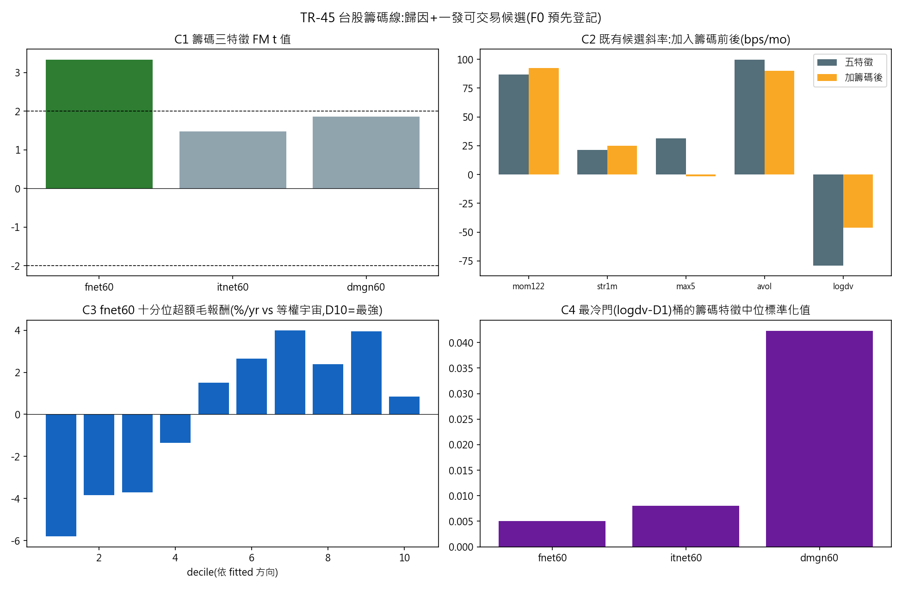

# TR-45 — 台股籌碼線:誰在推「延續市場」?(docs/27 b7 / docs/28 p1)

> 台股弧線(TR-39~44)收尾時留下兩個問題:(1) 已證實的延續機制(mom+、avol+)**是誰在推**?
> (2) 在唯一橫斷面還活著的棲地,先驗最強的未用維度(籌碼)有沒有一個乾淨候選?本 TR 用一個
> 預先登記家族同時回答。**F0 於滴灌進行中預先登記(commit `bc3c1fb`,資料落地前)**;API 欄位
> 事前實測(流向單位=股、每檔 2012-05 起;融資單位=張)。收集:法人買賣超+融資融券
> 1,220/1,220 檔(流向缺 51、融資缺 84=下市/不可融資,結構性)。
> 腳本:`scripts/tests/tr45_taiwan_chips.py` · 圖:`docs/tests/img/tr45_taiwan_chips.png`

## 判定:**MECHANISM-CONFIRMED / MARGINAL——外資流延續為真(fnet60 t=3.34,八特徵聯合仍 t=2.91),但預先登記的頂十分位組合在 TR-40 忠實超額基準下 FAILS-COSTS(超額毛僅 +0.74%/yr,淨 −4.12%/yr,t=−2.51);台股線維持「機制為真、無乾淨可交易候選」**

### CAL(三腿全過)

| CAL | 結果 | 門檻 | 判 |
|---|---|---|---|
| a:bottom-up 外資淨買金額 vs 官方聚合 | corr **+0.996** | 0.90(範圍差已預先聲明) | ✓ |
| b:融資逐日恆等式(今日=昨日+買−賣−現償) | **100.00%**(n=3,260,934) | 99% | ✓ |
| c:八特徵聯合覆蓋 | 中位 **808 檔/月**,100% 月份 ≥500 | 500/90% | ✓ |

### ⚠️ POST-RUN AUDIT NOTE(兩處 as-run 機器不忠實,發表前抓到;F0 未改)

1. **零價格污染**:停牌列 close=0 → tick/價格 = ∞ 毒穿成本序列(淨=−inf,輸出自曝)。
   與 TR-39 同型;先清洗再算價差。
2. **絕對 vs 超額基準(關鍵)**:v1 的 C3 用**絕對**報酬計毛/淨,印出「SIGNAL——第一個乾淨
   候選」。對照 TR-40 原機器稽核發現其全程以**相對等權宇宙的超額**計分(CAL-a 還先要求毛超額
   ≥+40bps/mo 才准進成本測試)——在 +17%/yr 的多頭窗,絕對基準下**任何** long-only 十分位都會
   「過關」。**v1 的 SIGNAL 是基準錯置的假象,不是發現**。修正後 C3 翻為 FAILS-COSTS。
   教訓入慣例:**long-only 桶的成本判定一律以超額(vs 等權宇宙)計**。

### C1 籌碼三特徵聯合 FM(月頻,NW t)

| 特徵 | 建構 | 先驗 | 斜率(bps/mo) | t | 判 |
|---|---|---|---|---|---|
| **fnet60** | 外資 60 日淨買金額/成交金額 | + | **+78.4** | **+3.34** | **候選** |
| itnet60 | 投信同構 | + | +22.0 | +1.48 | 不顯著 |
| dmgn60 | 融資使用率 60 日變化 | **−**(擁擠反轉) | +48.8 | +1.85 | 不顯著;**符號與先驗相反** |

dmgn60 的正號是一個誠實的方向性證偽:散戶槓桿流入在台股**延續**而非反轉——與整個
「延續市場」性格一致(對照 corr(dmgn60, avol)=+0.38:融資活動追蹤異常量=散戶注意力)。

### C2 歸因(F0 預先陳述的判讀:mom/avol 衰減 >1/3?——**答案:否**)

| 特徵 | 五特徵 | 八特徵(加籌碼) | 衰減 |
|---|---|---|---|
| mom122 | +86.7(t=2.53) | **+92.4(t=2.77)** | −7%(反而增強) |
| avol | +99.7(t=3.75) | **+89.8(t=3.49)** | +10% |
| max5(已退役) | +31.5(t=0.66) | −1.5(t=−0.03) | **+105%(被完全吸收)** |
| logdv | −79.1(t=−2.15) | −46.1(t=−1.29) | **+42%** |
| fnet60(八特徵內) | — | +43.7(**t=2.91**) | 獨立訊號 |

**歸因結論**:(1) **動能與異常量不是外資流扛的**——加入籌碼後幾乎不動,延續市場不能化約為
「外資在推」;fnet60 是與它們並立的**獨立**第四條延續通道。(2) 已退役的 max5 被籌碼完全吸收
——樂透特徵原來全是流向相關的雜訊。(3) logdv 衰減 42%(t 掉到 −1.29):低流動性溢酬與
「流向缺席」部分重疊——與 TR-44 的降級同向,再次支持它是結構性補償而非可套利異象。
(4) C4:最冷門 logdv-D1 桶的三個籌碼特徵全在市場中位(+0.01~+0.04)——**冷角落的溢酬不是
流向現象**(Amihud-Mendelson 結構性解讀成立)。

### C3 成本關卡(TR-40 忠實重用:超額基準、tick 2 跳、全額費稅、月頻、總報酬 fwd)

fnet60 頂十分位:絕對毛 +17.57%/yr,但**超額毛僅 +0.74%/yr(+6bps/mo)**——TR-40 的
≥+40bps/mo 毛閘門差 7 倍;扣 40%/mo 換手的全額成本後**超額淨 −4.12%/yr(t=−2.51)**
→ **FAILS-COSTS**。

十分位超額毛梯(D10→D1):**+0.8 +4.0 +2.4 +4.0 +2.7 +1.5 −1.3 −3.7 −3.8 −5.8**——
**駝峰+瀰散**:溢酬在 D7–D9(+2.4~+4.0),極端頂端回落(+0.8,追極端外資買超=過熱),
底半邊全負。「錢」其實在**避開外資賣最兇的那半邊**(D1 −5.8%/yr)——那是放空側,而台股
借券受限(F0 誠實界線;b4 未開)。與 TR-41 的 logdv 懸崖相反,fnet60 沒有可集中的角落。

## 誠實範圍

- 流向資料 2012-05 起(API 實測,短於價格面板但完整覆蓋 2014+ 評估窗);單一 regime 弧。
- 月頻時鐘排除當日流向-報酬內生性,月內回饋仍在——斜率讀作預測性關聯,歸因是主交付。
- C3 交易方向照 F0 用 fitted 符號(+1);頂十分位規格 F0 鎖定,駝峰段(D7–D9)**不可**事後
  改選(那是 HARKing;若要測 D7–D9 需新的預先登記)。
- 融資特徵僅存在於可融資名單(結構性,非倖存偏誤);試驗會計 +1(單一規格,無網格)。

## 後果

- **台股 b 系列(b2/b3/b6/b7)全部完成**。最終狀態不變且更完整:**機制為真——四條延續通道
  (動能、異常量、外資流、[融資流方向性一致但未過線])+一條結構性流動性補償——但在總報酬+
  全額成本+超額基準下,沒有任何一個乾淨可交易候選**。
- 歸因紅利:max5 退役的「為什麼」補上了(流向雜訊);logdv 的結構性解讀二度加固。
- docs/18 加 TR-45 列;docs/27 b7 ✅;README 計數 50→51、台股底線加歸因子句。
- 教訓入 fabric 慣例:成本判定的超額基準(見 AUDIT NOTE 2)。

*2026-07-21。F0 預先登記於 commit `bc3c1fb`(資料落地前);兩處機器不忠實(零價格、基準錯置)
發表前修正並全文記錄;判定照 F0 路由:MECHANISM-CONFIRMED / MARGINAL。*
